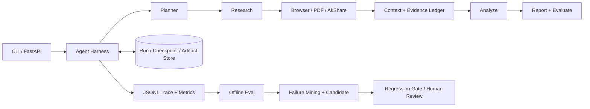

# Financial Research Agent

一个面向公司、行业和宏观研究的多阶段研报系统。它把规划、检索、网页/PDF读取、结构化金融数据、分析、成稿和质量检查放进统一 Agent Harness，并为每次运行提供预算、结构化错误、Trace、Checkpoint、恢复和离线评测。

第一次接触 Agent 工程，或准备技术面试，可先阅读：[V1 到 Harness 的小白友好技术文档](docs/v1_to_harness_interview_guide.md)。

> 当前评测使用稳定的离线 fixture，开发集没有人工复核样本。本文中的开发集结果是 `synthetic_draft` / `machine_verified` 工程信号，不是人工 Gold，也不代表线上真实投研质量。

## 为什么使用 Agent

金融研报不是一次模型调用：系统要选择不同数据工具、并发读取多来源、处理失败与冲突、维护数字—引用关系，并在证据或预算不足时明确停止。现有 Planner 最终被规范化为五阶段流水线；真正的动态决策集中在工具选择、检索扩展、Fallback、预算和终止策略，而不是增加表面上的 Agent 数量。

## 架构



生产 CLI 和 FastAPI 默认经过 `HarnessRunner`；`--legacy` 或 `USE_AGENT_HARNESS=false` 是显式回滚路径。Harness 复用原有 `WorkflowOrchestrator`，不重写业务 Agent。详细设计见 [架构文档](docs/architecture.md) 和 [审计报告](docs/architecture_audit.md)。

## Agent Harness、工具与错误

- Pydantic 状态对象记录 run/task/step/attempt/evidence/budget/final outcome，带 schema 与 checkpoint 版本。
- Tool Registry 声明用途、禁用场景、输入输出 schema、只读/副作用属性；长内容保存为 artifact，只注入摘要。
- Tool Executor 统一处理参数/结果校验、超时、临时错误重试、退避抖动、熔断、有界并发、幂等与重复调用。
- 错误分为 `TIMEOUT`、`RATE_LIMIT`、`AUTH_ERROR`、`INVALID_ARGUMENT`、`SCHEMA_ERROR`、`NOT_FOUND`、`TRANSIENT_NETWORK`、`PERMANENT_FAILURE`、`POLICY_BLOCKED`、`BUDGET_EXCEEDED`。只有临时错误自动重试。
- 副作用协议预留审批、dry-run、幂等键和补偿动作；当前注册的研究工具均为只读，不制造真实写操作。

预算同时限制 Token、费用、总时长、模型/工具调用次数、单工具和单阶段用量、补充检索轮数。预算或证据不足时返回 `insufficient`，不会伪装成功。

## Checkpoint、恢复与上下文

规划、Research 子任务、证据整理、分析、草稿、评测/修订之后写入 SQLite checkpoint。恢复时校验版本和配置指纹，跳过已成功的幂等阶段，并安全重试状态未知的步骤。运行状态、checkpoint 和大产物使用可替换的本地 Store 接口。

上下文按任务目标、计划、近期关键交互、Evidence Ledger、工具摘要、阶段状态和必要记忆分区；超长原文外置，来源与证据去重，压缩时保留未解决问题及数字—引用映射，并输出一致性诊断。完整 Trace 不会重新塞回提示词。

## Trace 示例

每次运行写结构化 JSONL，记录摘要和状态，不记录隐藏推理：

```json
{"event_type":"tool_call_completed","run_id":"...","step_id":"browse-1","tool_name":"web_search","status":"succeeded","payload":{"result_summary":"4 results","artifact_ref":"sha256:..."}}
{"event_type":"checkpoint_saved","run_id":"...","phase":"evidence","payload":{"version":1}}
{"event_type":"run_completed","run_id":"...","status":"degraded","payload":{"stop_reason":"enough_evidence"}}
```

敏感 Header、Cookie、Key 和常见 secret 字段在写 Trace 前脱敏。聚合器可按模型、工具、错误统计成功率、恢复率、冗余调用、Token、费用及 P50/P95 时延。

## 评测数据与指标

数据按主题组切分，避免同主题跨集合；当前生成产物为开发集 88、独立测试集 70、Bad Case 回归集 41（其中 31 条已重构为 13 条可执行任务，见 docs/regression_rebuild.md）。自动生成项默认 `synthetic_draft`，从历史确定性案例转换的项标为 `machine_verified`，只有人工复核后才允许 `human_verified`。开发集本次 264 行（88 任务 × 3 trials）中 human-verified 为 **0**。

评测组合 schema、工具选择/参数、环境状态、引用、数字溯源、安全规则和可选 LLM Judge；记录 Task Success、工具 P/R/F1、参数准确率、恢复率、引用有效性/覆盖率、数字溯源、无源数字、冗余调用、预算、Token/费用、时延和多-trial 稳定性。完整定义见 [评测文档](docs/evaluation.md)。

## 单变量消融：每项能力各自的收益与代价

**这一节替换了之前的一张无效对照表。** 旧表把 Task Success 0.6818 → 0.8068（+12.5pp）
记为「Harness 的收益」，三个问题使它不成立：

1. 基线文件生成于修复前，**Grader 集合与 harness 臂不同**，分数本就不可比；
2. 0.6818 实际是一次已修复的回归（去重命中返回精简投影、丢掉正文）留下的数字；
3. 差异被定位为**恰好 11 个任务，全部是 `interrupt_after_browse`** ——
   对照臂关闭了 checkpoint 却被要求恢复，直接抛异常。这是能力差异，不是成功率提升。

重做为**单变量消融**：每个臂与参照臂 `harness_full` 只差一个变量，
共用同一任务集、同一 stub、同一 Grader 集合、同一 trial 数，
并由脚本做有效性校验（三项一致才输出 Δ）。

同一 88-task 开发集 × 1 trial（离线 fixture 下同任务多 trial 评分标准差实测约 0.0007，
近确定性，故消融用单 trial 换运行时长；dev/test 主结果仍为 3 trials）：

| 指标 | `legacy`（无 Harness） | `harness_full` | 只关重试 | 只关 checkpoint | 只关预算 | 只关上下文压缩 | 只关 fallback 轮 |
|---|---:|---:|---:|---:|---:|---:|---:|
| Task Success | 0.7500 | 0.8068 | 0.8068 | **0.6818** | 0.8068 | 0.8068 | 0.8068 |
| Unresolved Failure | n/a | 0 | 0 | **0.1250** | 0 | 0 | 0 |
| False Success | n/a | 0.0114 | 0.0114 | 0.0114 | 0.0114 | 0.0114 | 0.0114 |
| 平均工具调用数 | n/a | 13.59 | 13.28 | 11.78 | 13.59 | 13.59 | **9.99** |
| 冗余调用率 | n/a | 0.0306 | 0.0306 | 0.0350 | 0.0306 | 0.0306 | **0** |
| P95 时延（秒） | 0.0986 | 1.1732 | 1.4005 | 0.8532 | 1.2241 | 1.2986 | 1.0429 |

`n/a` 表示该臂**没有这项能力**（legacy 无 trace，事件派生指标不存在），不是 0 分。

**可以据此说的结论，逐条对应上表：**

- **只有 checkpoint 对成功率有可测收益**（关掉 −12.5pp，且 Unresolved Failure 从 0 升到 0.125）。
  但要注意这部分收益来自 11 条**按构造必须恢复**的任务，属于能力有无，
  不是「同一任务做得更好」。真实收益更应表述为断点恢复省下的重复工作：
  实测首次运行 3 次工具调用 → 恢复运行 **0 次**。
- **重试、预算门禁、上下文压缩、fallback 轮在本评测集上对成功率均为 0 影响。**
- **fallback 轮的代价已量化**：多 3.6 次工具调用（13.59 vs 9.99）、
  多 3% 冗余调用，来源数与成功率**完全不变**。它在本集上未证明收益。
- legacy 的 Citation Coverage 更高（0.8568 vs 0.7318）。**这一条是未解决项，不是已解释项。**
  已确认的中间事实是来源数不同（legacy 平均 3.47 个、harness 2.97 个），
  来源多则 stub 的固定引用能解析出更多锚点；但**为什么 harness 拿到的来源更少
  尚未定位**（最可能是执行器去重与早停的交互）。
  在查清之前，不能把它说成「Harness 的取舍」——那是把未知包装成设计意图。

Harness 在本集上的真正收益不在成功率，而在**可归因性**。重构回归集上
legacy 与 harness 的 Task Success **完全相同（0.8462）**，但：

| 指标 | legacy | harness |
|---|---:|---:|
| Task Success | 0.8462 | 0.8462 |
| **Unresolved Failure** | **0.5385** | **0** |
| 有结构化 Trace | 否 | 是 |

即：Harness 没有让这个系统更常成功，而是让**失败变得可解释**。

原始结果与脚本：
`evals/results/abl_dev_*.jsonl`、`evals/reports/ablation_matrix_dev.md`、
`scripts/build_ablation_matrix.py`；
回归对照 `evals/reports/regression_verified_report.md`。
以上全部为离线 fixture 结果，**token 与费用恒为 0**，不能外推为线上收益。

代码冻结后独立运行的 test 集为 70 tasks × 3 trials：Task Success 0.7714、综合分 0.9365、Citation Validity/Coverage 1.0/0.7429、Number Grounding/Unsupported 1.0/0、P95 2.7934 秒。原始结果 SHA-256 为 `dfdd1f98bd2694132cc82b5bc34b11260421c4afcbecf68e8a2da6d170ac3fc5`（该文件的 `trace_path`/`report_path` 已由 `scripts/normalize_result_paths.py` 归一化为仓库相对路径，**分数、指标、grades、错误分类等测量内容逐字节未变**，脚本自带守卫会在测量内容变动时拒绝写入；归一化前的哈希为 `167318d75bbf5181…`）；其 human-verified 同样为 0。

## 长期记忆及 A/B

记忆分 semantic、episodic、procedural，带 namespace、来源、置信度、TTL、去重、冲突处理、敏感信息和注入内容过滤；procedural 规则需版本化、审批后激活并可回滚。默认关闭，API 通过 `enable_memory=true`、CLI 通过 `--enable-memory` 显式开启。

3 个主题 × 2 sessions 的离线构造 A/B 中，`none` 与 `full` 下游成功率都为 1.0；完整策略平均注入 78.7 tokens，Memory Precision 0.6667、Recall 1、过期误用率 0、跨用户泄漏率 0。它**没有证明任务效果提升**，只能说明隔离、冲突处理和偏好/别名复用链路可运行。详见 [记忆文档](docs/memory.md)。

## 受控离线优化

Trace 失败经分类后只生成 Prompt、工具描述/schema、路由、检索、停止、预算或记忆策略候选。候选先跑开发集，再过独立测试集、回归集、安全、数字溯源、泄漏、成本和 P95 门禁；即使通过也只形成建议版本，不自动改生产 Prompt 或部署。目前失败挖掘从 264 行开发结果识别 87 个失败记录，并生成 v004/v005 候选；它们尚未完成门禁，因此未启用。

## 快速启动

```bash
python -m venv .venv
# Windows: .venv\Scripts\activate
pip install -r requirements.txt
copy .env.example .env
python main.py "贵州茅台投资价值分析"
python -m uvicorn api.main:app --host 0.0.0.0 --port 8000
```

真实运行需要在 `.env` 配置兼容 LiteLLM 的模型凭据和所需搜索 Provider。稳定离线 demo 不需要 Key：

```bash
python scripts/dev.py demo
```

## 测试与实验命令

```bash
python scripts/dev.py test
python scripts/dev.py eval-smoke
python scripts/dev.py eval
python scripts/dev.py eval-test       # 冻结方案后谨慎运行
python scripts/dev.py eval-regression
python scripts/dev.py memory-ab
python scripts/dev.py mine
python scripts/dev.py propose         # 只生成候选
python scripts/dev.py trajectories
python scripts/dev.py train-check     # 不启动 GPU 训练
```

装有 `make` 时可用同名目标，例如 `make test`、`make eval-smoke`、`make demo`。

## Bad Cases 与边界

实际发现并修复的例子包括：Fallback 重放相同核心查询导致冗余调用、API 并发运行共享全局 Harness 上下文导致 Trace 串线、离线 macro fixture 意外触网、productive query 记忆从错误事件读取参数而无法写入。复现与回归证据见 [失败案例](docs/failure_cases.md)。原 41 条回归数据中大量样本源于历史问题描述；31 条 bad case 已逐条重构并显式分类（13 条可执行、9 条判定非 Agent 行为、5 条需真实网络、4 条转人工队列，见 [regression_rebuild.md](docs/regression_rebuild.md)）。重构后任务的期望值仍为 `needs_human_review`，可以说“能防回归”，不能说“期望已被人工确认”。

已知限制：开发评测没有人工 Gold；LLM Judge 尚未完成人工校准；API 任务队列是单进程内存实现，重启会丢任务状态；本地 API namespace 当前适用于单租户部署；Docker 与 GPU LoRA 训练未验证，Qwen3-1.7B LoRA 仅提供配置、数据导出和前置检查，不自动训练。

关于 fixture 的代表性，现在有实测依据而不是猜测：16 条真实 provider canary （`evals/reports/live_canary_report.md`）显示离线 Number Grounding 0.9956 对应真实环境 0.8126，离线「成功但含无源数字」0.0154 对应真实 0.8571——**fixture 系统性高估数字溯源质量**，因为 fixture 网页里的数字是按报告需要生成的。真实单次费用约 $0.0158、P95 时延约 341s（n=16，每条 1 trial，不构成成功率的统计结论，也不是 SLO）。

## 成本与安全边界

离线 fixture 结果的 Token/费用**结构性为 0**（stub 替换了 `call_llm`），不能用于声称真实成本下降；唯一的真实成本数据来自 16 条 canary（总计 $0.2520）。真实运行由 Harness 预算硬限制；网页/PDF 一律作为不可信数据，Prompt Injection 不可改变工具政策；日志不写 Key/Cookie/隐藏推理；只读工具默认允许，未来写工具必须审批、幂等并支持 dry-run。任何投资结论都需要人工复核，本项目不构成投资建议。

技术报告：[从 V1 到 Harness](docs/v1_to_harness_interview_guide.md)（改造了什么）、[评测口径重建](docs/measurement_credibility_report.md)（凭什么说它变好了）。

可复现证据和不可声称事项汇总在 [resume_evidence.md](docs/resume_evidence.md)，关键设计决策记录在 [docs/decisions](docs/decisions/)。
