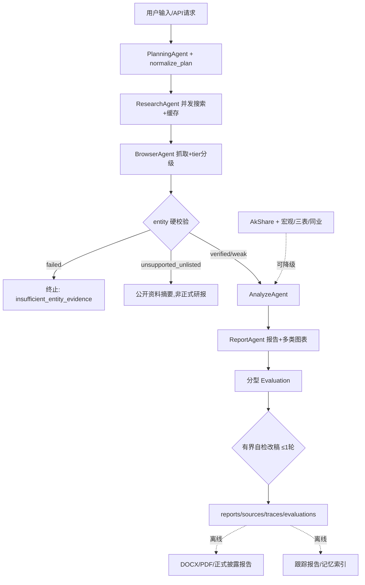

# Financial Research Multi-Agent System

> **v4-competition**。在 v3-full 基础上补齐比赛要求的金融业务深度：宏观研究真实链路、
> 跟踪型报告、公司三表/治理/同业比较、行业生命周期/集中度/产业链/三年情景、正式披露模板、
> 有界自检改稿、上市公司硬校验、AkShare 字段级 lineage、FastAPI+Docker、30-case 分层评测。
> 本文档如实区分**已实现**（有代码+验证）、**可降级**（外部依赖失败时自动退化）、
> **仍有限制**（明确边界）。不接入 Wind、不用付费金融数据 API；报告不构成投资建议。

## 1. 项目背景

传统金融研报撰写依赖人工搜索、阅读和整理：资料分散、耗时长、结论难以溯源。本项目是一个
受控多智能体工作流：输入一句自然语言主题，自动完成检索、抓取、来源筛选、结构化数据获取、
估值计算、报告生成、有界自检改稿和质量评估，产出带引用标注和图表的中文金融研究报告
（公司/行业/宏观三大类），并可通过 FastAPI 对外提供服务。

设计目标不是"最快生成"，而是**可追溯、可评估、可复盘**：每个数字有来源分类，每次运行有
完整 trace，每个踩过的坑记录在 [eval/bad_cases.md](eval/bad_cases.md)。

## 2. 系统架构



工具调用经标准 MCP（stdio Server + 持久 ClientSession），不可用时降级为直接调用
（[docs/mcp_integration.md](docs/mcp_integration.md)）。整套流水线既可通过 CLI（`main.py`）
运行，也可通过 FastAPI 服务（`api/`）异步提交与查询。

## 3. 已实现能力

### 3.1 主链路与基础设施（v1→v3，全部保留）

多 Agent 五阶段工作流、Planner 规范化+有界重执行、并发搜索+缓存、域名黑白名单、语义排序
融合、确定性 DCF、财务趋势图表、AkShare 结构化数据、source tier 分级、数字级 grounding、
分型 Evaluation、DOCX/PDF 导出、本地文件输入、实体验证、向量记忆、30 个 pytest。
详见 [docs/final_status.md](docs/final_status.md) 与 [docs/capability_matrix.md](docs/capability_matrix.md)。

### 3.2 v4 新增能力

| 能力 | 说明 | 代码 / 文档 |
|---|---|---|
| 宏观研究真实链路 | 22 项指标实取（GDP/CPI/PPI/PMI/利率/汇率/社融/出口/地产等）+ 政策解析 + 6 条传导链 + 8 类灰犀牛监控 | [docs/macro_research.md](docs/macro_research.md) |
| 季度/年度跟踪报告 | 真实多期同比/环比（三表），历史 run 记录对比，insufficient_history 如实标注 | [docs/tracking_report.md](docs/tracking_report.md) |
| 公司深度 | 三表抽取/杜邦/现金流质量/股权治理/真实同业比较（新浪板块真实成分，非编造均值） | [docs/company_research.md](docs/company_research.md) |
| 行业深度 | 证据驱动生命周期判断/真实CR-HHI/产业链模板+来源验证/三年情景（输入逐项标注来源类型）/进入退出评分 | [docs/industry_research.md](docs/industry_research.md) |
| 正式披露模板 | 20 项披露要素 + 合规检查器，未达标自动 DRAFT/INCOMPLETE 标记 | [docs/report_disclosure.md](docs/report_disclosure.md) |
| 图表扩展 | 股票价格/相对指数/PE-PB、宏观指标组图、行业CR+三年情景图 + 一致性检查（主体/期间/数值1%容差） | `tools/market_chart_builder.py`、`tools/macro_chart_builder.py`、`tools/industry_chart_builder.py`、`tools/chart_consistency_checker.py` |
| 有界自检改稿 | report→evaluate→revise→final_evaluate，硬上限 1 轮，只修复具体问题，改稿后分数不降才采用 | `tools/report_reviser.py`、`orchestrator/workflow.py` |
| 上市公司硬校验 | 证券代码+交易所映射注册表，四态判定（verified/unsupported_unlisted_company/weak/failed） | `tools/listed_company_registry.py`、`tools/entity_validator.py` |
| AkShare 字段级 lineage | 逐字段 raw_field/platform/endpoint/transformation/derived_from/confidence，no_direct_source_url 如实标注 | `tools/data_lineage.py`、`outputs/eval/data_lineage_report.md` |
| FastAPI + Docker | 异步任务队列（提交/查询/取回）+ 7 项健康检查 + Dockerfile/compose | [docs/deployment.md](docs/deployment.md) |
| 30-case 分层评测 | 公司10/行业10/宏观10，每类含季度跟踪/年度跟踪/风险分析/图表题 | `eval/topics_competition_30.json` |

完整比赛要求逐项对齐见 [docs/competition_alignment.md](docs/competition_alignment.md)。

## 4. 明确未实现

- **没有 Wind**（全项目零 Wind 代码/依赖）
- 没有生产级向量数据库/长期用户记忆（memory 是 numpy 余弦本地索引，默认不接主链路）
- 没有全行业营收口径的集中度数据（CR/HHI 是上市公司市值口径）
- 没有严格投行级 DCF、没有概率分布采样的情景模拟（是配置假设驱动的工程演示）
- 没有分布式/持久化任务队列（FastAPI 任务队列是单进程内存实现，重启丢状态）
- 没有独立跟踪引擎覆盖行业/宏观（跟踪工具专注公司三表）
- 容器内 PDF 导出不可用（依赖宿主机 Edge，标准 Python 镜像没有）

## 5. 可降级能力

| 依赖 | 失败时 |
|---|---|
| AkShare（财务/宏观/三表/股东/板块） | 逐接口降级，缺失字段进 missing_fields；整体失败退回纯网页分析 |
| MCP | 网关降级为直接函数调用 |
| embedding 模型 | 语义排序/记忆检索退回关键词匹配 |
| Edge（PDF） | 只产出 DOCX/HTML，degraded=True |
| 同业板块数据 | peer_comparison 返回 degraded，不编造行业均值 |
| 政策文本 LLM 解析 | 降级为规则抽取（机构名/日期正则+线索词句级分类） |
| 有界改稿 | 改稿后分数未提升则丢弃，保留原报告 |
| LLM 整体断供 | 全链路走确定性 fallback |

## 6-15. 各模块详细说明

见 [docs/macro_research.md](docs/macro_research.md)、[docs/company_research.md](docs/company_research.md)、
[docs/industry_research.md](docs/industry_research.md)、[docs/tracking_report.md](docs/tracking_report.md)、
[docs/report_disclosure.md](docs/report_disclosure.md)、[docs/deployment.md](docs/deployment.md)、
[docs/akshare_integration.md](docs/akshare_integration.md)、[docs/mcp_integration.md](docs/mcp_integration.md)、
[docs/memory_design.md](docs/memory_design.md)、[docs/report_export.md](docs/report_export.md)、
[docs/local_file_input.md](docs/local_file_input.md)。

## 16. 评测结果

### v3 既有 10-topic 回归（v4 收口时重跑，真实数据）

| 指标 | 数值 |
|---|---|
| success_rate | **10/10** |
| avg_quality_score | 0.78 |
| avg_source_count | 4.7 |
| number_grounding_rate | 0.764 |
| tier1_or_tier2_ratio | 0.36 |
| avg_duration | 208.8s |

与历史基线（10/10、0.8、5.0、0.869、0.42）相比处于同一水平，属正常的真实网络/LLM
运行波动，**不是回归**——v4 新增的宏观/公司深度/行业深度/改稿等链路对 company_research/
industry_research 的既有能力零侵入式扩展，未触发这 10 个固定 topic 的任何新增分支。

### v4 30-case 分层评测（人工构建固定 benchmark，非随机抽样，真实数据）

| 指标 | 数值 |
|---|---|
| success_rate | **30/30** |
| avg_source_count | 4.6 |
| avg_quality_score | 0.761（company 0.8 / industry 0.742 / macro 0.741） |
| valid_citation_rate | 1.0 |
| number_grounding_rate | 0.85 |
| tier1_or_tier2_ratio | 0.462 |
| entity_validation_pass_rate | 1.0（verified 19 / weak 3 / not_applicable 8） |
| chart_generation_rate | 0.867 |
| revision_trigger_rate | 0.2 |
| tracking_report_success_rate | 1.0（2 例真实触发） |
| macro_indicator_coverage | 1.0（22/22 已注册可用指标） |
| company_statement_coverage | 1.0 |
| industry_scenario_completion_rate | 1.0 |
| report_compliance_pass_rate | 0.0（**符合预期，非缺陷**：检查的是原始报告而非经 disclosure_builder 包装的正式版，几乎所有真实报告都至少有 1 个未溯源数字或缺报告日期戳，这正是合规检查器与 DRAFT 机制存在的意义） |
| total_latency | avg 236.5s / p50 192.7s / p90 410.8s / p95 517.7s |

详见 [outputs/eval/competition_report.md](outputs/eval/competition_report.md)。**过程中发现并修复
一个真实 bug**：entity_validator 曾把宏观/未收录同义词的行业主题误判为
insufficient_entity_evidence，导致首次全量跑时 11/30 失败；修复后（[eval/bad_cases.md](eval/bad_cases.md)
Bad Case 31）复跑全部通过，30/30。

### 测试

`python -m pytest tests` → **99/99 通过**（离线，约 90 秒）。

### 导出与部署验证

DOCX/PDF 导出：真实验证通过（`python scripts/export_reports.py --latest`）。FastAPI：真实
HTTP 端到端验证通过（POST /reports → GET /tasks → GET /reports，含真实 DOCX 导出）。Docker：
Dockerfile/compose 已写好并静态审查，**本次未在当前沙箱环境验证 build/run**（无 Docker 守护进程）。

## 17. 如何运行

```bash
pip install -r requirements.txt
cp .env.example .env   # 填 API Key

# 单报告（company_research/industry_research/macro_research/risk_research/valuation_research）
python main.py --topic "贵州茅台投资价值分析" --report_type company_research \
  --requirements "公司概况,财务分析,估值分析,风险提示,投资观点" --output_format html

# 季度/年度跟踪报告
python scripts/build_tracking_report.py --symbol 600519 --period annual
python scripts/build_tracking_report.py --symbol 002594 --period quarterly

# 正式披露报告（合规检查 + DRAFT 标记）
python scripts/build_formal_report.py --latest

# 30-case 分层评测
python scripts/run_competition_eval.py --run
python scripts/build_competition_report.py

# V3 既有 10-topic 回归 + 全部评测报告
python eval/eval_runner.py --run
python scripts/collect_eval_summary.py && python scripts/build_eval_report.py
python scripts/build_source_quality_report.py && python scripts/build_grounding_report.py
python scripts/build_data_lineage_report.py
python scripts/build_deep_eval_report.py && python scripts/build_latency_report.py
python scripts/build_ablation_report.py

# 测试 / 导出
python -m pytest tests
python scripts/export_reports.py --latest

# FastAPI 服务
uvicorn api.main:app --host 0.0.0.0 --port 8000
# http://localhost:8000/docs  http://localhost:8000/health

# Docker（本次未在当前沙箱环境验证 build/run，见 docs/deployment.md）
docker build -t financial-research-agent .
docker run --env-file .env -p 8000:8000 financial-research-agent
```

## 18. 限制、风险与免责声明

1. AkShare 数据依赖网络与第三方接口稳定性，可能延迟/口径差异/字段变更；
2. 估值、情景模拟结果是工具计算与配置假设的演示，**不构成投资建议或目标价**；
3. source grounding 是工程引用检查，**不等于专业金融审计**；Evaluation/合规检查器是启发式规则，不等于分析师/合规官判断；
4. 上市公司硬校验/虚构实体识别是启发式，仅覆盖沪深北 A 股，港股/美股/新三板/未上市公司可能被判 `unsupported_unlisted_company`；
5. 正式披露模板**不代表持牌证券研究报告**，无持牌分析师参与；
6. PDF 导出依赖本机 Edge（容器内默认不可用）；memory 不是生产级长期记忆；FastAPI 任务队列是单进程内存实现，重启丢状态；
7. 宏观传导链与行业生命周期/情景模型是规则推演与工程假设，**不是专业预测保证**；
8. 30-case 评测集是人工分层构建的固定 benchmark，**不是随机抽样，不能代表所有金融任务的泛化能力**；
9. 系统**不能完全避免幻觉**，不保证投资观点正确；
10. 本项目所有产出仅供技术研究参考，使用者需自行核实并承担决策风险。
