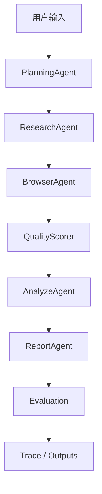

# Financial Research Multi-Agent System

> v1 收口版本。本文档是项目的权威说明，描述当前 v1 **已经实现**的能力和**尚未实现**的边界，不做夸大。完整的 v1 收口状态说明见 [docs/final_status.md](docs/final_status.md)。

## 1. 项目背景

传统金融研报撰写依赖人工搜索、阅读和整理：资料分散、耗时长、结论难以溯源到原始出处、报告结构也不稳定。本项目是一个 Multi-Agent 工作流，用户输入一句自然语言主题，系统自动完成搜索、抓取、来源筛选、结构化分析、报告生成和质量评估，产出一份带引用标注的中文金融研究报告（公司或行业类）。

项目的设计目标不是"尽可能快地生成一份报告"，而是验证一条**可追溯、可评估、可复盘**的工程链路：

- **可追溯**：报告里的结论要能追溯到具体抓取、打分过的来源（`[s1]`/`[s2]` 引用），每次运行的完整执行路径都落盘成 trace。
- **可评估**：每份报告都会拿到一个多维度规则化质量分（引用覆盖率、来源支撑度、财务/估值深度、来源权威性等）。
- **可复盘**：系统在迭代过程中出现过的真实工程问题（搜索召回跑偏、Planner 乱拆任务、相关性误杀等）都记录在 [eval/bad_cases.md](eval/bad_cases.md)，每一条都有现象、根因、修复和指标对比。

本系统生成的报告**仅供研究/参考使用，不构成投资建议**。

## 2. 系统能力概览

**已实现（v1）**：

- 多 Agent 研报生成工作流（Planning -> Research -> Browse -> Analyze -> Report -> Evaluate）
- `PlanningAgent` 任务规划，并强制规范化为固定 5 阶段执行计划
- `ResearchAgent` 并发搜索 + 搜索结果缓存
- `BrowserAgent` 网页/PDF 内容读取，域名白/黑名单，读取上限，提前停止，放宽相关性兜底
- `QualityScorer` 来源相关性/质量打分（subject + 别名 + 行业同义词 + 权威域名综合判断）
- `AnalyzeAgent` 基于已筛选来源做结构化财务/风险/估值分析（规则抽取 + LLM 综合，禁止编造）
- `ReportAgent` 生成带 `[source_id]` 引用的 Markdown/HTML 报告
- 规则化 Evaluation 自动评估（含 `source_count` 硬性封顶，避免虚高分）
- 全链路 Trace 记录（`research_metrics`/`browser_metrics`/`planner_metrics`/`performance_metrics`/`compression_metrics`/`evaluation_diagnostics`）
- 固定 10 case 批量评测（`eval/topics.json` + `eval/eval_runner.py`）
- Direct LLM baseline 对比（验证"有来源引用"和"无来源直接生成"的差异）
- Bad case 复盘文档，记录真实工程问题与修复过程

**已实现（v2 新增）**：

- MCP 协议封装：`web_search`/`read_webpage`/`read_pdf` 通过标准 MCP Server（官方 `mcp` SDK，stdio 传输）暴露，ResearchAgent/BrowserAgent 作为 MCP Client 经协议调用，MCP 不可用时优雅降级为直接调用（见 [docs/mcp_integration.md](docs/mcp_integration.md)）
- 向量语义排序：候选排序层叠加本地 embedding 相似度（bge-small-zh-v1.5，ModelScope 下载、CPU 推理，无付费 API），与关键词规则分加权融合而非替换——每个候选保留 `rule_score`/`semantic_score`/`rank_score` 三字段，可解释性不丢；模型不可用时自动退回纯规则（召回对比见 [outputs/eval/semantic_ranking_compare.md](outputs/eval/semantic_ranking_compare.md)）

**当前明确没有实现**（不要误认为已具备）：

- 没有长期记忆（每次运行都是无状态的一次性流水线；搜索缓存只是按 query 字符串的原始 key-value 缓存，不是语义记忆）
- 没有向量数据库或完整 RAG（没有向量库持久化；语义能力仅限候选排序层的 embedding 相似度）
- 没有真实 Wind / AkShare 等结构化金融数据 API 接入（财务数字全部来自公开网页/PDF 文本抽取）
- 没有严格的 DCF 等财务估值建模工具
- 没有独立的机器学习预测工具
- MCP 封装是本 pipeline 自用的 stdio server，还不是可供外部 IDE/Agent 连接的独立部署服务
- 没有完整的 Docx/正式 PDF 报告导出（当前只输出 Markdown/HTML）
- 报告内容**不构成投资建议**
- Evaluation 是启发式的工程规则评分，**不等价于专业金融分析师的判断**

## 3. 系统架构

```
用户输入（topic、report_type、requirements、output_format）
        │
        ▼
  PlanningAgent  ──LLM──▶  原始任务列表
        │
        ▼
  normalize_plan()（强制收敛为固定 5 阶段）
        │
        ▼
  research -> browse -> analyze -> report -> evaluate
        │
        ▼
outputs/{reports, traces, sources, evaluations}/*.json|.md|.html
```



所有 Agent 都继承自 `agents/base_agent.py::BaseAgent`，统一提供 `run()`（重试 + 计时 + 异常兜底）、`log_step()`、`call_llm()`（通过 LiteLLM 调用，模型可通过 `.env` 切换）、`parse_json_response()`（对 LLM 输出做容错解析）。

## 4. Agent 分工

- **PlanningAgent**（[agents/planning_agent.py](agents/planning_agent.py)）——让 LLM 把请求拆解成任务计划。它的原始输出从不会被直接信任：`normalize_plan()` 会在执行前把任意数量的任务强制收敛成固定 5 个（research/browse/analyze/report/evaluate 各一个，依赖/顺序/重试次数全部固定）。
- **ResearchAgent**（[agents/research_agent.py](agents/research_agent.py)）——构建一小组核心搜索 query（不是逐个 requirement 生成 query），用 `ThreadPoolExecutor` 并发调用 `ddgs` 搜索，按 query 原文缓存结果到 `outputs/cache/search_cache.json`。
- **BrowserAgent**（[agents/browser_agent.py](agents/browser_agent.py)）——抓取候选 URL 的网页/PDF 内容，委托 `QualityScorer` 打分，保留 Top-K 来源。内置域名白/黑名单、读取上限、提前停止；当抓到内容但没有一个越过相关性阈值时，会降级为放宽相关性的兜底选择，而不是直接判定失败或反复重试同一批 URL。
- **QualityScorer**（[tools/quality_scorer.py](tools/quality_scorer.py)）——综合 subject（标准化主题）、公司别名（股票代码/英文名）、行业同义词、金融关键词密度、来源权威性来打分，而不是要求原始 topic 字符串逐字出现。
- **AnalyzeAgent**（[agents/analyze_agent.py](agents/analyze_agent.py)）——规则关键词抽取（财务/风险/估值信号）+ LLM 综合分析，强制只能基于已抓取资料，不允许编造。
- **ReportAgent**（[agents/report_agent.py](agents/report_agent.py)）——生成带 `[source_id]` 引用的 Markdown/HTML 报告，并单独运行 `evaluate_report_quality()`（规则化评分器，不是 LLM 评委，模型服务不可用时依然能跑）。

## 5. 核心工作流

1. 用户通过 `main.py` 提交主题（+ report_type、requirements、output_format、max_sources）。
2. `PlanningAgent` 产出任务计划；`normalize_plan()` 无论 LLM 返回什么都收敛成固定 5 阶段。
3. `ResearchAgent` 构建约 5-6 个核心 query，并发执行（优先查缓存），返回去重候选 URL。
4. `BrowserAgent` 按域名/相关性预过滤、排序候选，在读取上限内抓取内容，用 `QualityScorer` 逐一打分，凑够足够相关来源后提前停止；相关性判定失败但有可用内容时走放宽相关性兜底；确实没有可用来源时在 `analyze`/`report` 之前就终止，不生成没有资料支撑的"正式报告"。
5. `AnalyzeAgent` 抽取财务/风险/估值信号，让 LLM 综合成结构化分析，标注 `source_id`。
6. `ReportAgent` 渲染最终报告，再用 `evaluate_report_quality()` 打分。
7. 报告、入选来源、完整执行 trace、质量评估结果全部落盘。

## 6. 关键工程优化

- **Research 并发与缓存**：`ThreadPoolExecutor` 并发跑一批核心 query（有限 worker 数、每个 query 独立超时），按精确 query 字符串缓存结果（带 TTL）。
- **Query 数量控制**：搜索 query 由固定的信息维度构建，不再逐 requirement 生成，避免 query 数量膨胀。
- **Planner 规范化**：`normalize_plan()`（[agents/planning_agent.py](agents/planning_agent.py)）把任意任务数收敛为固定 5 个；`orchestrator/workflow.py` 在执行边界处强制调用，不只依赖 PlanningAgent 自身校验。
- **Topic 别名 / 行业同义词**：`build_relevance_profile()`（[utils/text_utils.py](utils/text_utils.py)）把 topic 展开成 subject + 公司别名 + 行业同义词，避免相关性判断要求原始短语逐字出现。
- **QualityScorer 相关性修复**：基于 subject/别名/行业词命中综合判断，而不是对完整 topic 字符串做关键词计数。
- **Browser 读取上限 / 提前停止 / 放宽相关性兜底**：限制实际抓取的候选数量，凑够相关来源提前停止；抓到内容但零相关时降级选择，而不是反复重试同一批 URL。
- **Evaluation source_count 硬性封顶**：`source_count` 过低时给总分设置上限（如只有 1 个来源封顶 0.5），避免格式好看但资料单薄的报告拿到虚高分。
- **Trace 可观测性**：每次运行落盘 `research_metrics`/`browser_metrics`/`planner_metrics`/`performance_metrics`/`compression_metrics`/`evaluation_diagnostics`，bad case 可以事后诊断。

详细的问题现象、根因和修复过程见 [eval/bad_cases.md](eval/bad_cases.md)。

## 7. 评测结果

评测基于 `eval/topics.json` 里固定的 10 个 topic（5 个公司研究 + 5 个行业研究），每个 topic 取最新一次 run。以下是 v1 收口时的评测快照：

| 指标 | 数值 |
|---|---|
| total_cases | 10 |
| success_cases | 10 |
| success_rate | 1.0 |
| avg_source_count | 5.0 |
| source_count >= 5 | 10 / 10 |
| avg_quality_score | 0.831 |
| avg_total_time | 124.336s |
| avg_research_time | 0.029s |
| avg_browser_time | 23.406s |
| avg_analyze_time | 34.721s |
| avg_report_time | 32.961s |
| planner_normalized_task_count all == 5 | True |
| quality_score < 0.6 | 0 / 10 |
| total_time > 180s | 0 / 10 |

**关于 `avg_research_time=0.029s` 的重要说明**：这是**热缓存**评测结果——10 个 topic 在评测过程中反复运行，`outputs/cache/search_cache.json` 已经命中缓存，所以 Research 阶段几乎瞬间完成。**冷缓存**下 `ResearchAgent` 需要实际发起 Web Search，历史实验中通常约 **10-16 秒**，具体取决于网络和搜索服务状态。热缓存评测用于验证主链路稳定性和 Planner/Browser/Analyze/Report 各阶段的行为，**不代表首次查询永远只需要 0.03 秒**——首次跑一个新 topic 时请预期 Research 阶段要花 10 秒以上。

上面这份快照是 v1 收口时的一次性记录，会随实际重跑而变化。最新结果请看：

```bash
python scripts/collect_eval_summary.py
python scripts/build_eval_report.py
```

产出 `outputs/eval/eval_summary.csv`（每个 topic 最新一次 run 一行）、`outputs/eval/eval_summary.md`、`outputs/eval/eval_report.md`（所有数字都从 CSV 现算，不是写死的）。

## 8. Direct LLM Baseline 对比

为了让"可追溯性 vs. 速度"这个权衡有真实数字支撑，项目里有一个 baseline：完全跳过 Agent 流程，只用一次 prompt 让 LLM 直接写报告，不搜索、不抓取网页、不带引用。

```bash
python scripts/run_direct_llm_baseline.py
python scripts/build_baseline_compare.py
```

v1 收口时的对比结果（见 [outputs/eval/baseline_compare.md](outputs/eval/baseline_compare.md) 获取最新数据）：

- Direct LLM 平均更快，`avg_total_time` 约 **58.474s**（单次 LLM 调用，没有搜索/抓取/打分开销）。
- Direct LLM 没有真实来源：`avg_source_count = 0`。
- Direct LLM 没有可验证引用：`avg_citation_coverage = 0`。
- Direct LLM 没有来源支撑：`avg_source_grounding = 0`（这三个 0 是设计上必然的结果，因为 baseline 从不抓取或附加外部来源，不是打分打出来的差距）。
- Agent System 更慢，`avg_total_time` 约 **124.336s**。
- Agent System 有真实抓取的来源、`source_id` 引用、结构化评估结果、以及覆盖 research/browser/planner/performance/compression/evaluation 的完整执行 trace。
- 项目目标不是最快生成一份报告，而是让金融研报生成更可追溯、可评估、可复盘。这个对比是为了把这个权衡用真实指标说清楚，不是为了证明 Agent 系统"更正确"。

**需要明确的是**：以上对比**不代表**"Agent 系统完全避免幻觉""Agent 生成内容一定比 Direct LLM 正确""Direct LLM 一定错误"，也**不代表**系统能保证投资观点正确——两条链路生成的都是基于文本的报告草稿，Agent 系统的优势是可追溯和可复盘，不是内容正确性的保证。

## 9. Bad Case 复盘

v1 迭代过程中发现并修复的真实工程问题，按"现象/原因/修改/结果/指标变化"逐条记录在 [eval/bad_cases.md](eval/bad_cases.md)，包括：

- ResearchAgent 串行搜索导致耗时过长
- Planner 输出重复任务导致执行链路不稳定
- QualityScorer 完整 topic 匹配导致相关性误杀
- BrowserAgent 对同一批 URL 无意义重试
- source_count 太低但 Evaluation 虚高
- eval_summary 统计历史旧 run 导致指标污染
- eval_runner.py `--help` 误触发实际评测
- 网页/PDF 抓取中的 403/404/empty_content 问题
- 行业研报复用公司财务指标导致 financial_depth_score 不公平
- 热缓存评测和冷缓存评测容易混淆

## 10. 当前限制

1. 没有跨运行的长期记忆——每次 `main.py` 调用都是无状态的一次性流水线。
2. 没有向量数据库或 RAG——来源排序/筛选依赖关键词和规则，不是语义检索。
3. 没有接入真实的 Wind / AkShare 等金融数据 API——财务数字全部来自公开网页/PDF 文本抽取。
4. 没有严格的 DCF 等财务估值建模工具。
5. 没有独立的机器学习预测工具。
6. 没有标准 MCP Server/Client 协议封装。
7. 没有完整的 Docx/正式 PDF 报告导出，目前只输出 Markdown/HTML。
8. 搜索结果依赖公开网页，存在真实世界的失败模式：403/404、清洗后内容为空、站点结构不统一。
9. `evaluate_report_quality()` 是启发式规则评分器（引用计数、关键词命中、结构检查），不等价于专业金融分析师的判断，也不是 LLM-as-judge。
10. `source_grounding` 目前只是工程层面的引用检查（有没有标注 `[source_id]`），不是逐条事实核verification。
11. 报告内容仅供研究/参考，**不构成投资建议**。

## 11. Future Work（v2 方向）

1. report_type-specific Evaluation——针对 industry_research 单独设计财务/市场维度指标，而不是复用公司研究的关键词表。
2. 来源分级（source tier）——更细粒度地区分官方公告、权威财经媒体、一般来源。
3. 数字级 grounding——把"有没有引用"细化到"每个具体数字有没有对应来源"。
4. 接入 AkShare 等结构化金融数据工具，减少对网页文本抽取的依赖。
5. Valuation / DCF 工具——提供真正的估值计算能力，而不是让 LLM 复述资料里的估值结论。
6. Docx/PDF 正式报告导出。
7. MCP-compatible tool registry——把 `web_search`/`web_reader`/`pdf_reader` 封装成标准 MCP Tool。
8. 本地文件上传解析（用户自带财报/研报 PDF）。
9. 向量数据库与长期知识库，支持历史报告/来源的语义复用。

## 12. 如何运行

```bash
python -m venv .venv
# Windows:
.venv\Scripts\activate
# macOS/Linux:
source .venv/bin/activate

pip install -r requirements.txt
cp .env.example .env   # 填入你的 API Key
```

生成单份报告：

```bash
python main.py --topic "比亚迪投资价值分析" --report_type company_research --requirements "公司概况,财务分析,估值分析,风险提示,投资观点" --output_format html --max_sources 5 --max_results 8
```

评测相关命令：

```bash
python eval/eval_runner.py --help              # 查看用法，不会执行任何评测
python eval/eval_runner.py --run               # 执行 eval/topics.json 里全部 10 个 topic
python eval/eval_runner.py --collect-only      # 不执行任何新 run，只汇总现有 outputs
python scripts/collect_eval_summary.py         # 汇总每个 topic 最新一次 run -> outputs/eval/eval_summary.csv|md
python scripts/build_eval_report.py            # 生成 outputs/eval/eval_report.md
python scripts/run_direct_llm_baseline.py      # 跑 Direct LLM baseline -> outputs/baseline_reports/
python scripts/build_baseline_compare.py       # 生成 outputs/eval/baseline_compare.md
```

## 13. 项目目录结构

```
financial_research_agent/
├── main.py                       # CLI 入口，跑单个 topic
├── config.py                     # 环境变量与全局配置
├── agents/                       # PlanningAgent / ResearchAgent / BrowserAgent / AnalyzeAgent / ReportAgent
├── orchestrator/                 # WorkflowOrchestrator：调度与 context 管理、normalize_plan 执行边界
├── tools/                        # 无状态工具：搜索、网页/PDF 解析、质量打分、域名规则
├── schemas/                      # Pydantic 数据模型
├── prompts/                      # LLM prompt 模板
├── utils/                        # 日志/文件/文本/缓存工具
├── eval/
│   ├── topics.json               # 正式的 10 case 评测集，v1 指标的唯一数据来源
│   ├── test_cases.json           # 开发/扩展用的测试用例，不作为 v1 最终指标来源
│   ├── eval_runner.py            # 评测执行入口（--run / --collect-only）
│   └── bad_cases.md              # bad case 复盘记录
├── scripts/                      # collect_eval_summary / build_eval_report / run_direct_llm_baseline / build_baseline_compare
├── docs/
│   └── final_status.md           # v1 最终状态说明
└── outputs/
    ├── reports/                  # 生成的研报（.md / .html）
    ├── traces/                   # 执行 trace（.json）
    ├── sources/                  # 入选来源（.json）
    ├── evaluations/              # 单次运行的质量评估（.json）
    ├── cache/                    # 搜索结果缓存
    ├── baseline_reports/         # Direct LLM baseline 报告
    └── eval/                     # 最终评测汇总与 baseline 对比（eval_summary.csv/md、eval_report.md、baseline_compare.md）
```

## 14. 免责声明

本项目生成的所有报告、分析和评估结果均基于公开网页/PDF 资料的自动化抓取与 LLM 处理，**仅供技术研究与参考使用，不构成任何投资建议**。报告中的数据可能存在时效性问题、抓取误差或 LLM 生成偏差，使用者需自行核实并承担决策风险。Evaluation 模块给出的质量分是启发式的工程规则评分，不等价于专业金融分析师的判断，也不保证报告结论的正确性。
