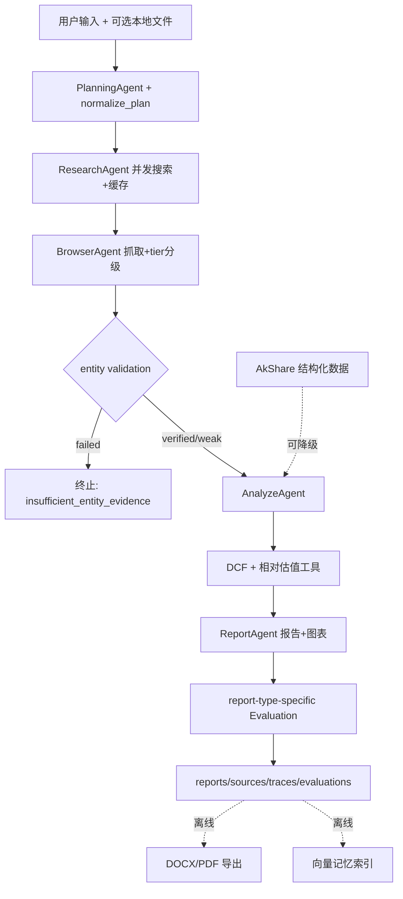

# Financial Research Multi-Agent System

> **v3-full**。本文档如实区分三类能力：**已实现**（有代码+验证）、**可降级**（外部依赖失败时自动退化、主流程不崩）、**仍有限制**（明确写出边界）。没有实现 Wind；报告不构成投资建议。

## 1. 项目背景

传统金融研报撰写依赖人工搜索、阅读和整理：资料分散、耗时长、结论难以溯源、结构不稳定。本项目是一个 Multi-Agent 工作流：输入一句自然语言主题，自动完成搜索、抓取、来源筛选、结构化数据获取、估值计算、报告生成和质量评估，产出带引用标注和图表的中文金融研究报告（公司/行业类）。

设计目标不是"最快生成"，而是**可追溯、可评估、可复盘**：每个数字有来源分类（网页引用/结构化数据/配置假设/模型测算），每次运行有完整 trace，每个踩过的坑记录在 [eval/bad_cases.md](eval/bad_cases.md)（24 条，含现象/根因/修复/指标变化）。

## 2. 系统架构



工具调用经标准 MCP（stdio Server + 持久 ClientSession）：`web_search` / `read_webpage` / `read_pdf` / `fetch_financial_snapshot`，MCP 不可用时自动降级为直接调用（见 [docs/mcp_integration.md](docs/mcp_integration.md)）。

## 3. 已实现能力

**主链路（v1→v2）**：多 Agent 五阶段工作流、Planner 强制规范化 + 有界动态重执行（browse 候选不足时回跳 research 一轮）、并发搜索+缓存、域名黑白名单、语义排序融合（bge-small-zh 本地 embedding + 规则分加权）、确定性 DCF、财务趋势图表、全链路 trace、10 topic 评测集、Direct LLM baseline 对比。

**v3 新增**：

| 能力 | 说明 | 代码 |
|---|---|---|
| AkShare 结构化数据 | 营收/净利/ROE/毛利率/现金流年度序列 + PE/PB/市值/股价，统一 FinancialDataSnapshot，缺失字段如实 missing_fields | [tools/akshare_tool.py](tools/akshare_tool.py) |
| 数据归一化 | 新浪指标矩阵→标准字段（元→亿元、年度序列） | [tools/financial_data_normalizer.py](tools/financial_data_normalizer.py) |
| 相对估值 | PE/PB 相对**自身近一年历史分位**（不编造行业均值），undervalued/neutral/overvalued/unknown | [tools/valuation_relative.py](tools/valuation_relative.py) |
| DCF 增强 | 输入优先级 AkShare现金流→文本抽取→净利代理→默认值，逐参数 akshare:field / [sX] / config_assumption 标注 | [tools/valuation_dcf.py](tools/valuation_dcf.py) |
| source tier 分级 | tier1 官方/tier2 财经媒体/tier3 普通-UGC/unknown/local_user_file，每个 Source 带 tier 字段 | [tools/source_tier.py](tools/source_tier.py) |
| 数字级 grounding | 报告全文数字分类：sourced/akshare/assumption/calculated/unsourced + 幻觉引用检测 + 数值核对 | [tools/number_grounding.py](tools/number_grounding.py)、[tools/citation_checker.py](tools/citation_checker.py) |
| 分型评估 | company/industry/risk/valuation/macro 五套指标；行业研报不再被公司财务关键词封顶 | [evaluators/report_evaluator.py](evaluators/report_evaluator.py) |
| DOCX/PDF 导出 | python-docx + Edge headless，离线后处理 | [tools/report_exporter.py](tools/report_exporter.py) |
| 本地文件输入 | PDF/TXT/MD/CSV/Excel → source（s901+，不占网页名额） | [tools/local_file_reader.py](tools/local_file_reader.py) |
| 实体验证 | A股代码表(5530只)+别名表+来源正文证据三重校验，虚构主体终止输出 insufficient_entity_evidence | [tools/entity_validator.py](tools/entity_validator.py) |
| 向量记忆 | 报告摘要/bad case 本地索引（numpy 余弦 + bge），默认不参与主链路 | [memory/](memory/) |
| 离线测试与报告 | 30 个 pytest + deep_eval/latency/ablation/source_quality/grounding 报告脚本 | [tests/](tests/)、[scripts/](scripts/) |

## 4. 明确未实现

- **没有 Wind**（无代码、无假实现；商业终端不符合本项目公开可复现定位）
- 没有生产级向量数据库（memory 是 numpy 余弦本地索引）
- 没有长期用户记忆（memory 只索引产物，不记用户状态）
- 没有行业可比公司倍数数据（相对估值参照系是自身历史，明示于输出）
- 没有严格投行级 DCF（净利代理现金流未扣资本开支，折现率/永续增长是配置假设）
- 没有多轮追问、没有独立 ML 预测工具、MCP 是自用 stdio 而非对外部署服务

## 5. 可降级能力（外部依赖失败时的行为）

| 依赖 | 失败时 |
|---|---|
| AkShare 未装/网络失败/字段变化 | 逐接口降级，缺失字段进 missing_fields；快照整体失败则退回纯网页/PDF 分析，trace 记录 structured_data_metrics |
| MCP 不可用 | 网关降级为直接函数调用，日志告警 |
| embedding 模型不可用 | 语义排序退回纯规则；memory 检索退回关键词重叠 |
| Edge/PDF 打印失败 | 只产出 DOCX/HTML，状态显式 degraded |
| 本地文件坏/不支持 | 单文件跳过 + warning |
| LLM 整体断供 | planning/analyze/report 全部走确定性 fallback，10/10 完成度实测（bad_cases 17） |

## 6. 工具调用（MCP）

`mcp_server/tools_server.py`（FastMCP，stdio）暴露 4 个工具；`tools/tool_gateway.py` 维护持久 ClientSession（后台事件循环 + keeper task），Agent 侧同签名调用。搜索缓存在 client 侧，命中不发协议调用。详见 [docs/mcp_integration.md](docs/mcp_integration.md)。

## 7. AkShare 结构化数据

只封装**本环境实测可用**的接口（新浪财务摘要/新浪日线/百度估值/A股代码表；东财系被代理拦截，刻意不依赖）。数据依赖网络和第三方接口稳定性，快照缓存 12h。字段可用性、降级策略、为什么没接 Wind：见 [docs/akshare_integration.md](docs/akshare_integration.md)。

## 8. DCF / 相对估值

DCF：两阶段（显式期折现+Gordon 永续），bear/base/bull 三情景，输出含 `input_sources`（每个参数标注 akshare:field / [sX] / config_assumption / derived）、assumptions、warning。相对估值：PE/PB 当前值在自身近一年分布中的分位。**两者都是工具计算+假设的演示，不构成目标价或投资建议**，报告正文强制注明来源类型。

## 9. Source tier

启发式分级（tier1 官方公告/交易所/监管、tier2 主流财经媒体、tier3 普通/UGC、unknown、local_user_file），**不等于来源绝对可靠**。当前评测集实测 tier1+2 占比 0.42（行业主题的优质内容天然多在一般财经站点）。报告：`python scripts/build_source_quality_report.py` → [outputs/eval/source_quality_report.md](outputs/eval/source_quality_report.md)。

## 10. 数字级 grounding

报告里每个实质性数字（金额/百分比/倍数，年份除外）分类溯源；假设类数字**标注为假设即合规，不为其伪造引用**（项目红线）。运行时评估含数值核对（AkShare/DCF 数字与工具输出 1% 容差比对），离线报告只做标注分类（区别已在报告中说明）。v3 实测整体 grounding 率 **0.879**（v2 报告基线 0.691）。

## 11. Report-type-specific Evaluation

company/industry/risk/valuation/macro 五套指标（后三类已实现、未经真实评测 topic 验证——评测集目前只有公司+行业）。所有类型共享防刷分底线：source_count 硬封顶、引用不足封顶、未溯源数字封顶、幻觉引用封顶（0.75）。行业研报不再因缺公司财务关键词被封顶（bad_cases 9 → 已修复）。

## 12. DOCX / PDF 导出

`python scripts/export_reports.py --latest | --run-id <id> | --all-eval`。详见 [docs/report_export.md](docs/report_export.md)。PDF 依赖本机 Edge，失败降级。

## 13. 本地文件输入

`python main.py --topic ... --local-files "a.pdf,b.xlsx"`。本地来源 s901+，报告中与网页来源区分标注。详见 [docs/local_file_input.md](docs/local_file_input.md)。

## 14. 实体验证

company 主题三重证据（A股代码表/别名表/来源正文真实提及），全部不命中 → 终止并输出"实体无法验证"报告 + `entity_validation_failed` 评估标记。**启发式，不保证 100%**：未上市真实公司可能被判 weak/failed（可用 --local-files 提供资料）。实测：虚构公司"星河量子能源股份有限公司"被正确拦截（相关性层曾被 15 个泛金融页面骗过，实体层拦下）；10 个真实 topic 零误杀。

## 15. Memory

本地轻量向量索引（报告摘要+bad cases），`python scripts/build_memory_index.py` / `python scripts/search_memory.py --query "..."`。**不是长期用户记忆、不是生产向量库、默认不影响主链路**。详见 [docs/memory_design.md](docs/memory_design.md)。

## 16. 评测结果（v3 全量 run，真实数据）

| 指标 | 数值 |
|---|---|
| success_rate | **10/10** |
| avg_source_count | 5.0 |
| avg_quality_score | 0.8（company 0.8 / industry 0.8——行业不再被系统性压分） |
| number_grounding_rate | **0.869**（评估口径）/ 0.879（离线全文扫描） |
| tier1_or_tier2_ratio | 0.42 |
| avg_total_time | 348s（本轮搜索冷缓存 11.1s/topic + AkShare 首次抓取；热缓存时约 130-160s） |
| pytest | **30/30 通过**（离线，~6s） |

明细见 [outputs/eval/eval_report.md](outputs/eval/eval_report.md)、[deep_eval_report.md](outputs/eval/deep_eval_report.md)、[latency_report.md](outputs/eval/latency_report.md)、[ablation_report.md](outputs/eval/ablation_report.md)（真实历史前后对比，非受控重跑）、[baseline_compare.md](outputs/eval/baseline_compare.md)。

## 17. 如何运行

```bash
pip install -r requirements.txt
cp .env.example .env   # 填 API Key

# 单报告（可带本地文件）
python main.py --topic "比亚迪投资价值分析" --report_type company_research \
  --requirements "公司概况,财务分析,估值分析,风险提示,投资观点" --output_format html \
  --max_sources 5 --max_results 8

# 评测
python eval/eval_runner.py --run
python scripts/collect_eval_summary.py && python scripts/build_eval_report.py
python scripts/run_direct_llm_baseline.py && python scripts/build_baseline_compare.py
python scripts/build_source_quality_report.py && python scripts/build_grounding_report.py
python scripts/build_deep_eval_report.py && python scripts/build_latency_report.py
python scripts/build_ablation_report.py

# 测试 / 导出 / 记忆
python -m pytest tests
python scripts/export_reports.py --latest
python scripts/build_memory_index.py && python scripts/search_memory.py --query "比亚迪估值"
```

## 18. 限制、风险与免责声明

1. AkShare 数据依赖网络与第三方接口稳定性，可能延迟/口径差异/字段变更；
2. 估值结果是工具计算与配置假设的演示，**不构成投资建议或目标价**；
3. source grounding 是工程引用检查，**不等于专业金融审计**；Evaluation 是启发式评分，不等于分析师判断；
4. 虚构实体识别是启发式，不保证 100%（未上市公司可能误判）；
5. PDF 导出依赖本机 Edge；memory 不是生产级长期记忆；
6. 系统**不能完全避免幻觉**，不保证投资观点正确；
7. 本项目所有产出仅供技术研究参考，使用者需自行核实并承担决策风险。
