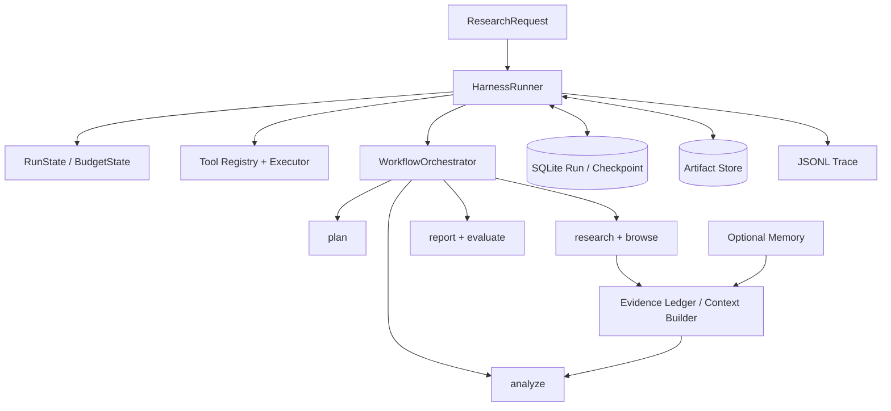

# 统一 Agent Harness 架构

## 目标与边界

本次升级在原有 `WorkflowOrchestrator` 外增加统一运行控制面，不重写五阶段研究流水线。Harness 负责“如何可靠执行”，业务 Agent 负责“研究什么和如何生成”。CLI 与 FastAPI 默认进入 Harness，并保留显式 legacy 回滚。

## 组件关系

## 状态与执行

`src/runtime/state.py` 定义带 `schema_version` 的 Run、Task、Step、Attempt、Evidence、Budget 和 Outcome 模型。`runner.py` 驱动阶段门禁，更新预算并在终态统一判断 succeeded、degraded、insufficient、failed 或 cancelled。状态和 checkpoint 可序列化；配置指纹不一致或 schema 不兼容时拒绝不安全恢复。

`src/runtime/checkpoint.py` 提供 RunStore、CheckpointStore、ArtifactStore 抽象及本地 SQLite/文件实现。checkpoint 位于规划、研究、证据、分析、草稿与评测边界。恢复只跳过已完成且幂等的阶段；未知的执行中步骤不会被当成成功。

## 工具控制面

`src/tools/registry.py` 为工具注册唯一名称、namespace、用途/禁用说明、Pydantic 输入输出和副作用元数据。`executor.py` 在调用前后校验 schema，并负责：

- 结构化错误分类，只重试 transient/rate-limit/timeout；
- 指数退避与抖动、工具/Provider 熔断；
- 全局和工具级有界并发；
- 重复调用检测、调用预算、取消与超时；
- 副作用工具的 approval、dry-run、idempotency key 和补偿协议；
- 大结果写 artifact，只向模型返回受限摘要。

现有搜索、网页、PDF 和金融快照通过 `tools/tool_gateway.py` 桥接进入当前 Harness 上下文。并发子任务通过 `contextvars.copy_context()` 显式传播 run 绑定，避免不同 API 请求串线。

## 上下文与证据

`src/runtime/context.py` 将目标、计划、阶段、近期交互、Evidence Ledger、工具摘要和可选记忆分别计费。超预算时先外置长内容、去重、按来源摘要，再分阶段压缩。校验器检查关键数字/引用映射与未解决问题在压缩前后是否保留；诊断写入结果和 Trace。原始网页永远是数据，不是指令。

## 可观测性

`src/observability` 写 append-only JSONL，事件包括运行、模型/工具、重试、熔断、预算、checkpoint、memory、approval、grader 和终态。Trace 保存可见输入/输出摘要、状态和评分，不保存 Chain of Thought；写入前递归脱敏。聚合指标可按工具、模型、错误和运行统计。

## 兼容性与部署边界

- `python main.py ... --legacy` 或 `USE_AGENT_HARNESS=false` 回到旧入口。
- API worker 为单进程内存队列，任务元数据不持久化；Harness 内部 run/checkpoint 持久化不等于 API 队列持久化。
- 默认 API namespace 是 `api_local`，适用于本地单租户；多租户部署必须从认证主体派生 namespace/user_id。
- 本地 Store 接口可替换，但项目不强制 Redis、Kafka 或 PostgreSQL。

逐文件的升级前事实与差异见 [architecture_audit.md](architecture_audit.md)。
