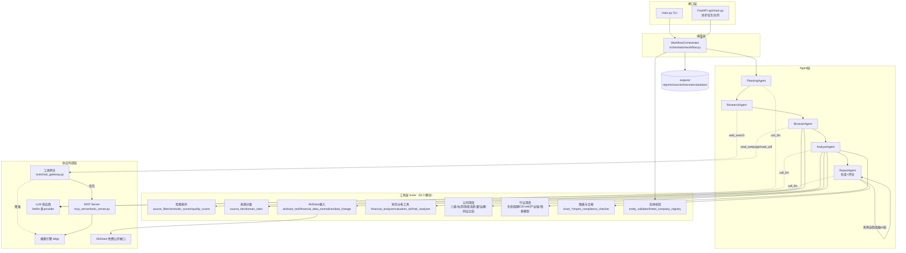
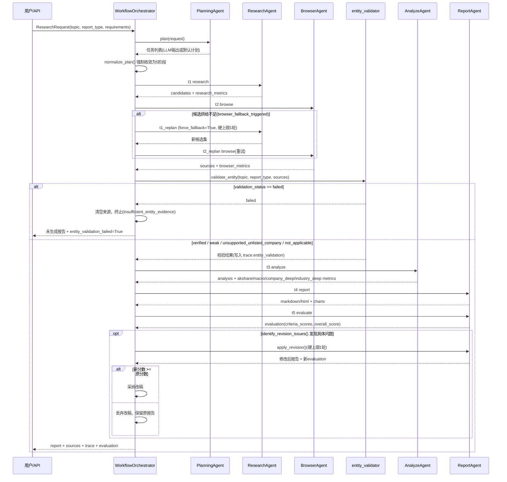
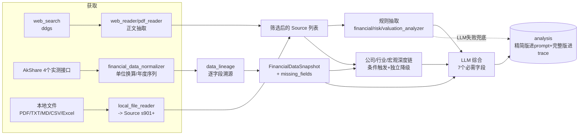
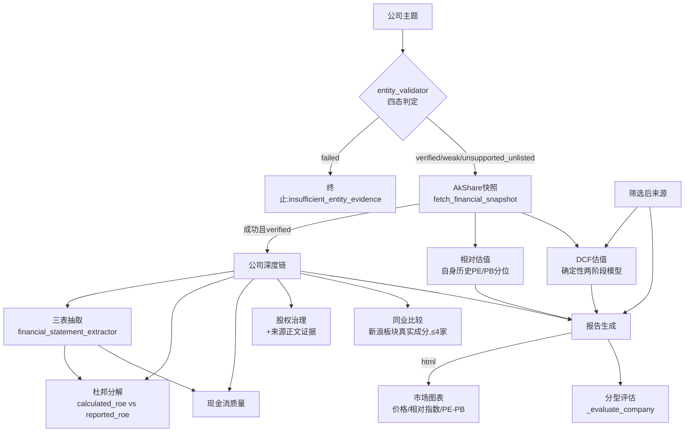
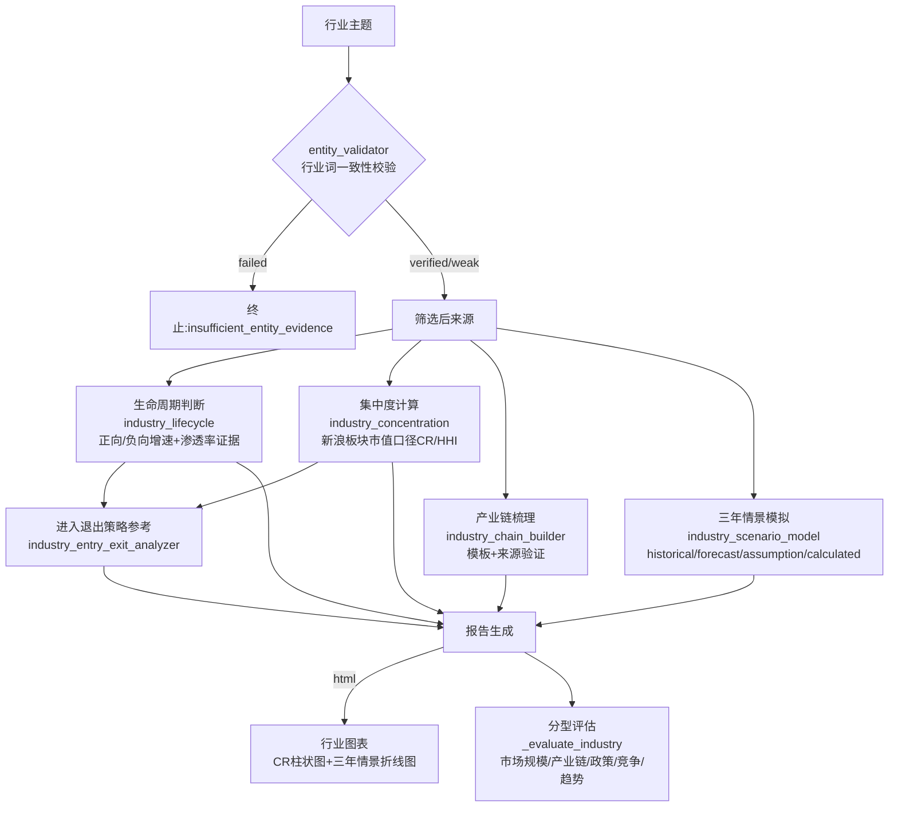
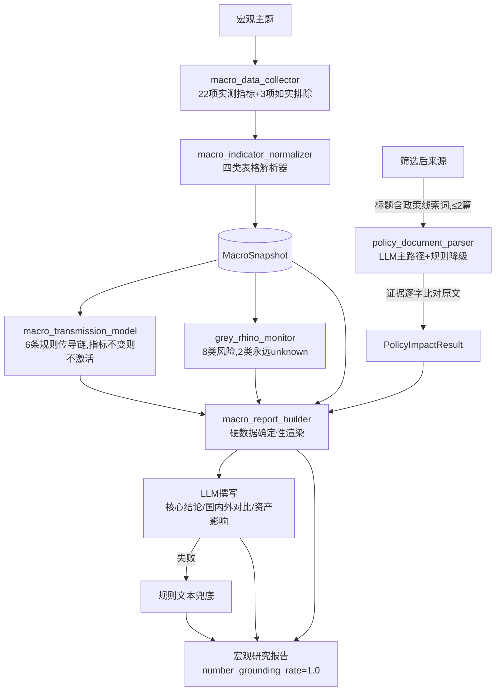
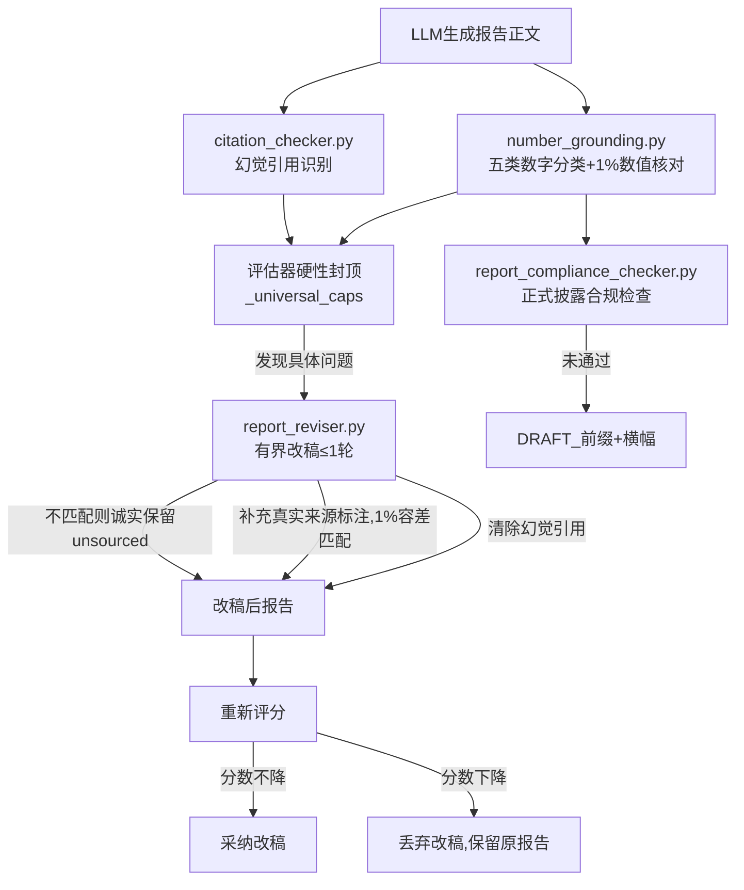
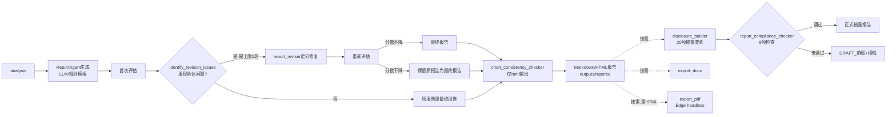

# Financial Research Agent 技术报告 v4

> 本报告基于仓库当前代码、文档与评测结果撰写，所有数据均标注来源；未找到证据的数据将明确标注"当前仓库中未找到可靠证据"，不做推测。
>
> 版本范围：v4-competition（当前分支 `v4-competition`）。第 1—8 章聚焦项目背景、系统架构、Agent 工作流、技术选型、数据获取、检索与 RAG、公司研报能力、行业研报能力；第 9—16 章续接宏观与策略研报能力、估值系统、数字溯源与幻觉控制、报告生成/合规/导出、记忆系统、MCP 与工具网关、FastAPI 与部署、测试体系。评测结果、跟踪报告细节等仍在本轮范围之外。

## 目录

1. [项目背景与比赛需求](#1-项目背景与比赛需求)
2. [系统总体架构](#2-系统总体架构)
3. [Agent 与工作流设计](#3-agent-与工作流设计)
4. [技术框架选型对比](#4-技术框架选型对比)
5. [数据获取与融合](#5-数据获取与融合)
6. [检索、来源筛选与 RAG](#6-检索来源筛选与-rag)
7. [公司研报能力](#7-公司研报能力)
8. [行业研报能力](#8-行业研报能力)
9. [宏观与策略研报能力](#9-宏观与策略研报能力)
10. [估值系统](#10-估值系统)
11. [数字溯源、引用与幻觉控制](#11-数字溯源引用与幻觉控制)
12. [报告生成、合规和导出](#12-报告生成合规和导出)
13. [记忆系统](#13-记忆系统)
14. [MCP 与工具网关](#14-mcp-与工具网关)
15. [FastAPI 与部署](#15-fastapi-与部署)
16. [测试体系](#16-测试体系)
17. [评测集设计](#17-评测集设计)
18. [30-case 首轮 19/30 失败与实体校验 Bug 修复](#18-30-case-首轮-1930-失败与实体校验-bug-修复)
19. [最终评测结果](#19-最终评测结果)
20. [消融实验](#20-消融实验)
21. [性能与成本](#21-性能与成本)
22. [Fallback 与可靠性设计](#22-fallback-与可靠性设计)
23. [当前限制](#23-当前限制)
24. [结论与未来工作](#24-结论与未来工作)

---

## 1. 项目背景与比赛需求

### 1.1 问题背景

传统金融研报的撰写流程高度依赖分析师人工检索资料、阅读年报/公告/新闻、整理财务数据、
手工建模估值，再撰写成文。这个流程存在三个结构性问题：

- **资料分散**：公司公告、行业数据、宏观指标、新闻评论分布在交易所、财经媒体、统计局等
  不同信源，人工整合耗时且容易遗漏；
- **结论难以溯源**：最终报告里的数字和判断，往往在成文后就与原始出处脱钩，复核成本高；
- **难以复用与规模化**：每一份新研报都要重新走一遍检索-阅读-整理流程，无法批量、可重复地
  产出。

本项目（Financial Research Agent）是一个**受控多智能体（multi-agent）工作流系统**：输入
一句自然语言主题（如"贵州茅台投资价值分析"），系统自动完成任务规划、并发检索、网页/PDF
抓取与来源筛选、结构化金融数据获取、确定性估值计算、报告生成、有界自检改稿与质量评估，
最终产出带有逐条引用标注、财务/市场图表的中文金融研究报告，覆盖公司、行业、宏观三大报告
类型，并可通过 FastAPI 对外提供 HTTP 服务。项目从 v1 到 v4 迭代四个大版本，工程设计目标始
终是**可追溯、可评估、可复盘**，而不是"生成速度最快"或"看起来最像分析师写的"：

- 可追溯——每个出现在报告里的数字都有来源分类（引用 / AkShare 结构化数据 / 配置假设 /
  模型测算 / 未溯源，见第 6 章数字级 grounding 部分），来源本身也分官方/权威媒体/一般来源
  三档；
- 可评估——每次运行都产出结构化 `evaluation`（分型质量评分）与 `trace`（研究/浏览/规划/
  性能/压缩/评估六类指标全链路记录），可用固定评测集横向比较；
- 可复盘——项目在迭代过程中把发现的真实工程问题逐条记录在 [eval/bad_cases.md](../eval/bad_cases.md)
  （现有 31 条，含现象/原因/修改/结果/指标变化），而不是只保留最终"能跑通"的版本。

（来源：[README.md](../README.md) 第 1、2 节；[docs/final_status.md](final_status.md)）

### 1.2 比赛需求与本项目的对齐方式

根据 [docs/competition_alignment.md](competition_alignment.md)，比赛在总体约束和十项具体
功能两个层面提出要求，本项目的对齐结论（均标注为"✅ 完全满足"，逐项证据见该文档）包括：

**总体约束**：
- 不接入 Wind（全项目零 Wind 相关代码/依赖）；
- 不使用付费金融数据 API（仅用 AkShare 免费公开转载数据 + 网页搜索/PDF）；
- 不伪造行业均值/宏观指标/财务数据/评测结果（同业比较、集中度、情景模拟、灰犀牛监控等
  模块在数据不足时统一返回 `degraded=True` 或 `unknown`，不用编造数据填充空白）；
- 公司研报仅针对上市公司（`tools/entity_validator.py` 四态硬校验，见第 7 章）；
- 关键数据记录来源/报告期/抓取时间（`tools/data_lineage.py`）；
- 报告不构成投资建议（每类报告固定免责声明 + 合规检查器强制项）。

**十项功能要求**（要求编号与 competition_alignment.md 一致）：

| # | 要求 | 本报告涉及章节 |
|---|---|---|
| 1 | 宏观/策略研报真实链路 | 不在本轮范围（第 9 章及以后） |
| 2 | 季度/年度跟踪型报告 | 不在本轮范围 |
| 3 | 公司三表/股权/治理/同业比较 | 第 7 章 |
| 4 | 行业生命周期/集中度/产业链/三年情景 | 第 8 章 |
| 5 | 正式研报披露模板 | 不在本轮范围 |
| 6 | 30-case 三大类型分层评测 | 不在本轮范围 |
| 7 | 股票/指数/宏观/行业图表 | 第 5、7、8 章部分涉及 |
| 8 | 有界自检改稿 | 第 3 章工作流部分 |
| 9 | 上市公司硬校验 | 第 6、7 章 |
| 10 | AkShare 原始来源 lineage | 第 5 章 |

其余交付项（FastAPI + Docker、测试覆盖、文档更新）不在本轮 1-8 章范围内。

### 1.3 本报告的证据原则

本报告所有数字与结论均来自仓库现有文件（代码、`docs/*.md`、`eval/bad_cases.md`、
`outputs/eval/*`），不重新运行 10-topic 或 30-case 评测、不生成 DOCX/PDF、不修改核心业务
代码。凡是某项数据在当前仓库中检索不到可靠出处的，本报告将明确写"当前仓库中未找到可靠
证据"，不做推测或估算。

---

## 2. 系统总体架构

### 2.1 分层视图

系统在代码组织上分为五层，层与层之间通过明确的接口（Schema/网关函数）解耦：

| 层 | 目录/文件 | 职责 |
|---|---|---|
| 接口层 | [main.py](../main.py)（CLI）、[api/](../api/)（FastAPI：`main.py`/`task_manager.py`/`schemas.py`） | 接收用户请求（一句自然语言主题 + report_type + requirements），CLI 同步执行，API 异步任务队列（提交/查询/取回） |
| 编排层 | [orchestrator/workflow.py](../orchestrator/workflow.py) | `WorkflowOrchestrator` 驱动五阶段任务的依赖调度、有界重执行（replan）、有界自检改稿、实体硬校验、异常终止路径 |
| Agent 层 | [agents/](../agents/)（`planning_agent`/`research_agent`/`browser_agent`/`analyze_agent`/`report_agent`，均继承 [agents/base_agent.py](../agents/base_agent.py)） | 每个 Agent 对应工作流的一个阶段，`BaseAgent.run()` 统一处理重试、耗时统计、异常捕获 |
| 工具层 | [tools/](../tools/)（51 个模块，覆盖检索排序、来源分级、AkShare 接入、财务/估值/风险规则抽取、DCF、公司深度、行业深度、图表、合规检查等） | 无状态纯函数/类，Agent 通过工具网关或直接 import 调用；工具层内部尽量不依赖 Agent 层 |
| 协议/外部依赖层 | [mcp_server/tools_server.py](../mcp_server/tools_server.py)（MCP Server）、[tools/tool_gateway.py](../tools/tool_gateway.py)（MCP Client 网关）、AkShare/搜索引擎/LLM 供应商 | `web_search`/`read_webpage`/`read_pdf` 经标准 MCP 协议（stdio 传输、持久 ClientSession）调用，网关在协议不可用时自动降级为同进程直接函数调用 |

（来源：目录结构实测 [Glob]；[docs/mcp_integration.md](mcp_integration.md)）

### 2.2 系统架构图



### 2.3 关键设计原则

1. **固定 5 阶段骨架 + 有界动态性**：工作流主链路（research→browse→analyze→report→
   evaluate）由 `normalize_plan()` 强制收敛为固定 5 个任务，不把执行计划的控制权交给
   LLM Planner（原因见第 3 章）；唯一允许的"动态性"是 browse 阶段候选供给不足时触发的
   一轮有界重检索（`_MAX_REPLAN_ROUNDS = 1`），以及报告生成后的有界自检改稿（同样硬上限
   1 轮）。（来源：[orchestrator/workflow.py](../orchestrator/workflow.py)、
   [docs/dynamic_planning.md](dynamic_planning.md)）
2. **单点失败不致命**：LLM 调用、AkShare 接口、MCP 协议、embedding 模型、Edge PDF 导出
   等外部依赖均设计了显式降级路径（见 README 第 5 节"可降级能力"表），任一环节失败时
   系统退化到确定性规则兜底而不是整体崩溃。[eval/bad_cases.md](../eval/bad_cases.md)
   Bad Case 17 记录了一次真实的全 LLM 断供事故，压测证明 fallback 链路全覆盖（10/10
   仍能跑完）。
3. **协议边界收敛**：MCP 化只封装了三个无状态工具函数（`web_search`/`read_webpage`/
   `read_pdf`），Agent 侧代码只需替换 import 语句即可切换调用路径，业务逻辑零改动；
   `analyze` 阶段的规则抽取函数因输入已在内存中、无跨进程复用价值，未做 MCP 化。
   （来源：[docs/mcp_integration.md](mcp_integration.md)）
4. **产出物可追溯**：每次运行落盘四类产物——`reports/`（最终报告）、`sources/`（筛选后
   来源全文+评分）、`traces/`（六类指标全链路记录）、`evaluations/`（分型质量评分）——
   均以 `run_id` 关联，任何一个数字都可以从报告回查到来源、从来源回查到抓取时刻。
   （来源：[orchestrator/workflow.py](../orchestrator/workflow.py) 第 430-444 行）
5. **CLI 与 API 共享同一编排层**：`api/task_manager.py` 内部同样调用
   `WorkflowOrchestrator`，只是把同步执行包装成异步任务队列（提交/查询/取回），两条
   入口路径不存在逻辑分叉。API 任务队列是单进程内存实现，服务重启会丢失任务状态
   （README 第 4、18 节明确的已知限制）。

---

## 3. Agent 与工作流设计

### 3.1 BaseAgent：统一的执行骨架

所有 Agent 继承 [agents/base_agent.py](../agents/base_agent.py) 的 `BaseAgent`，共享同一套
`run()` 执行骨架：子类只需实现 `execute(task, context)`，`run()` 负责计时、按
`task.max_retries` 重试、把任意异常捕获为失败的 `TaskResult` 而不是让整个进程崩溃、以及把
每次尝试记录进 trace。`BaseAgent` 还提供两个共享能力：`call_llm()`（经 LiteLLM 统一调用可
配置的 LLM 供应商）和 `parse_json_response()`（从可能带 Markdown 代码围栏或散文包裹的 LLM
输出中尽力提取 JSON）。（来源：[agents/base_agent.py](../agents/base_agent.py)）

重试机制包含两个针对真实故障模式设计的例外：
- **`non_retryable` 标记**：当 Agent 判断"重试也会得到相同结果"（例如
  `BrowserAgent` 已经抓到内容但相关性判为 0，重试同一批 URL 不会有不同结果）时，可在异常
  上标记 `non_retryable=True`，`run()` 立即停止重试，不浪费重试预算（对应
  [eval/bad_cases.md](../eval/bad_cases.md) Bad Case 4）；
- **`partial_result` 透传**：Agent 可通过异常的 `partial_result` 属性把诊断信息（如
  `browser_metrics`）带出来，即使任务最终判失败，orchestrator 和 trace 仍能看到具体发生
  了什么，而不是一个空的失败记录。

### 3.2 五个 Agent 各自的职责

| Agent | 文件 | 输入 | 输出 | 关键设计点 |
|---|---|---|---|---|
| PlanningAgent | [agents/planning_agent.py](../agents/planning_agent.py) | `ResearchRequest`（topic/report_type/requirements） | 任务列表（经 `normalize_plan()` 强制收敛） | LLM 输出的计划仅作为参考，`description`/`parameters` 可保留，但 `task_id`/`dependencies`/`priority`/`max_retries` 全部由代码强制统一为固定 5 阶段；LLM 失败或输出不合法时直接退回确定性默认计划 |
| ResearchAgent | [agents/research_agent.py](../agents/research_agent.py) | subject + report_type | 候选 URL 列表 + `research_metrics` | 5 个核心维度 query（公司/行业两套模板）+ 可选别名 query，`ThreadPoolExecutor` 并发执行，命中 `SEARCH_TARGET_UNIQUE_RESULTS` 提前停止；首轮候选不足或被上游强制（`force_fallback`）时追加最多 5 个 `site:` 权威域名限定 query |
| BrowserAgent | [agents/browser_agent.py](../agents/browser_agent.py) | 候选 URL 列表 | Top-K `Source` 列表 + `browser_metrics` | 域名黑名单预过滤 → 规则+语义融合排序 → 单域名分散守卫（每域最多 4 席）→ 抓取上限 `MAX_BROWSE_CANDIDATES=20` + 达到 `top_k*2` 个相关来源即提前停止 → 相关性判 0 时的 relaxed-relevance 兜底（见第 6 章） |
| AnalyzeAgent | [agents/analyze_agent.py](../agents/analyze_agent.py) | Top-K `Source` | 结构化 `analysis` + 各类 metrics | 规则抽取（financial/risk/valuation）与 LLM 综合并行产出；按 `report_type` 条件触发 AkShare 快照、公司深度链、行业深度链、宏观数据链、DCF 估值，任一子链失败都独立降级（`try/except` 包裹，不影响主分析） |
| ReportAgent | [agents/report_agent.py](../agents/report_agent.py) | `analysis` + `Source` 列表 | Markdown/HTML 报告 + `evaluation` | 同时承担生成（`_generate`/`_generate_macro`）与评估（`_evaluate`，委托 `evaluators/report_evaluator.py` 按 report_type 分派）两个任务类型；LLM 输出未通过结构校验（含 8 个必需标题中至少 5 个）时回退确定性模板渲染 |

### 3.3 工作流编排：固定骨架 + 三处有界动态点

`WorkflowOrchestrator.run()`（[orchestrator/workflow.py](../orchestrator/workflow.py)）执行
的主链路是固定的 `planning → research → browse → analyze → report → evaluate` 六步（含
Planning 共 6 个 `on_progress` 步），按依赖关系用简单拓扑排序调度。这个"固定骨架"是刻意
设计的：v1 阶段 LLM Planner 曾输出 9-17 个任务、包含重复的 research/browse 阶段，导致同一
阶段被实际执行多次（[eval/bad_cases.md](../eval/bad_cases.md) Bad Case 2）；`normalize_plan()`
把"LLM 说什么就执行什么"改成"LLM 输出仅供参考，执行计划由代码保证"，此后 10 个评测 topic
的 `planner_normalized_task_count` 恒为 5。

在这个固定骨架之上，系统只保留三处**由确定性信号触发、有硬性次数上限**的动态点，而不是把
执行计划的控制权交还给 LLM（方案对比见 [docs/dynamic_planning.md](dynamic_planning.md)）：

1. **有界重检索（replan）**：browse 失败且诊断信号显示是"候选供给不足"（而非相关性阈值
   问题，后者有独立的 relaxed-relevance 兜底）时，回跳一轮 research（带
   `force_fallback=True`，强制追加权威站点 query），再重试 browse；硬上限
   `_MAX_REPLAN_ROUNDS = 1`，只在失败路径触发，10 个评测 topic 全部一次成功时该逻辑完全
   不执行（`replan_metrics.triggered=False`）。
2. **上市公司/主体实体硬校验**：browse 成功后、analyze 之前插入 `validate_entity()`
   校验点（详见第 6、7 章）；判定为 `failed` 时清空来源、把该 browse 任务标记为逻辑失败，
   走既有的"资料不足"终止路径而不是继续生成看似有据实则无凭据的报告。
3. **有界自检改稿（v4 新增）**：report → evaluate 之后，若 `identify_revision_issues()`
   识别出具体问题（如未溯源数字、幻觉引用、缺失免责声明），调用 `apply_revision()` 定向
   修复并重新评分；硬上限 1 轮（不循环），且**只有改稿后分数不低于改稿前才采纳**，否则
   丢弃改稿保留原报告——不会为了"看起来修过"而牺牲已验证的 grounding 质量。

除上述三点外，任何运行的执行路径都是固定的 5 阶段，不存在 ReAct 式"LLM 决定下一步"的动态
调度。（来源：[orchestrator/workflow.py](../orchestrator/workflow.py)；
[docs/dynamic_planning.md](dynamic_planning.md)）

### 3.4 工作流时序图



### 3.5 有界性设计的共同逻辑

三处动态点（重检索、实体校验终止、自检改稿）在设计上有一个共同的工程约束：**触发条件必须
是运行时可观测的确定性信号，且都设有硬上限，都不依赖 LLM 在执行中临时决定"要不要再来一
轮"**。这与"固定 5 阶段骨架"并不矛盾——骨架挡住的是 LLM Planner 输出的不可控性（阶段数量、
阶段顺序），有界动态点解决的是骨架内部特定失败模式的补救，两者作用的层面不同。这个设计取舍
本身也是从真实故障中提炼出来的：Bad Case 2（LLM 输出失控）促成了固定骨架，Bad Case
16/23（虚构实体绕过相关性层）促成了实体校验终止点，而自检改稿则是 v4 阶段新增、用于在不
重跑整条流水线的前提下修复报告里的具体缺陷。

---

## 4. 技术框架选型对比

本章列出项目在关键环节做过的技术选型，以及未选择的替代方案与理由。所有选型均来自
`requirements.txt`、`config.py`、各模块 docstring 与 `docs/*.md` 的显式说明，不臆测未在
仓库中出现的备选方案的具体细节。

### 4.1 LLM 接入层：LiteLLM 统一网关 vs 各家 SDK 直连

`agents/base_agent.py::call_llm()` 统一通过 `litellm.completion()` 调用，模型名/API Base
经 `config.MODEL_NAME`/`OPENAI_API_BASE` 从环境变量注入。`.env.example`（README 运行说明）
表明支持 OpenAI 兼容接口、DeepSeek、Anthropic、Ollama 等多家供应商。选择统一网关而非为每家
供应商写专用 SDK 调用代码，好处是**换模型只改配置、不改代码**，Agent 层完全不感知具体供应商；
代价是牺牲了各家 SDK 的供应商特定功能（如某些厂商专属的结构化输出/工具调用协议），项目的
JSON 解析因此走的是"尽力从文本中提取"的 `parse_json_response()`（正则匹配代码围栏或
`{...}`/`[...]`），而不是依赖某个供应商的强类型 structured output。

### 4.2 工具调用协议：MCP（Model Context Protocol） vs 直接函数调用

v1 阶段 `web_search`/`read_webpage`/`read_pdf` 是同进程内的普通函数调用；v2 阶段引入标准
MCP（官方 `mcp` SDK 的 FastMCP，stdio 传输）：[mcp_server/tools_server.py](../mcp_server/tools_server.py)
作为 Server 子进程，[tools/tool_gateway.py](../tools/tool_gateway.py) 作为 Client 网关，
`ResearchAgent`/`BrowserAgent` 只需把 `from tools.web_search import web_search` 改成
`from tools.tool_gateway import web_search`，调用代码零改动。选择 MCP 而非继续直接调用的
理由是让工具调用具备**标准协议边界**（便于未来接入外部 MCP 生态），代价是引入了一层协议
序列化开销与一个真实的工程坑——MCP Python SDK 的 `stdio_client`/`ClientSession` 的 cancel
scope 必须绑定在常驻 task 上，否则第一次调用后连接就被关闭（[eval/bad_cases.md](../eval/bad_cases.md)
Bad Case 11）。当前是**自用型 MCP 化**：Server 由网关自动拉起、只服务本 pipeline，不是可供
外部 IDE/Agent 连接的独立部署服务；协议层不可用时自动降级为直接函数调用，不反复重试。
（来源：[docs/mcp_integration.md](mcp_integration.md)）

### 4.3 语义排序：本地轻量 embedding vs 商用向量检索 API vs 纯规则

来源排序层选择"规则打分 + 本地 embedding 语义相似度加权融合"（`(1-w)*rule + w*semantic`，
w=0.35），而不是接入商用向量检索/embedding API，也不是完全依赖规则。模型选用
BAAI/bge-small-zh-v1.5（约 95MB，CPU 推理），理由是**免费、可离线、中文效果够用**；下载
渠道从 HuggingFace 直连改为 ModelScope（国内网络对 HuggingFace/hf-mirror 均下载失败，见
[eval/bad_cases.md](../eval/bad_cases.md) Bad Case 12），这是一个纯粹由网络环境约束驱动的
选型调整，不是技术优劣判断。规则分未被语义分替代而是保留融合，是为了不牺牲可解释性——
`rule_score`/`semantic_score`/`rank_score` 三个字段在 trace 里都可见，便于事后定位"是谁把
候选推进来的"。模型不可用时自动退回纯规则排序（`semantic_score=None`），排序功能不因此
中断。（来源：[tools/semantic_scorer.py](../tools/semantic_scorer.py)、
[tools/source_filter.py](../tools/source_filter.py)、[docs/capability_matrix.md](capability_matrix.md) 第2项）

### 4.4 结构化金融数据：AkShare（免费公开接口） vs Wind/付费终端

比赛与项目红线明确不接入 Wind、不使用付费金融数据 API，因此结构化数据层唯一选型是 AkShare——
一个转载/聚合新浪、百度股市通等公开数据源的免费 Python 库。项目没有"全信文档"，而是逐接口
实测可用性：东方财富系接口（`stock_individual_info_em`、`stock_zh_a_hist` 等）在本环境全部
`ProxyError`，最终封装只依赖实测通过的四个接口（`stock_financial_abstract`/
`stock_zh_valuation_baidu`/`stock_zh_a_daily`/`stock_info_a_code_name`），单接口失败只影响
对应字段（`missing_fields` 如实记录），不影响整体获取。（来源：
[docs/akshare_integration.md](akshare_integration.md)；[eval/bad_cases.md](../eval/bad_cases.md)
Bad Case 18）

### 4.5 长期记忆：本地轻量向量索引 vs 生产级向量数据库

`memory/` 模块用 numpy 余弦相似度 + 本地 JSONL/npy 文件持久化，不是 Milvus/FAISS 等生产级
向量数据库。选型理由是记忆体量只有几十条（报告摘要 + bad case 记录），暴力余弦检索本身就是
最合理实现，引入专用向量数据库属于过度工程。这个模块**默认不参与主链路**——Agent 完全不
调用它，只有两个显式脚本（`build_memory_index.py`/`search_memory.py`）使用，定位是辅助性的
"以前是否研究过类似主题/踩过什么坑"检索工具，不是长期用户记忆或对话历史存储。
（来源：[docs/memory_design.md](memory_design.md)）

### 4.6 Web 服务框架：FastAPI + 内存任务队列 vs Django/Flask + 消息队列

对外服务选择 FastAPI（异步、原生 Pydantic 集成、自带 Swagger UI），任务队列是
`api/task_manager.py::TaskManager` 的单进程内存实现（提交/查询/取回三个端点 + 7 项健康
检查），而不是 Celery/RQ + Redis 这类生产级分布式任务队列。选型理由是比赛场景下服务化的
核心诉求是"能通过 HTTP 提交任务、异步查询结果"，FastAPI 原生异步 + 线程池并发（受
`API_MAX_CONCURRENT_TASKS` 限制）足以满足；代价是**服务重启会丢失所有任务状态**，不支持
多进程/多机部署下的任务共享，这是文档中明确声明的已知限制，不是被忽略的缺陷。
（来源：[docs/deployment.md](deployment.md)）

### 4.7 报告导出：python-docx + Edge headless vs 专用 PDF 渲染服务

DOCX 导出用 python-docx 直接从 Markdown 结构渲染（标题层级、表格、图表 base64 内嵌）；PDF
导出选择调用**本机 Edge 浏览器的 headless 打印**（Windows 自带、零额外依赖），而不是接入
wkhtmltopdf/WeasyPrint 等专用 HTML-to-PDF 库或云端渲染服务。这个选型的代价在容器化场景下
体现得很明显：标准 `python:3.11-slim` 镜像内没有 Edge，因此**容器内 PDF 导出会自动降级**，
需要额外在 Dockerfile 里装 Chromium/Edge 才能解决（项目声明未做此扩展，超出比赛范围）。
DOCX/HTML/Markdown 三种格式不受此限制。（来源：[docs/report_export.md](report_export.md)、
[docs/deployment.md](deployment.md)）

### 4.8 数据校验与序列化：Pydantic

`schemas/` 目录（`task.py`/`report.py`/`source.py`/`macro_data.py`/`company_research.py`/
`industry_research.py`/`tracking.py`/`financial_data.py`/`request.py`/`trace.py`）全部基于
Pydantic 定义，为 Agent 间传递的数据结构（`Task`/`TaskResult`/`Source`/`Report` 等）提供
运行时类型校验，也是 FastAPI 请求/响应模型（`api/schemas.py`）的基础。这是一个贯穿全栈的
基础设施选型，不单独对比替代方案。

### 4.9 选型取舍的共同逻辑

以上选型有一条共同主线：**优先选免费、可离线、可降级的组件，而不是功能最强的组件**。这
既是比赛"不接入 Wind、不用付费 API"的硬约束所致，也是项目"单点失败不致命"设计原则（第 2
章）在技术选型层面的体现——每一处选型都配有明确的失败路径和降级策略，而不是假设外部依赖
永远可用。

---

## 5. 数据获取与融合

系统的数据来源分四类：网页搜索/正文抓取、PDF 解析、AkShare 结构化金融数据、用户本地文件。
四类数据在 AnalyzeAgent 阶段汇聚为统一的 `analysis` 结构，供 ReportAgent 生成报告引用。

### 5.1 网页与 PDF：非结构化数据获取

- **搜索**：[tools/web_search.py](../tools/web_search.py) 基于 `ddgs`（DuckDuckGo 搜索库，
  项目注释说明原 `duckduckgo-search` 包已改名且原包不再维护/限流），单次查询失败重试 2 次
  （`tenacity`），最终失败返回空列表而不抛异常，按 URL 去重后返回 `{title, url, snippet}`。
- **网页正文抓取**：[tools/web_reader.py](../tools/web_reader.py) 用 `requests` + 
  `BeautifulSoup` 抓取并清洗正文——剥离 `script`/`style`/`nav`/`footer`/`header`/`aside`/
  `noscript`/`form` 等标签，按最小行长（8 字符）过滤噪声行，编码使用响应的 `apparent_encoding`
  探测结果。任何网络或解析异常都被捕获为 `{success: False, error: ...}`，不会让整批候选
  因单个 URL 失败而中断。
- **PDF 解析**：[tools/pdf_reader.py](../tools/pdf_reader.py) 基于 PyMuPDF（`fitz`），支持
  本地路径与远程 URL（远程先下载到临时文件，解析完删除），逐页抽取文本并拼接为
  `full_text`，同样"永不抛异常"。
- 两者的调用路径均经过 `tools/tool_gateway.py`，即第 4 章所述的 MCP 协议路由（可用时走
  MCP，不可用时降级为直接函数调用），对 `BrowserAgent` 而言接口签名不变。

### 5.2 AkShare：结构化金融数据获取

[tools/akshare_tool.py](../tools/akshare_tool.py) 封装四个经本环境实测可用的 AkShare 接口
（详见第 4.4 节），获取的原始 DataFrame 经
[tools/financial_data_normalizer.py](../tools/financial_data_normalizer.py) 归一化：

- 新浪 `stock_financial_abstract` 返回的是"指标 × 报告期"矩阵（宽表），归一化把
  营业总收入/归母净利润/经营现金流量净额/资产总计/负债合计（金额类）和 ROE/毛利率/资产
  负债率（比率类）映射为统一字段名，并生成最多 6 年的年度序列；
- **单位换算的诚实边界**：金额字段原始单位是"元"，归一化用数量级启发式（`abs(value) <
  1e6` 视为已是亿元口径不再换算）除以 1e8 转为"亿元"，避免对口径已经是亿元的异常值重复
  换算；
- **推导字段显式标注**：资产负债率若缺失但总资产/总负债齐全，会推导计算并在
  `derived_fields` 中记录来源字段，不冒充原始科目；
- 任何字段取不到，一律进 `missing_fields`，不用行业均值或默认值填充。

### 5.3 数据 lineage：让每个数字都能回答"从哪来"

[tools/data_lineage.py](../tools/data_lineage.py) 在归一化之上再叠加一层字段级溯源
（`schemas/financial_data.py::LineageEntry`），对快照里的每个字段记录：归一化字段名/原始
指标名（`raw_field`）/数值/单位/报告期/provider（固定为 `"akshare"`）/`original_platform`
（如"新浪财经""百度股市通"，即 AkShare 实际转载的原始平台，而不是笼统写 AkShare）/接口
说明/抓取时间/换算说明/推导来源字段/是否缺失/置信度。项目对"AkShare 不回传精确原始 URL"
这一事实的处理方式是显式标注 `no_direct_source_url=True`，而不是编造一个看起来精确却不
存在的 URL——这是"拒绝伪造来源"红线在数据层的具体落实。`lineage_summary()` 给出一组
run 的字段总数/有来源字段数/无直接 URL 字段数/推导字段数/缺失字段数统计。
（来源：[tools/data_lineage.py](../tools/data_lineage.py)）

### 5.4 本地文件：用户提供资料的接入

[tools/local_file_reader.py](../tools/local_file_reader.py) 支持 PDF（PyMuPDF）/TXT/
Markdown/CSV（pandas）/Excel（pandas + openpyxl，最多前 5 个 sheet），通过 `--local-files`
参数传入。本地文件转换为标准 `Source` 对象，`source_id` 从 `s901` 起编号（与网页来源
`s1..sN` 区分，同时兼容报告正文里 `[sX]` 的引用格式），`authority_tier=local_user_file`；
**不参与相关性排序竞争、不占网页来源的 `top_k` 名额**，即用户主动提供的资料默认全部保留。
财报类本地文件会尝试复用图表数据抽取器的守卫逻辑抽取年度营收/净利润序列，抽取失败则留空，
不编造。单文件解析失败只跳过该文件并记 warning，不影响主流程。
（来源：[docs/local_file_input.md](local_file_input.md)）

### 5.5 数据融合：AnalyzeAgent 如何把四类数据合成一份 analysis

`AnalyzeAgent.execute()`（[agents/analyze_agent.py](../agents/analyze_agent.py)）是数据
融合真正发生的地方，融合逻辑分三层：

1. **规则抽取层**（`_rule_based_analysis`）：对已筛选来源的正文做纯关键词/正则抽取
   （`financial_analyzer`/`risk_analyzer`/`valuation_analyzer`），不依赖 LLM，是 LLM 失败
   时的兜底基础；
2. **结构化数据层**：按 `report_type` 条件性拉取 AkShare 快照（`_fetch_structured_data`，
   仅 company_research）、宏观数据链（`_run_macro_chain`，仅 macro_research）、公司深度链
   （三表/杜邦/现金流质量/治理/同业比较，快照获取成功时触发）、行业深度链（生命周期/
   集中度/产业链/情景模型，仅 industry_research）——每条子链独立 `try/except` 包裹，
   任一失败只影响自身对应的 `analysis` 字段和 metrics，不影响其余数据来源；
3. **LLM 综合层**：把网页/PDF 来源摘录（`build_analysis_context`，只取与金融语境相关的
   句子，而不是整页原文，控制上下文长度）与结构化数据的精简 JSON 块
   （`_structured_data_block`/`_macro_data_block`，显式提示"引用这些数字时注明来源为
   AkShare，缺失字段不要编造"）一并注入 prompt，由 LLM 产出 7 个必需字段（overview/
   key_trends/financial_analysis/valuation_analysis/risk_analysis/investment_view/
   data_limitations）的结构化分析；LLM 失败或输出不完整时，`_fallback_analysis` 用纯规则
   抽取结果拼出保守版本（明确标注"资料不足"或"仅基于关键词规则抽取"）。

融合后的 `analysis` 对象同时携带精简版（供 LLM 报告生成阶段引用，控制在约 6000 字符预算内）
和完整版（`financial_snapshot_full`/`dcf_valuation_full`/`macro_bundle_full`/
`company_deep_full`/`industry_deep_full`，进入任务结果和 trace，供事后复查），这个"精简版
进 prompt、完整版进 trace"的两级结构贯穿公司/行业/宏观三类报告，是数据融合层的统一设计
模式。（来源：[agents/analyze_agent.py](../agents/analyze_agent.py) 第 497-522 行）

### 5.6 数据获取与融合流程图



---

## 6. 检索、来源筛选与 RAG

本章覆盖"从一句用户主题到一组可信、可引用来源"的完整链路，以及这些来源如何被压缩注入
LLM 上下文并在生成后回查验证（即本系统的 RAG——检索增强生成——实现方式）。系统**没有
使用向量数据库做检索**（第 4.5 节已说明 memory 模块的定位与主链路无关），检索层的核心是
"关键词/site 限定搜索 + 规则与语义融合排序 + 多重相关性判定"，"增强生成"的核心是"摘录
注入 + 引用标注 + 事后数字级溯源核对"，是一种偏工程规则而非端到端向量检索的 RAG 实现。

### 6.1 主题画像：从一句话到可匹配的词表

检索与筛选的第一步不是直接拿用户原话去搜索，而是先构建"相关性画像"
（`utils/text_utils.py::build_relevance_profile`）：

1. `normalize_topic()` 剥离"投资分析""研究报告"等报告类型噪声后缀，得到核心主体
   （如"中芯国际投资风险分析" → "中芯国际"）——原始措辞是给人看的报告标题，不是给
   搜索引擎的最优 query；
2. 在内置 `COMPANY_ALIASES`（公司名 → 股票代码/英文名/昵称，如"宁德时代" →
   `["宁德时代","CATL","300750"]`）和 `INDUSTRY_SYNONYMS`（行业 → 同义词，如"光伏" →
   `["组件","硅片","电池片","逆变器",...]`）两张种子表里查找主体是否命中，命中则把别名/
   同义词并入候选词表；
3. 最终产出 `relevance_terms = [subject] + aliases + industry_terms`，后续相关性判断
   （检索前的 title/snippet 粗筛、检索后的正文相关性打分、实体校验）统一使用这份词表，
   而不是只匹配完整主题字符串。

这一设计直接源于一个真实故障：v1 阶段的相关性判断只做"完整 subject 字符串是否出现"的
检查，真实文章几乎不会逐字复述标准化后的主题短语（往往只提别名或行业同义词），导致大量
真实相关内容被判定为近零相关性而被丢弃（[eval/bad_cases.md](../eval/bad_cases.md) Bad
Case 3：中芯国际一个 case 从 `20 usable -> 0 relevant` 修复为 `6 usable -> 6 relevant`）。
种子表目前只覆盖 5 家公司、5 个行业，是显式的"小种子表，非详尽注册表"，未收录的主体退化
为只用 `[subject]` 做匹配（第 6.5 节的 Bad Case 31 即由此类未覆盖场景触发）。

### 6.2 检索：核心 query + 有界 fallback

`ResearchAgent`（详见第 3.2 节）用固定 5 个核心维度 query 模板（公司/行业两套）覆盖财务/
估值/风险/官方数据/竞争格局这几个信息维度，而不是把用户勾选的 `requirements`（报告章节
需求）逐一映射成搜索 query——v1 阶段后者曾把 query 数量膨胀到 9 个且语义高度重叠
（[eval/bad_cases.md](../eval/bad_cases.md) Bad Case 1）。核心 query 用
`ThreadPoolExecutor` 并发执行，命中缓存（`utils/cache_utils.py`，按 query 原文缓存 24
小时）时跳过网络请求；首轮唯一候选数低于阈值（`SEARCH_MIN_UNIQUE_RESULTS=20`）或被
orchestrator 的有界重检索强制（`force_fallback=True`，见第 3.3 节）时，追加最多 5 个
`site:` 权威域名限定的 fallback query（如 `site:cninfo.com.cn`）。

### 6.3 来源筛选：三层过滤 + 融合排序

候选 URL 进入 `BrowserAgent` 后，经过四个筛选环节（详见第 3.2 节表格，此处展开筛选逻辑
本身）：

1. **域名黑白名单预过滤**（[tools/domain_rules.py](../tools/domain_rules.py)）：黑名单
   （抖音/快手/B站/小红书等社交平台 + `investing.com`/`wikipedia.org`/`wallstreetcn.com`
   等历史上反复出现 403/空内容的站点，见 Bad Case 8）在抓取前直接剔除，不浪费网络往返；
   白名单分两档——`TIER1_OFFICIAL_DOMAINS`（cninfo/上交所/深交所/证监会/gov.cn 等）和
   `TIER2_FINANCIAL_MEDIA_DOMAINS`（东方财富/同花顺/财联社/新浪财经等）；
2. **规则 + 语义融合排序**（[tools/source_filter.py](../tools/source_filter.py)）：不经过
   网络抓取，只用 title/snippet/url 给候选打分——规则分（tier 权重 + 主体/别名/金融信号词
   命中 + 低质量广告词扣分）与本地 embedding 语义相似度（bge-small-zh-v1.5，见第 4.3 节）
   按 `(1-w)*rule_norm + w*semantic` 融合（w=0.35），语义层不可用时权重退化为 0（纯规则）；
   `rule_score`/`semantic_score`/`rank_score` 三个字段都保留在结果里，排序结果可解释、可
   审计；
3. **单域名分散守卫**（`BrowserAgent`）：融合排序后单个域名在抓取窗口最多占 4 席，超出
   部分不丢弃只后移——这是应对"语义排序把同站点多篇高相关内容一起推进窗口，恰逢该站当天
   批量反爬"这一真实故障的守卫（[eval/bad_cases.md](../eval/bad_cases.md) Bad Case 13：
   贵州茅台一轮曾因 4 个雪球帖集中被抓、该站批量 403，导致 20 候选只抓成 3 个来源）；
4. **正文相关性打分**（[tools/quality_scorer.py](../tools/quality_scorer.py)）：抓取正文
   后综合五个维度算最终 `score`——`topic_relevance`(0.30)/`financial_density`(0.25)/
   `content_length`(0.15)/`source_readability`(0.10)/`authority_hint`(0.20)；
   `topic_relevance` 本身检查主体/别名/行业同义词/权威域名+词命中/金融信号词密度，只有
   当"完全没有任何相关信号命中"且"金融词密度也很低"时才把分数压到近零（`_NEAR_ZERO_CAP
   =0.05`），避免像 v1 那样把有实质内容的来源错杀。

来源分级（[tools/source_tier.py](../tools/source_tier.py)）在评分之外独立运行，把每个
`Source` 标注为 `tier1`（官方/交易所/监管/公告年报原文）/`tier2`（主流财经媒体）/
`tier3`（普通来源/UGC，如雪球/股吧/贴吧/36氪）/`unknown`/`local_user_file`，用于报告
标注、排序加权和评测统计（`tier1_or_tier2_ratio`），是启发式分级而非绝对可靠性判断——
项目文档明确写"tier1 也可能有错漏，tier3 也可能高质量"。

抓取本身还有两处兜底：抓取上限 `MAX_BROWSE_CANDIDATES=20` + 达到 `top_k * 2` 个相关来源
即提前停止（避免为只用 5 个来源而抓 60+ 个 URL，见 Bad Case 4 的耗时问题）；以及当"抓到
足够可用内容但相关性打分器判全部为 0"时的 **relaxed-relevance 兜底**——可用来源数
`>=5` 时改选整体分数最高的来源并标记 `relaxed_selected=True`，供下游/trace 消费者知晓
这批来源的 grounding 强度弱于常规相关性通过的选择；低于该阈值则判定 browse 失败并触发
第 3.3 节的有界重检索。

### 6.4 实体真实性校验：检索链路的最后一道闸门

`entity_validator.py::validate_entity()`（在 browse 成功、analyze 之前执行，详见第 3.3、
3.4 节）是检索与筛选链路的收尾环节，解决的问题是：**相关性打分器可能被"泛金融内容"骗过**。
[eval/bad_cases.md](../eval/bad_cases.md) Bad Case 16 记录了一次真实验证——虚构主题"希兹
维恩量子玄武科技投资分析"仍能抓出 `20 -> 18 usable -> 15 relevant -> top 5`，因为金融关键词
密度加分不要求主体词命中，泛谈营收/估值/风险的无关文章单靠财务词密度就能越过阈值。相关性
层本身为避免"误杀真实主体"的风险没有直接修改（v1 阶段修法需要重新评估对已验证 10 case 的
影响），而是在其后新增一道独立的实体校验层：

- **company_research** 四态：`verified`（A股代码表或内置别名表命中，走完整公司研报）/
  `unsupported_unlisted_company`（代码表未命中但来源正文 ≥3 处真实提及，判断为真实但未
  上市，只生成"公开资料摘要"）/`weak`（1-2 处证据，继续执行但留痕）/`failed`（代码表和
  来源证据均未命中，终止生成，见第 7 章）；
- **industry_research**：行业词/同义词在 ≥3 个来源正文一致出现判 `verified`，未命中内置
  同义词表时用"行业/产业"前的核心词（而非整段描述性短语）做补充候选（第 8 章展开）；
- **macro_research/risk_research/valuation_research**：直接返回 `not_applicable`，不参与
  来源去留判定——这三类报告的研究对象（GDP、CPI、利率、估值方法本身）不存在"是否虚构"
  这个概念，套用行业式逐字匹配只会误伤真实主题（详见第 6.5 节）。

### 6.5 一个来自真实评测的反例：实体校验层自身的边界

30-case 分层评测首次全量真实运行时暴露了实体校验层的一个设计缺陷：它对"非
company_research 的所有 report_type"统一套用行业式校验逻辑，导致 8/10 个宏观 case（GDP、
利率环境等长句主题不会被任何文章逐字包含）和 3/10 个未收录同义词表的行业 case（创新药/
白酒/消费电子）被误判 `insufficient_entity_evidence`，来源被清空，整体 `success_rate` 从
预期的高位跌到 0.633（19/30）。修复方式即第 6.4 节所述的 `not_applicable` 旁路 +
核心词提取补充候选，修复后复跑 30/30 全部通过。这是一个**只有在跑真实的、覆盖面更大的
评测集时才会暴露**的问题——离线单测用的是精心构造的、能匹配上的输入，天然绕开了这个坑；
这一事实本身也印证了"检索/筛选/校验链路的正确性不能只靠离线单测验证，需要真实网络+更大
主题覆盖面的评测"。（来源：[eval/bad_cases.md](../eval/bad_cases.md) Bad Case 31；
[outputs/eval/competition_report.md](../outputs/eval/competition_report.md)）

### 6.6 RAG：检索结果如何进入生成、生成结果如何回查检索

系统的"检索增强生成"不经过向量库召回，而是围绕"筛选后的 Top-K 来源"直接展开，分生成前
压缩注入和生成后回查验证两段：

**生成前——摘录而非整页注入**：`utils/text_utils.py::extract_relevant_excerpt()` 从来源
正文里只保留命中 `FINANCIAL_CONTEXT_KEYWORDS`（营收/净利润/毛利率/现金流/估值/风险/
政策等约 20 个关键词）的句子，而不是把整页正文塞进 LLM 上下文——这是"LLM 做金融分析真正
需要的是数字和判断句，不是导航栏和广告文案"这一判断的直接体现。命中内容不足
`min_chars=200` 时用原文开头补足，避免短来源被完全丢弃。`AnalyzeAgent.build_analysis_context()`
和 `ReportAgent.build_report_context()` 复用同一份摘录结果（`source_excerpts` 在两个 Agent
之间透传），避免重复计算；每个来源摘录带 `[source_id]` 标签，是报告正文引用格式
`[sX]` 的直接来源。

**生成后——引用与数字双重回查**：
- [tools/citation_checker.py](../tools/citation_checker.py) 从报告正文抽取所有 `[sX]`/
  `[source_sX]` 引用，校验每个引用的 `source_id` 是否真实存在于本次来源列表——不存在的
  引用即"幻觉引用"（`invalid_citation_count`），不计入有效引用；
- [tools/number_grounding.py](../tools/number_grounding.py) 对报告全文每个"实质性数字"
  （金额/百分比/倍数，年份不算）做五类溯源分类：`sourced`（句中有合法 `[sX]` 引用）/
  `akshare`（标注了 AkShare 来源，且与结构化快照数值 1% 容差内近似相等时额外记
  `value_verified`）/`assumption`（标注"配置假设"等）/`calculated`（标注"模型测算/DCF/
  情景"等，同样做数值核对）/`unsourced`（以上都不满足）；`number_grounding_rate =
  grounded / total` 是 30-case 评测和公司/行业/宏观各类报告质量评分共享的核心指标之一
  （第 4.9 节"共同逻辑"在此进一步体现：**分类器的职责是如实统计，不是把数字"洗"成有源**——
  假设就标假设、测算就标测算，不为了刷分伪造引用）。

这套"摘录注入 + 双重回查"机制，本质上是用确定性规则代替向量检索的召回-排序步骤，用
事后核对代替生成前的强约束解码——即先让 LLM 自由生成，再用规则严格审计生成结果里的每
一个数字和引用是否有据，而不是在生成过程中做检索约束。这个取舍的代价在 evaluators 层
体现为"硬性封顶"（第 7 章展开）：`unsourced_number_count > 0` 会把整份报告的评分上限
压到 0.8，无效引用出现则压到 0.75——用评分机制反向约束生成质量，弥补生成阶段本身没有
强约束的空缺。

---

## 7. 公司研报能力

公司研报（`report_type=company_research`）是四类报告中能力最完整的一类，覆盖结构化数据、
深度财务分析、估值、上市公司硬校验、图表与评分共六个环节。

### 7.1 结构化数据获取与相对估值

`AnalyzeAgent._fetch_structured_data()` 对公司主题调用 AkShare 快照（第 5.2 节），成功后
`analysis["structured_financial_data"]` 携带 revenue/net_profit/gross_margin/roe/
operating_cash_flow/debt_ratio/pe/pb/ps/market_cap/price 等字段及 `missing_fields`。
[tools/valuation_relative.py](../tools/valuation_relative.py) 在快照基础上做相对估值——
项目坦承"免费公开数据源没有可靠的行业可比公司倍数接口"（[eval/bad_cases.md](../eval/bad_cases.md)
Bad Case 19），因此参照系不是行业均值，而是**该股票自身近一年 PE/PB 历史分位**（百度
估值日度序列）：当前值处于自身历史 ≤30% 分位判 `undervalued`、≥70% 判 `overvalued`，
含义在输出中明确标注"相对自身历史"而非"相对同行"；PS 没有历史序列则诚实输出 `unknown`。
实测：贵州茅台 PE 18.21 处于自身近一年 4.4% 分位，判定为相对自身历史低估。

### 7.2 DCF 估值：确定性两阶段模型

[tools/valuation_dcf.py](../tools/valuation_dcf.py) 是一个纯 Python 确定性计算模块（同样
输入永远得到同样输出），核心是显式预测期逐年折现 + Gordon 永续期模型：

- `base_fcf` 取值优先级为 AkShare 经营现金流 → 来源文本正则抽取的经营现金流 → AkShare
  净利润代理 → 来源文本净利润代理 → 配置默认值，每一级都在结果 `inputs_provenance` 里
  标注 `kind`（akshare/derived/extracted/proxy/default）+ 具体出处（字段名或
  `[source_id]` + 原句）；
- 首年增长率同理优先取 AkShare 营收序列 YoY（`derived`），其次文本抽取（正则匹配"营收
  同比增长X%"），显式增速沿线性衰减路径收敛到永续增长率；
- 折现率（默认 9%）、永续增长率（默认 2.5%）无法从新闻文本可靠抽取，使用 `config.py`
  中可配置的工程假设值，**永远标注为 `config_assumption`**，不假装是抽取值；
- 校验护栏：`terminal_growth >= discount_rate` 时直接拒绝计算（Gordon 永续值会发散）；
- 输出 bear/base/bull 三情景（各年增长率 ±3pp、折现率 ∓1pp 的固定规则，不是概率采样），
  并在 `warning` 字段明确声明"工程近似估算……不构成目标价或投资建议"。

实测：比亚迪 DCF 区间 bear/base/bull = 4482/5872/7893 亿元（`base_fcf` 取净利润代理
326.19 亿元，来源带 `source_id`）。（来源：[docs/capability_matrix.md](capability_matrix.md)
第 3 项；[tools/valuation_dcf.py](../tools/valuation_dcf.py)）

### 7.3 三表抽取与杜邦分解

[tools/financial_statement_extractor.py](../tools/financial_statement_extractor.py) 用
`ak.stock_financial_report_sina` 抽取利润表/资产负债表/现金流量表（年报或季报，最新在前），
每个科目保留 `field`（标准化名）/`raw_field`（新浪原始指标名，同一字段在不同报告期存在
文本变体时用候选列表按优先级匹配，见 [eval/bad_cases.md](../eval/bad_cases.md) Bad Case
27）/`value`/`unit`/`derived`/`derived_from`/`missing`，推导科目（毛利=营收-营业成本等）
显式标 `derived=True`。

[tools/dupont_analyzer.py](../tools/dupont_analyzer.py) 在三表基础上做杜邦分解：
`ROE = 净利率 × 总资产周转率 × 权益乘数`（归母口径：`net_margin = 归母净利/营业总收入`、
`asset_turnover = 营业总收入/期末总资产`、`equity_multiplier = 期末总资产/归母权益`），
任何一项输入缺失则对应输出为 `None` 并进 `missing_fields`，不推算不猜。计算得到的
`calculated_roe` 与 AkShare 快照的 `reported_roe` 会有差异，`formula_note` 明确解释这是
"期末总资产 vs 平均总资产"口径不同所致，不掩盖差异也不强行调平。

### 7.4 现金流质量、股权治理

[tools/cashflow_quality_analyzer.py](../tools/cashflow_quality_analyzer.py) 计算经营现金流/
净利润、自由现金流/净利润、现金收入比、资本开支强度、应收/存货增速对照营收增速，
`quality_flags` 是阈值写死、可审查的规则提示，不是审计结论。

[tools/shareholder_structure.py](../tools/shareholder_structure.py) 用
`ak.stock_main_stock_holder` 真实抓取前十大股东、持股比例、股东总数及环比变化；免费接口
没有的字段（实际控制人、股权质押、机构持股明细）如实进 `limitations`，不猜不编。
[tools/corporate_governance_analyzer.py](../tools/corporate_governance_analyzer.py) 在
结构化股权数据之上叠加来源正文的句级证据抽取（董监高变动/股权激励/关联交易/治理风险，
带 `source_id`），没有证据就说没有证据。

### 7.5 同业比较：真实板块成分，拒绝编造行业均值

[tools/peer_comparison.py](../tools/peer_comparison.py) 的同业集合来自新浪行业/概念板块的
真实成分股（`stock_sector_spot` + `stock_sector_detail`，全市场映射缓存 7 天，首次构建
需遍历约 49 个板块耗时约 28 秒，[eval/bad_cases.md](../eval/bad_cases.md) Bad Case 29），
剔除 ST/退市/无市值个股后按总市值接近度选取最多 4 家 peer；PE/PB/市值取自板块行情快照，
营收/净利同比增速、毛利率、ROE、经营现金流/净利润取自各 peer 的新浪财务摘要（12 小时
缓存）。每个指标的同业分位数（`company_percentile`）只在有效样本 ≥3 个时才计算，样本
不足时该指标分位如实缺失而不是硬凑。**拿不到板块数据或有效样本 <2 家时返回
`degraded=True` + 具体原因**，绝不用行业平均数填充空白——这是项目"不伪造行业均值"红线
在代码层面的直接落实。

### 7.6 上市公司硬校验：四态判定

[tools/listed_company_registry.py](../tools/listed_company_registry.py) 基于
`stock_info_a_code_name`（AkShare 全市场 A 股代码-名称表，7 天缓存，与
`tools/akshare_tool.py::resolve_symbol` 同源）判断证券代码是否存在、映射到具体交易所
（`exchange_of()` 按代码前缀规则识别上交所/深交所/北交所及科创板/创业板），**显式声明
仅覆盖沪/深/北交所 A 股**，不冒充覆盖港股/美股/新三板。`tools/entity_validator.py`
（第 6.4 节已介绍机制）在此基础上组合来源正文证据，给出公司主题的四态判定：

| 状态 | 触发条件 | 后续动作 |
|---|---|---|
| `verified` | A股代码表命中，或项目内置别名表命中 | 生成完整公司研报（结构化数据+深度链全部启用） |
| `unsupported_unlisted_company` | 代码表未命中，但来源正文 ≥3 处真实提及主体 | 生成"公开资料摘要"，标题与正文顶部显式标注"非上市公司研究报告"，不做结构化财务数据验证 |
| `weak` | 来源证据 1-2 个 | 继续执行，evaluation 诊断中留痕 |
| `failed` | 代码表未命中且无任何来源证据 | 终止生成，输出 `insufficient_entity_evidence` 说明（见第 3.4 节工作流终止路径） |

实测：10 个真实上市公司（贵州茅台/比亚迪/宁德时代/中芯国际/隆基绿能/五粮液/招商银行/
海康威视/恒瑞医药/中国平安）零误杀；"华为技术有限公司"（真实存在但未上市）正确识别为
`unsupported_unlisted_company`；虚构公司"星河量子能源股份有限公司"正确拦截为 `failed`
（[eval/bad_cases.md](../eval/bad_cases.md) Bad Case 23：相关性层曾被泛金融内容骗过、
判定 `15 relevant`，但实体层最终拦截，来源数归零）。（来源：
[docs/company_research.md](company_research.md)）

### 7.7 图表与质量评分

`request.output_format=html` 且获取到 AkShare 快照时，
[tools/market_chart_builder.py](../tools/market_chart_builder.py) 生成股票价格走势、
相对指数、PE-PB 序列三类图表；产出的图表元数据经
[tools/chart_consistency_checker.py](../tools/chart_consistency_checker.py) 做主体/期间/
数值（1% 容差对照 `snapshot.pe`/`pb`）一致性检查，发现不一致只记 warning、不阻断报告
生成。质量评分委托 [evaluators/report_evaluator.py::_evaluate_company](../evaluators/report_evaluator.py)
（第 6 章已介绍共享的数字级 grounding/引用有效性/来源数量硬性封顶机制），公司专属维度
额外包括：8 个必需章节的 `completeness`、财务章节关键词深度 `financial_depth_score`
（营收/净利润/毛利率等 8 词，命中 4 个满分）、估值章节关键词深度
`valuation_depth_score`（估值/PE/PB/DCF 等 9 词，命中 3 个满分）、风险章节是否带引用的
`risk_grounding_score`；`financial_depth_score=0` 时额外封顶到 0.75（这一维度曾是 v1
阶段行业研报被公司导向指标误伤的根源，第 8 章展开）。

### 7.8 公司研报能力全景图



### 7.9 已知限制（如实标注）

- 上市公司注册表仅覆盖沪/深/北交所 A 股，不含港股/美股/新三板；
- 同业集合是新浪板块口径，非申万/证监会行业分类，也非全行业口径，样本仅含所选 ≤4 家 peer；
- 免费接口没有实际控制人、股权质押、机构持股明细等字段；
- DCF 是工程近似（现金流代理未扣资本开支，折现率/永续增长率是配置假设），不构成目标价；
- 治理风险抽取依赖检索到的来源文本，检索不到相关表述不代表不存在风险。
（来源：[docs/company_research.md](company_research.md)）

---

## 8. 行业研报能力

行业研报（`report_type=industry_research`）在 v1/v2 阶段只有一套"关键词打分"的评估器，
本身没有任何行业专属的数据分析工具；v4 阶段新增五个独立工具模块，构成"生命周期判断 →
集中度计算 → 产业链梳理 → 三年情景模拟 → 进入/退出策略参考"的完整链路，全部由
`AnalyzeAgent._run_industry_deep_chain()`（第 5.5 节已介绍触发机制）统一编排，任一子模块
失败独立降级、不影响其余模块。

### 8.1 生命周期判断：有证据、非 LLM 拍板

[tools/industry_lifecycle.py](../tools/industry_lifecycle.py) 从已检索来源正文用正则抽取
三类数字证据（均带 `source_id` 可溯源）：正向增速（`_GROWTH_RE`：同比增长/增速/复合增长率
/CAGR/年均增长）、负向增速（`_NEG_GROWTH_RE`：同比下降/下滑/负增长/同比减少）、渗透率
（`_PENETRATION_RE`），并统计政策线索词（政策/规划/补贴/十四五等）和产能过剩线索词
（产能过剩/出清/萎缩/衰退/淘汰落后）命中的来源数。规则判定五档：

| 阶段 | 判定条件 |
|---|---|
| 导入期 | 增速中位数 ≥15% 且渗透率 <20% |
| 成长期 | 增速中位数 ≥15%（渗透率不明或 ≥20%） |
| 成长期后段/成熟期 | 增速中位数 5%-15% |
| 成熟期 | 增速中位数 <5% |
| 衰退期 | 负增长表述 ≥2 处，且（增速中位数不明或 <5%） |
| unknown | 没有任何数字证据（正向增速、渗透率、负向增速三者皆无）时，不做无依据判断 |

判定逻辑本身在写单测过程中被发现过一个真实 bug：早期版本的"证据不足"早退检查只统计正向
增速证据（`growth_vals`），完全没把负向增速证据（`neg_vals`）算作"已有证据"，导致"来源只
提到下降、没提到正增长"这个最典型的衰退证据模式反而被最先拦截为 `unknown`，永远走不到
衰退期判定分支（[eval/bad_cases.md](../eval/bad_cases.md) Bad Case 25）。修复后新增专门
回归测试（`tests/test_industry_deep.py::test_lifecycle_decline_stage_from_negative_growth_mentions`）
防止复发。产能过剩/出清线索词命中 ≥2 个来源时，即使阶段判定不是衰退期，也会在
`stage_reason` 里附加"存在结构性衰退信号"的提示，不隐藏矛盾信号。

### 8.2 集中度：CR3/CR5/CR10/HHI，真实市值口径

[tools/industry_concentration.py](../tools/industry_concentration.py) 坦承"免费公开渠道
没有全行业营收市占率数据"，因此用**新浪行业/概念板块内 A 股上市公司的总市值份额**计算
集中度——这是一个明确声明的口径妥协，`sample_note` 字段每次都会写清楚"上市公司市值口径，
非全行业营收口径，未含未上市企业与海外企业"。行业主题到板块名的映射是一张内置候选表
（18 组关键词 → 候选板块，如"白酒"→["白酒概念","酿酒行业"]、"创新药/生物医药"→
["创新药概念","生物制药行业"]），按顺序尝试直到匹配到有效成分 ≥5 家的板块；匹配不到
或成分不足 5 家时 `degraded=True`，只保留来源正文中独立抽取的"CR/市占率"表述作为线索
证据，不强行计算。实测：白酒行业 CR5=88.12%、HHI=4242.8（33 家真实成分股，样本剔除
ST/退市/无市值个股）。

### 8.3 产业链：内置模板 + 来源验证，拒绝模板夹带无据信息

[tools/industry_chain_builder.py](../tools/industry_chain_builder.py) 内置 10 个重点行业
（新能源汽车/光伏/半导体/储能/创新药/白酒/机器人/消费电子等）的上游/中游/下游/终端环节
模板——这是纯定性的行业常识（如新能源汽车上游"锂矿/正负极/电解液"对应候选公司
["赣锋锂业","天齐锂业","华友钴业"]），不含任何数字。关键设计是**来源验证**：模板给出的
候选公司只有在本次检索来源正文/标题中真实出现才保留（`verified_in_sources` 字段可查），
模板本身不能替系统"背书"来源里没提到的公司名；无模板覆盖的行业退化为通用四段链并标注
`limitation`。

### 8.4 三年情景模拟：输入来源逐项标注，拒绝虚构规模数字

[tools/industry_scenario_model.py](../tools/industry_scenario_model.py) 的每个输入变量都
标注 `value_kind`，共四类：`historical_source`（来源抽取的当前市场规模/历史增速，带
`source_id`）/`external_forecast`（来源抽取的机构预测增速，优先级高于历史增速延展）/
`config_assumption`（bear/bull 相对 base 的调节系数——固定为 base×0.4 / base×1.5，写死在
代码里可审查；抽不到任何来源增速时的保守默认值 8%）/`calculated_value`（逐年复利计算结果，
模拟未来 3 年）。**抽不到真实市场规模数字时，输出退化为指数形式**（基期=100，
`is_indexed=True`），不虚构"XX亿元"的规模数字——这与第 7.5 节同业比较"拿不到数据就
`degraded`"是同一条红线在不同模块的重复实践。`limitation` 字段明确写"工程化情景演示，
不构成行业预测保证"，并列出未建模的因素（政策突变、技术替代、价格战等非线性冲击）。

### 8.5 进入/退出策略参考：规则打分，非投资建议

[tools/industry_entry_exit_analyzer.py](../tools/industry_entry_exit_analyzer.py) 综合
生命周期阶段（导入期+1/成长期+2/成熟期0/衰退期-2 等固定分值）、增速中位数、CR5 集中度
（≥70% 判"头部固化"扣 1 分，≤40% 判"格局分散"加 1 分）、政策线索命中数、产能过剩线索
命中数，加总打分后映射到"积极关注/选择性参与/谨慎观望/规避"四档建议，每条建议都带
`score_breakdown`（各分项明细）和 `rationale`（逐条理由文本）。生命周期为 `unknown` 时
直接输出 `advice="unknown"`，不在证据不足的基础上勉强给结论。`limitation` 字段明确声明
"规则打分……输出为策略研究参考，不构成投资建议"。

### 8.6 行业专属评估维度与历史教训

[evaluators/report_evaluator.py::_evaluate_industry](../evaluators/report_evaluator.py) 用
五个行业专属维度替代公司研报的财务/估值深度评分：`market_size_score`（市场规模/渗透率/
出货量/CAGR 等词，命中 3 个满分）、`industry_chain_score`（产业链/上下游/供应链等词）、
`policy_score`（政策/规划/监管/补贴/十四五等词，命中 2 个满分）、`competition_score`
（竞争格局/市占率/集中度/龙头/CR 等词）、`trend_score`（趋势/增长/预测/前景/拐点等词）。

这套分型评估本身是从一个真实的公平性问题里长出来的：v1 阶段所有 `report_type` 共用同一套
公司导向的财务关键词表（营收/净利润/毛利率等）判断"财务分析深度"，但行业研报本该谈市场
规模、产业链、政策趋势而非单一公司财报，用公司财务关键词衡量行业报告"深度"，导致
AI机器人、低空经济等行业研报的 `financial_depth_score=0` 拖累了整体评分
（[eval/bad_cases.md](../eval/bad_cases.md) Bad Case 9）。v3 阶段引入分型评估器后，行业组
不再套用公司导向的财务/估值深度封顶，`docs/final_status.md` 记录的 v3 回归结果显示行业组
与公司组评分持平（均值 0.8）；v4 30-case 评测中行业类别 10 个 case 平均质量分 0.742
（company 0.8、macro 0.741，三类差距明显收窄，详见
[outputs/eval/competition_report.md](../outputs/eval/competition_report.md)）。

### 8.7 行业主题的实体校验：核心词优先于整段短语

第 6.4-6.5 节已介绍 `entity_validator` 对行业主题的校验逻辑与 Bad Case 31 的教训，这里
从行业能力视角补充：行业词校验依赖内置 `INDUSTRY_SYNONYMS` 同义词表（当前仅覆盖
AI机器人/半导体国产替代/光伏/低空经济/新能源汽车 5 个行业），未命中的行业主题（如
"创新药行业投资机会"）此前会退化为对整段描述性短语做逐字匹配，而真实文章几乎不会逐字
包含这种完整短语；修复后改用 `_core_industry_terms()` 从"行业/产业"关键字之前提取核心词
（"创新药行业投资机会"→"创新药"）作为补充候选，与完整 subject 一起参与匹配。这个修复的
价值在于覆盖面：内置同义词表只有 5 个行业，但 `_core_industry_terms()` 对任意"XX行业"
"XX产业"命名模式的主题都能生效，不需要逐个行业手工维护同义词表。

### 8.8 图表能力

`report_type=industry_research` 且获取到行业深度 bundle 时，
[tools/industry_chart_builder.py](../tools/industry_chart_builder.py) 生成集中度
（CR3/CR5/CR10 柱状图）与三年情景（bear/base/bull 折线图）图表；数据点不足时诚实跳过，
不补零凑图（与第 5-7 章一致的"宁缺毋滥"图表原则）。

### 8.9 行业研报能力全景图



### 8.10 已知限制（如实标注）

- 板块归类为新浪口径，非申万/证监会标准行业分类；
- 集中度是上市公司市值口径，非全行业营收口径，可能与真实营收集中度有显著差异；
- 产业链模板的环节间量化价格传导系数不可得，`price_transmission` 只是文字描述；
- 情景模拟的 bear/bull 调节系数是固定工程假设（×0.4/×1.5），不是概率分布采样，不构成
  预测保证；
- 内置行业同义词表仅覆盖 5 个行业，其余行业依赖 `_core_industry_terms()` 的核心词提取，
  对不含"行业/产业"字样的行业命名方式仍可能退化为整段短语匹配；
- 进入/退出策略打分未覆盖资本开支强度、技术壁垒等量化数据（免费渠道不可得）。
（来源：[docs/industry_research.md](industry_research.md)；
[tools/industry_scenario_model.py](../tools/industry_scenario_model.py)；
[tools/industry_entry_exit_analyzer.py](../tools/industry_entry_exit_analyzer.py)）

---

## 9. 宏观与策略研报能力

宏观研报（`report_type=macro_research`）是 v4 阶段从零新增的能力——v3 及之前"宏观研究只有
评估器，没有真实数据链路"（[docs/final_status.md](final_status.md)）。`AnalyzeAgent`
仅对该 `report_type` 触发 `_run_macro_chain()`（第 5.5 节已介绍触发机制），链路由指标
采集、指标归一化、政策文本解析、传导链、灰犀牛监控、报告组装六个环节构成，全部围绕同一条
红线："能确定性渲染的硬数据绝不让 LLM 生成，LLM 只负责解读性文字"。

### 9.1 指标采集：22 项实测可用指标 + 3 项如实排除

[tools/macro_data_collector.py](../tools/macro_data_collector.py) 只封装本环境**实测可用**
的 AkShare 宏观接口，覆盖 GDP/CPI/PPI/制造业与非制造业 PMI/M1-M2/1年期与5年期LPR/中美10年
期国债收益率/人民币中间价/进出口同比/贸易帐/工业增加值/固定资产投资/社零/国房景气指数/
外汇储备/美联储利率/美国 CPI 共 22 个指标（`_INDICATOR_SPECS`），每项都记录原始发布机构
（国家统计局/中国人民银行/海关总署/国家外汇管理局/美联储/美国劳工统计局等，写入
`source_name`）与 AkShare 实际转载平台（`original_platform`，如"东方财富数据中心(转载)"
"金十数据(转载)"，而不是笼统写"AkShare"）。三项指标（社会融资规模——mofcom SSL 握手失败；
城镇调查失业率——接口返回非 JSON；美元指数——无实测通过的稳定免费接口）被显式列入
`KNOWN_UNAVAILABLE` 常量，每次快照都会把它们计入 `missing_indicators` 并给出具体原因，
不是静默漏做。单指标解析失败（`spec["parse"]` 抛异常或返回空值）只记入 `errors`/
`missing`，不影响其余 21 项指标的采集；同一 `endpoint` 被多个指标共用时只抓取一次
（`df_cache`），降低接口调用次数。整体快照缓存 12 小时。（来源：
[tools/macro_data_collector.py](../tools/macro_data_collector.py)；
[docs/macro_research.md](macro_research.md)）

### 9.2 指标归一化：四类表格解析器

[tools/macro_indicator_normalizer.py](../tools/macro_indicator_normalizer.py) 针对 AkShare
宏观接口返回的四种典型表格形态（月度表、季度表、金十风格表、日期-命名列表）分别提供
`parse_month_table`/`parse_quarter_table`/`parse_jin10_table`/`parse_named_column_table`
四个解析函数，统一输出 `{value, period, previous_value, yoy, mom}` 结构，供
`MacroDataPoint`（`schemas/macro_data.py`）承载。人民币中间价的原始口径是"元/100美元"，
`_parse_usd_cny()` 显式除以 100 转换，并在 `transformation` 字段写明换算方式，不悄悄转换。

### 9.3 政策文本解析：LLM 主路径 + 规则降级，证据必须逐字比对原文

[tools/policy_document_parser.py](../tools/policy_document_parser.py) 只对来源标题带政策
特征线索词（政策/通知/意见/规划/会议/央行/国务院/发改委等）且正文长度 >200 字的来源触发
（每次运行最多解析 2 篇，控制 LLM 成本），提取发布机构/发布日期/政策主题/政策目标/政策
工具/受益行业/受限行业/潜在影响/证据摘句九项结构化信息：

- **主路径（LLM）**：prompt 明确要求"只依据给定原文抽取信息，不得编造原文没有的内容"，
  `evidence_quotes` 逐句返回后，代码侧再做一次**逐字比对**——只有摘句的前 20 个字符真实
  出现在原文中才保留，模型编造的摘句会被剔除并在 `limitation` 里注明"模型给出的摘句未通过
  原文比对，已剔除"；
- **降级路径（规则抽取）**：LLM 不可用时退回正则——机构名正则（`_ISSUER_RE`，覆盖国务院/
  央行/发改委/工信部/证监会等 15+ 类机构 + 省级政府）、日期正则（`_DATE_RE`）、目标/工具/
  支持/限制四类线索词库（如"降准"→"降低存款准备金率"、"限购"→"限购限售调整"）在**子句
  级**（含逗号切分，避免一句内支持/限制信号互相抵消）匹配，命中即摘取该子句作为证据。

两条路径都在结果的 `parse_method` 字段里如实标注（`"llm"` 或 `"rule_fallback"`），供报告
读者判断这段解读的可信来源。

### 9.4 宏观传导链：六条规则图，指标不动则链路不激活

[tools/macro_transmission_model.py](../tools/macro_transmission_model.py) 内置六条传导链
（利率下行/汇率变动/通胀回升/流动性变化/外需变化/地产景气下行），每条链的触发条件是
`MacroSnapshot` 中对应指标**真实发生了方向性变动**（`最新值 - 前值`），未变动或缺失的
指标不会激活对应链路——例如利率下行链只在 LPR 或中国 10 年期国债收益率环比下降时触发，
输出的 `evidence_indicators` 明确指回具体指标 key，读者可以直接在报告的关键指标表里核对
这个判断的依据。每条链是"触发条件 → 有序传导步骤（变量+方向+理由）→ 受影响行业"的固定
规则图，代码注释明确声明"这是规则推演，不是训练出来的因果模型"。

### 9.5 灰犀牛风险监控：八类风险，无数据支撑的风险类型永远输出 unknown

[tools/grey_rhino_monitor.py](../tools/grey_rhino_monitor.py) 监控八类风险：高杠杆与资金
空转（M2-M1 剪刀差）、房地产市场下行（国房景气指数分级）、外需下降（出口同比分级）、通胀
反弹（CPI/PPI 分级）、汇率快速波动（中间价环比幅度）、流动性收紧（10Y 国债收益率近 20
交易日变动）、地缘冲突、产业链集中风险。前六类有对应结构化指标支撑，按写死可审查的工程
阈值（如 M2-M1 剪刀差 ≥3pct 判 medium、≥6pct 判 high）给出 low/medium/high 分级；**地缘
冲突和产业链集中风险没有免费结构化数据源，代码里没有为它们编写任何分级规则，永远输出
`unknown`**——这一点在 [tests/test_macro_pipeline.py](../tests/test_macro_pipeline.py)
有专门测试锁定，防止未来有人为了"看起来更完整"而给这两类风险臆造一个等级。每条风险的
`evidence` 字段附带具体指标值+来源标注，`limitation` 字段说明该判断覆盖不到的维度（如
"缺少宏观杠杆率与社融数据，仅以货币结构近似"）。

### 9.6 报告组装：硬数据确定性渲染，解读性文字才交给 LLM

[tools/macro_report_builder.py](../tools/macro_report_builder.py) 是这条链路"杜绝数字
幻觉"设计的收口：关键指标表、政策解读段落、传导路径段落、灰犀牛风险表、数据来源说明
**全部由结构化数据直接拼接成 Markdown，不经过 LLM**——`build_indicator_table_md()` 逐行
输出"指标 / 最新值 / 报告期 / 前值 / 数据来源"，`build_transmission_section_md()` 把每条
激活的传导链渲染成"变量→变量→变量"的箭头链路文本并标注触发依据指标。只有核心结论、
国内外对比、资产影响这几段解读性文字交给 `ReportAgent._generate_macro()` 里的 LLM 撰写
（`macro_report_prompt.txt`），且失败时有规则文本兜底（`llm_sections_used` 字段记录实际
采用了哪些 LLM 撰写的段落，供事后核对哪些内容是模型生成的）。这种"硬数据确定性渲染 + 解读
性文字 LLM 生成"的分工，使得宏观报告里每一个数字所在的句子都天然携带 AkShare/机构标注，
在第 11 章介绍的数字级 grounding 分类里几乎全部落入 `akshare` 类别而非 `unsourced`——
[docs/macro_research.md](macro_research.md) 记录的验收结果是组装后的完整宏观报告
`number_grounding_rate = 1.0`。

### 9.7 宏观报告能力全景图



### 9.8 已知限制（如实标注）

- 传导链是规则推演，不是计量经济模型，不保证预测准确；
- 政策解析依赖检索到的政策类来源，检索不到政策文件时该章节退化为来源综述；
- 指标存在发布滞后（如工业增加值/出口数据可能滞后 1-2 个月）；
- 地缘冲突、产业链集中风险两类灰犀牛没有结构化数据源，只能给出定性监测口径，不给量化
  等级；
- 社融、城镇调查失业率、美元指数三项指标本环境实测不可用，永远计入 `missing_indicators`。
（来源：[docs/macro_research.md](macro_research.md)）

---

## 10. 估值系统

系统的估值能力分两条独立路径：**DCF 绝对估值**（确定性两阶段折现模型）与**相对估值**
（自身历史倍数分位），两者都只对 `company_research` 触发，且都在第 7.1-7.2 节已介绍具体
计算细节的基础上，本章从"估值系统"的整体设计视角做归纳，并补充此前未展开的输入抽取与
护栏机制。

### 10.1 两条估值路径的定位差异

| 维度 | DCF 绝对估值 | 相对估值 |
|---|---|---|
| 方法 | 两阶段折现现金流（显式预测期 + Gordon 永续期） | 历史百分位（PE/PB 相对自身近一年分布） |
| 参照系 | 无参照系，自成一套现金流折现体系 | 该股票自身历史，不是行业均值 |
| 输出形式 | bear/base/bull 三情景企业价值区间（亿元） | undervalued/neutral/overvalued 信号 + 分位数 |
| 触发条件 | 有筛选后来源（`sources` 非空）即可尝试 | 需要 AkShare 快照里的 `pe`/`pb`/`multiples_history` |
| 工具 | [tools/valuation_dcf.py](../tools/valuation_dcf.py) | [tools/valuation_relative.py](../tools/valuation_relative.py) |

两者共享同一条设计红线——**不编造参照系**：DCF 的折现率/永续增长率是标注为
`config_assumption` 的工程假设，不假装是抽取值；相对估值因"免费公开数据源没有可靠的行业
可比公司倍数接口"（第 7.1 节、[eval/bad_cases.md](../eval/bad_cases.md) Bad Case 19）
而放弃了"相对行业"这个更符合分析师直觉的设计，改用"相对自身历史"，并在 `assumptions`
字段里逐条说明这个语义边界，不让读者误以为这是行业对比。

### 10.2 DCF：输入优先级与护栏

第 7.2 节已介绍 DCF 的 `base_fcf`/`first_year_growth` 五级来源优先级（AkShare 结构化数据 >
文本抽取 > 代理指标 > 默认值）及每一级的 `provenance` 标注，这里补充两处此前未展开的
细节：

- **句子切分的教训**：DCF 输入抽取没有复用 `utils/text_utils.split_sentences()`（它在
  英文句点处也切分），而是自建 `_split_zh_sentences()`（只按中文句读/换行切分）——因为
  "8039.65亿元"这类带小数的金额会被英文句点切成"8039."和"65 亿元"两截，正则永远抽不到
  完整数字（[eval/bad_cases.md](../eval/bad_cases.md) Bad Case 14）；
- **计算护栏**：`dcf_valuation()` 对 `base_fcf<=0` 和 `terminal_growth >= discount_rate`
  两种会导致计算无意义或发散的输入直接 `raise ValueError`，不会静默产出一个错误但看似
  正常的数字；首年增长率抽取值也有 `min(g1_raw/100.0, 0.60)` 的上限护栏，避免单条新闻里
  的极端增速被直接外推整个预测期。

### 10.3 相对估值：分位数的最小样本量门槛

[tools/valuation_relative.py](../tools/valuation_relative.py) 的 `_percentile_of()` 要求
历史序列至少有 30 个有效点才计算分位数，样本不足时直接返回 `None`（对应
`valuation_signal="unknown"`），不会用不足以支撑统计意义的样本硬算一个分位数出来。PS
（市销率）因为百度估值接口没有历史序列，只报告当前派生值、不给百分位信号，同样是"能给
的给、不能给的明确说不能给"的一致做法。

### 10.4 估值结果如何进入报告与评估

`AnalyzeAgent.execute()`（第 5.5、7.1、7.2 节）把两条估值路径的结果分别挂到
`analysis["dcf_valuation"]`（精简版：区间+入参+出处）和 `analysis["relative_valuation"]`
（完整结果，字段本身已经足够精简）；`ReportAgent` 通过
`tools/chart_renderer.py::build_valuation_table_html()` 把两者渲染成 HTML 报告里的估值
汇总表。评估阶段，`evaluators/report_evaluator.py::_evaluate_company` 的
`valuation_depth_score` 检查估值章节是否出现"估值/PE/PB/PS/市盈率/市净率/可比公司/DCF/倍"
等关键词（命中 3 个满分），分数 <0.6 时报告整体评分被封顶到 0.85——这意味着即使 DCF/相对
估值两个工具都成功计算出结果，如果 LLM 撰写报告正文时没有把这些结果的关键词组织进估值
章节，评分依然会被拉低，是"工具算得出 ≠ 报告写得进去"这一事实在评分层面的直接体现。

### 10.5 已知限制（如实标注）

- DCF 是工程近似估算：`base_fcf` 优先取经营现金流，取不到时退化为净利润代理（未扣资本
  开支，系统性偏乐观）；折现率/永续增长率是不可从文本抽取的配置假设；
  bear/bull 情景是固定的 ±3pp/±1pp 规则调节，不是概率分布采样；
- 相对估值的"低估/高估"是相对该股票自身近一年历史，不是相对同行，容易被误读为行业对比
  结论；
- 两条路径都明确声明"仅供研究参考，不构成投资建议/目标价"；
- 免费公开数据源没有可靠的行业可比公司倍数接口，本项目为此放弃了行业相对估值这一常见
  分析师方法，是数据可得性约束下的取舍，不是技术选择。
（来源：[tools/valuation_dcf.py](../tools/valuation_dcf.py)；
[tools/valuation_relative.py](../tools/valuation_relative.py)；
[docs/capability_matrix.md](capability_matrix.md) 第 3、7 项）

---

## 11. 数字溯源、引用与幻觉控制

第 6.6 节已从"RAG"视角介绍过引用校验与数字级 grounding 的基本机制，本章从"幻觉控制"这一
更贯穿全局的视角，系统梳理项目里所有防止数字/引用被伪造或误标的机制，覆盖生成、评估、
改稿三个阶段。

### 11.1 五类数字溯源分类：设计原则是"如实统计"而非"洗白"

[tools/number_grounding.py](../tools/number_grounding.py) 的 `analyze_report_numbers()`
是全项目数字级 grounding 的唯一实现，被 `evaluators/report_evaluator.py`（评分）、
`tools/report_compliance_checker.py`（合规检查）、`tools/report_reviser.py`（改稿）、
离线 `scripts/build_grounding_report.py`（评测报告）四处复用，保证"数字有没有溯源"这件事
在全系统只有一套判断标准，不会出现评分说有源、合规检查说无源的分裂结果。分类逻辑（详见
第 6.6 节）的关键约束写在模块 docstring 里："不为提高指标伪造引用——假设就标假设、测算
就标测算，分类器的职责是如实统计，不是把数字洗成有源"。数字提取正则 `_NUMBER_RE` 只匹配
带单位后缀（亿元/万元/元/%/倍）的实质性数字，年份数字（`_YEAR_RE` 匹配的"20XX年"）显式
排除在外，不会把每一处提到年份的句子都当成"未溯源数字"而拖累统计。

### 11.2 运行时数值核对 vs 离线标注分类：两个口径不假装是一回事

`analyze_report_numbers()` 除了分类，还对 `akshare`/`calculated` 两类数字做**数值核对**
（`_approx_in()`，1% 容差）——不只是句子里出现"AkShare"字样就算数，还要检查这个数字是否
真的近似等于结构化快照（或 DCF 输出）里的某个值，核对结果记入 `value_verified`。这个能力
只有运行时评估（`report_agent._evaluate`）能做到，因为只有那时内存里才有完整的 snapshot/
DCF 对象；离线扫描历史报告的 `scripts/build_grounding_report.py` 只有落盘产物（体积原因
snapshot/DCF 完整输出没有存进 trace），只能做标注分类、做不了数值核对。项目对这个口径
差异的处理方式是**在离线报告里明确写清楚区别**，而不是让读者误以为离线报告也做了数值审计
（[eval/bad_cases.md](../eval/bad_cases.md) Bad Case 21）——这是"诚实标注方法局限"这条
原则在文档层面的又一次实践。

### 11.3 引用校验：幻觉引用的识别与清除

[tools/citation_checker.py](../tools/citation_checker.py) 的 `CITATION_RE` 是全项目唯一
的引用格式正则（`\[((?:source_)?s\d+)\]`），被 `number_grounding.py` 和
`report_reviser.py` 共同复用。`check_citations()` 把报告正文里所有 `[sX]`/`[source_sX]`
引用与本次真实来源的 `source_id` 集合比对，找出"引用了不存在的来源"这类幻觉引用
（`invalid_citations`）。这类问题在有界自检改稿阶段会被**直接清除**而不是尝试"修复"——
`report_reviser.py::_strip_invalid_citations()` 把无效引用标记从文本中删掉，不猜测 LLM
原本想引用哪个真实来源、也不编一个新引用替换上去，这是"改稿只做减法式修正或补充真实标注，
绝不新增编造内容"这条原则的直接体现（该模块 docstring 明确写"never invents a citation,
never relabels an assumption as sourced data"）。

### 11.4 硬性封顶：用评分反向约束生成质量

第 6.6 节已提到评估器对 grounding 缺陷的硬性封顶（`_universal_caps()`，
[evaluators/report_evaluator.py](../evaluators/report_evaluator.py)）：

| 条件 | 分数上限 |
|---|---|
| `source_count == 0` | 0.3 |
| `source_count == 1` | 0.5 |
| `source_count == 2` | 0.6 |
| `source_count < 5` | 0.85 |
| `citation_hits < 5` | 0.8 |
| `unsourced_number_count > 0` | 0.8 |
| `invalid_citation_count > 0` | 0.75 |

这套封顶机制的历史动因是 [eval/bad_cases.md](../eval/bad_cases.md) Bad Case 5：v1 早期
`evaluate_report_quality()` 是纯加权平均，一份只有 1 个来源支撑的报告因为格式齐全就能拿
到 0.832 分，掩盖了"来源严重不足"这个根本性缺陷；改为 `min(weighted_score, min(caps))`
的硬性封顶（取所有触发条件里最严格的上限，而不是加权平均）后，同样输入的报告分数被压到
最高 0.5。封顶逻辑的诊断字段（`score_cap_reason`/`source_count_cap_applied`）会写入
`evaluation.diagnostics`，报告读者能明确看到"这份报告的分数被什么条件限制了"，而不是只
看到一个不明所以的低分。

### 11.5 合规检查：面向正式披露场景的第二道防线

[tools/report_compliance_checker.py](../tools/report_compliance_checker.py)（第 12 章
展开）里的 `no_unsourced_key_numbers` 检查项直接复用 `analyze_report_numbers()` 的
`unsourced_number_count`，`no_assumption_dressed_as_fact` 检查项用正则
`_FACT_DRESSING_RE` 识别"目标价/股价将达/必然/一定会/确定性地/保证"等把假设或预测写成
确定性事实的高危句式——这是幻觉控制在"语气"维度的延伸：不仅数字要有出处，对未来的判断
也不能用确定性语气包装成既成事实。检查不通过时报告仍会生成，但文件名强制加 `DRAFT_`
前缀、正文顶部插入横幅列出未通过项（第 12 章展开），不产出"看起来正式但有缺陷"的最终件。

### 11.6 幻觉控制的整体设计图景



### 11.7 一条贯穿全系统的一致性保证

第 11.1-11.5 节描述的四个模块（`number_grounding`/`citation_checker`/评估器/合规检查器/
改稿器）共享同一套判断原语（`CITATION_RE`、`_NUMBER_RE`、`analyze_report_numbers()`），
这不是偶然的代码复用，而是刻意的设计约束：**如果"什么算有来源的数字"这件事在不同模块
里有不同定义，幻觉控制体系本身就会自相矛盾**（比如评估器打高分但合规检查判不通过，读者
无所适从）。这也是第 4.9 节"共同逻辑"和第 6.6 节"分类器职责是如实统计"两条原则在数字
溯源这一具体领域的完整落地。

---

## 12. 报告生成、合规和导出

本章覆盖从 `analysis` 到最终可分发文件（Markdown/HTML/正式披露 Markdown/DOCX/PDF）的
完整链路，其中报告生成本身已在第 3.2 节（ReportAgent 职责）和第 6.6 节（RAG 生成侧）
介绍过核心机制，本章聚焦有界自检改稿、正式披露模板、合规检查、多格式导出四个此前未展开
的环节。

### 12.1 有界自检改稿：定向修复而非重新生成

第 3.3 节已介绍有界自检改稿在工作流中的触发位置（report → evaluate 之后，硬上限 1 轮，
分数不降才采纳）。这里补充 [tools/report_reviser.py](../tools/report_reviser.py) 的具体
修复清单——`identify_revision_issues()` 只识别五类**具体、可定向修复**的问题（空列表即不
触发改稿，避免无意义空转）：

| 问题类型 | 识别条件 | 修复动作 |
|---|---|---|
| `invalid_citations` | `invalid_citation_count > 0` | 删除指向不存在来源的引用标记 |
| `unsourced_numbers` | `unsourced_number_count > 0` | 为与 AkShare/DCF 真实值 1% 容差内匹配的数字补充来源标注；不匹配的诚实保留为未溯源 |
| `missing_disclaimer` | 正文不含"免责声明"或"不构成投资建议" | 追加固定免责声明段落 |
| `missing_risk_section` | `risk_warning` 评分 <0.5（仅 company_research） | 从规则抽取的风险点（带 `source_id`）组装风险提示章节；无证据则如实说明 |
| `missing_reference_list` | 有来源但正文/参考列表零引用 | 追加参考来源列表 |

每类修复都严格限定在"补充真实存在的东西"或"删除错误的东西"这两种操作内，模块 docstring
明确排除第三种可能——**编造一个新引用或把假设改标成有来源的数据**，这是幻觉控制原则
（第 11.3 节）在改稿场景下的直接延伸。

### 12.2 正式披露模板：20 项披露要素

[tools/disclosure_builder.py](../tools/disclosure_builder.py) 把一次 pipeline run 的产物
（正文报告、来源、评估、trace）包装成带完整披露章节的正式研究报告，`build_formal_report()`
从 `outputs/traces`/`outputs/sources`/`outputs/evaluations`/`outputs/reports` 四类产物
里按 `run_id` 重新组装，而不是要求重新跑一次流水线。固定披露章节（模板文本，不因主题变化）
包括投资评级（**本系统明确不提供投资评级**）、分析师声明（**明确无持牌分析师参与，
"分析师姓名/执业编号"栏目是占位说明**）、利益冲突声明、免责声明、报告传播与使用限制；
正文部分复用真实报告内容并前置研究逻辑与方法说明段落。整个模板设计的核心红线是"不冒充
持牌证券研究报告"，这条声明在多处重复出现而不是只写一次，是刻意的冗余。

### 12.3 合规检查器：8 项工程规则，不是法律认证

第 11.5 节已介绍合规检查器的两个关键检查项，完整清单是 8 项：风险提示章节、数据来源、
估值假设标注（仅当报告含估值内容时适用）、免责声明、研究对象与证券代码（行业/宏观报告
不适用代码项）、无来源关键数字、假设伪装成事实的句式、报告日期。模块 docstring 明确声明
"检查是工程规则，不等于法律合规审查"。**未通过检查时报告仍会生成，但文件名强制加
`DRAFT_` 前缀，正文顶部插入横幅列出具体未通过项**（`_DRAFT_BANNER`）——这个设计选择
本身回答了"为什么不干脆拒绝生成"：合规检查发现的问题（如某句话缺来源）不代表整份报告
毫无价值，强制标记为草稿比直接拒绝更诚实、更有用。

[docs/report_disclosure.md](report_disclosure.md) 记录的验收证据是对一次真实 v3 历史 run
（比亚迪财务分析）跑合规检查：`unsourced_number_count=11` 触发 `DRAFT_formal_<run_id>.md`，
其余 7 项检查通过——这与第 16 章将介绍的 30-case 评测中 `report_compliance_pass_rate=0.0`
是同一机制在不同场景下的体现：**未经处理的日常报告离正式披露标准存在差距是预期行为**，
DRAFT 机制存在的意义就是让这个差距显式化，而不是被掩盖。

### 12.4 图表一致性检查：报告生成的最后一道质量闸门

`ReportAgent._generate()` 在 HTML 输出模式下生成市场/行业图表后（第 7.7、8.8 节），会用
[tools/chart_consistency_checker.py](../tools/chart_consistency_checker.py) 对每张图的
元数据做三项核对：图表主体与报告研究对象是否一致（不把别的公司的图挂错报告）、图表数据
期间与正文提及年份是否有交集（仅提示级，不阻断）、图表关键数值与结构化数据是否在 1%
容差内一致。检查发现的问题只记 warning、不自动修复——模块 docstring 明确"本模块只检查，
不做自动图表修复"，修复图表数据错配需要人工介入或重新抓取数据，不是这一层该做的事。

### 12.5 多格式导出：DOCX/PDF，失败显式降级不影响主流程

[tools/report_exporter.py](../tools/report_exporter.py) 是离线后处理模块（不在主工作流
链路里），提供两个独立函数：

- **`export_docx()`**：用 python-docx 把 Markdown 解析为标题层级/列表/表格，从对应 HTML
  报告里正则提取 base64 图片（`_BASE64_IMG`）内嵌入文档（最多 4 张），追加来源列表（带
  `authority_tier` 标注）、估值假设说明、免责声明；`python-docx` 未安装时返回
  `{success: False, degraded: True}`，不抛异常；
- **`export_pdf()`**：优先从本机 Edge（`_EDGE_CANDIDATES` 探测两个标准安装路径）以
  `--headless --print-to-pdf` 打印 HTML 报告；Edge 不存在、HTML 报告不存在、或打印命令
  执行失败/产物过小（<1000 字节）均判定失败并返回 `degraded: True`，不影响 DOCX/HTML
  的产出。

两个函数的失败路径完全独立：一次 run 只有 Markdown 输出（无 HTML）时，PDF 会诚实跳过并
说明原因，DOCX 照常从 Markdown 生成（[eval/bad_cases.md](../eval/bad_cases.md) Bad Case
22）。API 服务（第 15 章）里 `export_formats` 参数触发的导出同样走这两个函数，导出失败
只记入任务的 `warnings` 列表、不影响任务本身的 `succeeded` 状态。

### 12.6 报告生成到导出的完整链路图



### 12.7 已知限制（如实标注）

- 有界自检改稿只修复 `identify_revision_issues()` 列出的五类具体问题，不做通用润色或
  内容扩写；
- 合规检查覆盖比赛要求的 8 个检查点，不是律师/合规官审查的替代品，"假设伪装成事实"检测
  只覆盖已知高危句式的正则匹配；
- 图表一致性检查只发现问题、不自动修复；
- PDF 导出依赖本机 Edge（容器内默认不可用，见第 15 章）；
- 正式披露报告不代表持牌证券研究报告，无持牌分析师参与。
（来源：[tools/report_reviser.py](../tools/report_reviser.py)；
[docs/report_disclosure.md](report_disclosure.md)；[docs/report_export.md](report_export.md)）

---

## 13. 记忆系统

第 4.5 节已从技术选型角度介绍记忆系统"本地轻量向量索引 vs 生产级向量数据库"的取舍，本章
补充实现细节与边界。

### 13.1 定位：辅助检索工具，不是长期用户记忆

[docs/memory_design.md](memory_design.md) 开篇即"先说清楚不是什么"：不是生产级向量数据库
（没有 Milvus/FAISS，是 numpy 余弦 + 本地文件持久化）；不是长期用户记忆（不记用户偏好或
对话历史）；**默认不参与主链路**——`orchestrator/workflow.py` 的固定 5 阶段流水线完全不
调用 memory 模块，只有 FastAPI 服务在 `enable_memory=True` 时于任务成功后 best-effort
重建索引（`api/task_manager.py` 第 149-156 行），以及两个显式命令行脚本
（`scripts/build_memory_index.py`/`scripts/search_memory.py`）会用它。它解决的问题是
"以前是否研究过类似主题""这个问题以前踩过什么坑"这类事后检索需求。

### 13.2 存储对象与索引构建

[memory/report_memory.py](../memory/report_memory.py)::`collect_memory_entries()` 从两类
既有产物构建记忆条目：

1. **报告摘要**（`kind="report_summary"`）：从 `outputs/eval/eval_summary.csv`（每个
   评测 topic 最新一次 run）读取报告路径，截取前 600 字符（HTML 报告先剥离
   `script`/`style` 标签和其余 HTML 标签）作为摘要正文，metadata 携带
   topic/report_type/run_id/quality_score/source_path/tags；
2. **Bad Case 记录**（`kind="bad_case"`）：把 [eval/bad_cases.md](../eval/bad_cases.md)
   按 `## Bad Case` 标题切分成独立条目，每条截取前 800 字符。

`build_index()` 调用 `LightVectorStore.rebuild()` 做**全量重建**而不是增量更新——模块
注释直接说明理由："本项目记忆体量小，重建比增量简单可靠"，这是刻意选择简单方案而非过度
设计增量索引维护逻辑。

### 13.3 检索实现：向量优先，关键词兜底

[memory/vector_store.py](../memory/vector_store.py)::`LightVectorStore` 复用
`tools/semantic_scorer.py` 的 bge-small-zh-v1.5 模型做 embedding（第 4.3 节已介绍该模型
的选型与下载渠道）；`search()` 优先走 embedding 余弦相似度，模型不可用（未下载/加载失败）
时自动退回**字符 bigram 重叠打分**（`_keyword_score()`，查询文本切成二元组，统计命中率）
——检索功能本身不会因为模型缺失而完全不可用，只是排序质量变糙。索引持久化为
`memory/index/records.jsonl`（文本+metadata）+ `memory/index/embeddings.npy`（向量矩阵，
仅向量模式下存在），两者行数不一致时判定索引损坏并放弃使用 embeddings（提示"建议重建"）
而不是继续用一份可能错位的向量矩阵做检索。

### 13.4 验收证据与使用方式

```bash
python scripts/build_memory_index.py                      # 全量重建索引
python scripts/search_memory.py --query "比亚迪估值分析"
python scripts/search_memory.py --query "相关性误杀" --kind bad_case
```

[docs/memory_design.md](memory_design.md) 记录的实测结果：27 条记录（10 条报告摘要 + 17
条 bad case），查询"比亚迪估值分析"时 top1 命中比亚迪报告（相似度 0.823），bad case
检索能召回相关工程问题记录（如查询"相关性误杀"能召回 Bad Case 3）。

### 13.5 已知限制（如实标注）

- 不是生产级向量数据库，不支持大规模数据、不支持分布式；
- 不记录用户偏好、不维护对话历史，不是个性化推荐或长期用户画像系统；
- 默认不参与主链路，报告生成的正确性不依赖 memory 模块是否可用；
- embedding 模型冷启动成本（本机实测 60-80 秒）在跨进程脚本式调用场景下会被放大，同进程
  内批量调用可复用已加载模型（`LightVectorStore` 单例已支持），跨进程调用则无法避免这一
  成本（[eval/bad_cases.md](../eval/bad_cases.md) Bad Case 24）。
（来源：[docs/memory_design.md](memory_design.md)）

---

## 14. MCP 与工具网关

第 4.2 节已从技术选型角度对比 MCP 与直接函数调用的取舍，本章展开协议实现细节，聚焦
"为什么这样实现"以及一个真实踩过的并发坑。

### 14.1 组件与调用链路

MCP 化只覆盖三个（后扩展为四个）无状态工具函数，组件分工：

| 文件 | 角色 |
|---|---|
| [mcp_server/tools_server.py](../mcp_server/tools_server.py) | MCP Server：用官方 `mcp` SDK 的 `FastMCP`（stdio 传输），`@mcp.tool()` 装饰器暴露 `web_search`/`read_webpage`/`read_pdf`/`fetch_financial_snapshot` 四个工具，内部直接调用对应 `tools/*.py` 里未经改动的原函数 |
| [tools/tool_gateway.py](../tools/tool_gateway.py) | Agent 侧调用网关：持久 MCP Client session，对上层暴露与原函数完全一致的同步签名 |
| `config.USE_MCP_TOOLS`（默认 true）/`config.MCP_TOOL_TIMEOUT`（默认 90s） | 总开关与单次协议调用超时 |

调用方（`ResearchAgent`/`BrowserAgent`/`AnalyzeAgent`）只需把 `from tools.web_search
import web_search` 改成 `from tools.tool_gateway import web_search`，函数签名和返回值
结构完全不变，业务逻辑零改动——协议边界被完整收敛在 `tool_gateway.py` 一个文件里。
Server 端结果统一用 `json.dumps` 序列化为字符串（而不依赖 MCP SDK 各版本行为不一的
"结构化内容"序列化机制），Client 端 `json.loads` 反序列化，保证跨 SDK 版本的稳定性。

### 14.2 关键工程坑：cancel scope 必须绑定在常驻 task 上

[tools/tool_gateway.py](../tools/tool_gateway.py) 的 `_McpGateway._start_locked()`
docstring 记录了 v2 阶段一个真实的并发编程坑（[eval/bad_cases.md](../eval/bad_cases.md)
Bad Case 11）：MCP Python SDK 的 `stdio_client`/`ClientSession` 内部用 anyio task group，
其 cancel scope **绑定在进入该上下文管理器的那个 asyncio task 上**——最初的实现在一个
短命协程里 `__aenter__` 拿到 session 就返回，协程一结束 task group 被拆除，stdio 传输
随之关闭，第一次调用后所有后续调用都是死连接（报 "Connection closed"）。

修复方案是标准的 **keeper-task 模式**：`_session_keeper()` 用 `async with` 同时持有
transport 和 session 两层上下文，把 session 引用通过 `ready` 事件交给外部线程后，
`await asyncio.Event().wait()` 永久挂起——这个协程作为后台 daemon 线程的事件循环里的常驻
task，只在进程退出时才结束，transport 和 session 因此在整个进程生命周期内保持存活。所有
`call_tool` 请求通过 `asyncio.run_coroutine_threadsafe()` 从任意调用方线程（包括
`ResearchAgent` 的 `ThreadPoolExecutor` worker）调度到这个常驻事件循环上执行，MCP client
按 request id 多路复用并发请求，多个搜索/抓取请求可以共享同一个 session 并发执行而不互相
阻塞。

### 14.3 降级策略：失败一次即永久降级，不反复重试

`_McpGateway` 用两个状态位（`_started`/`_failed`）实现"失败一次即永久降级"：`mcp` 包缺失、
Server 子进程启动失败、或协议层调用抛异常（超时/连接断开等）时，网关打 warning 并将
`_failed` 置为 `True`，**同一进程内后续所有调用直接跳过 MCP 尝试、走直接函数调用**，不会
在每次工具调用时都重新尝试建立连接（避免重试风暴拖慢整条流水线）。这个降级策略有一处
明确的边界区分：工具内部的业务失败（比如抓取某个网页返回 403）**不算 MCP 故障**——它是
以正常的 `{success: False}` 载荷经协议正常返回的，与直接调用的行为完全一致；只有协议层
本身出问题（连接断开、超时、序列化失败）才触发降级。

### 14.4 日志的一个细节：为什么用 `repr()` 而不是 `str()`

`tool_gateway.py` 第 134-139 行的异常日志用 `exc!r`（`repr()`）而不是直接格式化异常对象，
代码注释解释了原因：一次真实排查中，`asyncio.TimeoutError` 用 `str()` 格式化会得到空
字符串，日志行变成"MCP call_tool(...) failed, falling back to direct calls: "——什么信息
都没有，排查者一度以为是同一秒内发生了 4 次相同故障却找不到原因，最终定位到是慢速真实
搜索批次触发了 90 秒的 future 超时。这是一个很小但典型的"日志格式选择直接决定可诊断性"
的教训。

### 14.5 边界（诚实限定）

- 这是**自用型 MCP 化**：Server 由网关自动拉起、只服务本 pipeline 内部，不是可供外部
  IDE/Agent 连接的独立部署服务（那需要 SSE/HTTP 传输和鉴权，是后续方向，当前仓库未实现）；
- `analyze` 阶段的规则抽取函数（financial/risk/valuation analyzer）没有 MCP 化：它们的
  输入是已经在内存里的来源全文，走协议序列化几万字符纯属额外开销，没有跨进程复用价值；
- 传输方式仅 stdio，未实现 HTTP/SSE 传输。
（来源：[docs/mcp_integration.md](mcp_integration.md)；
[tools/tool_gateway.py](../tools/tool_gateway.py)）

---

## 15. FastAPI 与部署

第 4.6 节已从技术选型角度对比 FastAPI+内存队列与 Django/Flask+消息队列的取舍，本章展开
服务实现细节与容器化部署方式。

### 15.1 服务结构：三组路由 + 共享的 TaskManager

[api/main.py](../api/main.py) 挂载三组路由（`health`/`reports`/`tasks`），底层共享同一个
全局单例 `task_manager`（[api/task_manager.py](../api/task_manager.py)）：

| 端点 | 方法 | 作用 |
|---|---|---|
| `POST /reports` | 提交 | 接收 `CreateReportRequest`（topic/report_type/requirements/local_files/output_format/max_sources/export_formats/enable_memory/enable_revision），立即返回 `{task_id, status: "queued"}`，不阻塞等待生成完成 |
| `GET /tasks/{task_id}` | 查询 | 返回状态/进度/当前阶段，未完成时可持续轮询 |
| `GET /reports/{task_id}` | 取回 | 任务未完成返回 HTTP 202（提示继续轮询 `/tasks`）；完成后返回报告路径/导出路径/评估/来源摘要（含 `authority_tier` 分布）/warnings |
| `GET /health` | 健康检查 | 见 15.3 节 |

`TaskManager` 内部是 `ThreadPoolExecutor(max_workers=API_MAX_CONCURRENT_TASKS)`（默认
2）——因为 `WorkflowOrchestrator.run()` 本身是同步阻塞调用（LLM/网络/AkShare 请求全部
同步等待），把每个任务丢进线程池执行，FastAPI 的 asyncio 事件循环才不会被阻塞，`
max_workers` 直接等价于服务的并发任务数上限，超出的提交请求在线程池队列里排队
（`status=queued`），不会被拒绝或丢弃。

### 15.2 任务生命周期：三层防护应对同步阻塞任务

`TaskManager._run_guarded()` 用嵌套线程 + `join(timeout=...)` 实现硬超时：内层线程真正
执行 `WorkflowOrchestrator.run()`，外层 `join(timeout=API_TASK_TIMEOUT_SECONDS)`（默认
900 秒）等待，超时后立即把任务标记为 `failed`（"task exceeded Ns timeout"）并返回控制权
给线程池，**但内层线程本身不会被强行终止**（daemon 线程，随进程退出而结束）——这是文档
显式声明的已知限制"非阻塞式取消"，而不是被忽略的问题。任务状态有四种终态语义：
`succeeded`（正常完成）、`degraded`（完成但有需要关注的情况，如
`unsupported_unlisted_company` 或 `overall_score<0.4`，报告仍可用但 `warnings` 说明
原因）、`failed`（未生成有效报告，如 `insufficient_entity_evidence`/来源为空/超时/内部
异常）；`_run_guarded` 最外层还有一个 `try/except` 兜底，任何未预料的异常都会把任务标记
为 `failed` 而不是让工作线程崩溃后任务永远卡在 `running`。

任务完成（`succeeded`/`degraded`）后，若请求携带 `export_formats`，会调用第 12.5 节的
`export_docx()`/`export_pdf()`；若 `enable_memory=True`，会调用第 13 章的
`memory.report_memory.build_index()` 重建记忆索引——两者都用独立 `try/except` 包裹，
失败只追加到任务的 `warnings` 列表，不影响任务本身的终态。

### 15.3 健康检查：廉价可用性探测，不是运行时保证

[api/routes/health.py](../api/routes/health.py) 的设计原则在 docstring 里写得很明确：
每项检查都是**廉价、非阻塞**的可用性/配置检查，不会在每次 `/health` 调用时真的打一次
LLM/网络请求（避免把健康检查本身变成计费调用）。七项检查——`api`（恒健康）、
`llm_provider`（检查是否配置了任一 API Key）、`mcp`（`mcp` 包是否可导入）、`akshare`
（`akshare` 包是否可导入）、`embedding`（`sentence-transformers` 是否可导入）、
`export_deps`（`python-docx` 是否可导入 + 本机是否存在 Edge 路径）、`memory`（memory
模块是否可导入 + 索引是否已构建）。整体 `status` 判定逻辑区分"核心依赖"与"可降级依赖"：
只有 `api`/`llm_provider` 两项不健康才判 `unhealthy`；其余五项（MCP/AkShare/embedding/
导出依赖/memory）即使不健康，因为都有第 2、4、13 章介绍过的明确降级路径，只把整体状态
拉到 `degraded` 而非 `unhealthy`——这个判定逻辑本身就是"单点失败不致命"设计原则（第 2.3
节）在健康检查这个具体端点上的映射。

### 15.4 Docker 部署

[Dockerfile](../Dockerfile) 基于 `python:3.11-slim`，额外安装 `fonts-noto-cjk`（保证
matplotlib 生成的图表标题中文不乱码）和 `build-essential`（pandas 等包的原生依赖构建）。
镜像构建的安全考量：API Key 不写入镜像层，只能通过 `docker run --env-file .env` 在运行时
注入；`.dockerignore` 排除 `.env`/`outputs/` 运行产物/`memory/index/`，Dockerfile 里还
额外用 `rm -rf` 兜底删一次这些目录，防止本地开发过程中误 `COPY` 进去的缓存或密钥泄漏到
镜像里。容器健康检查（`HEALTHCHECK`）直接调用 `/health` 端点而不是真实 LLM 调用，容器
编排层可以用它判断服务就绪状态，与第 15.3 节的健康检查设计原则一致。**容器内 PDF 导出
因缺少 Edge 浏览器会自动降级**——这是 Dockerfile 注释里明确写出的已知限制，`python:
3.11-slim` 镜像不含 Edge/Chromium，需要额外扩展才能支持容器内 PDF（本项目声明未做此
扩展，超出比赛范围），DOCX/HTML/Markdown 三种格式不受影响。

```bash
docker build -t financial-research-agent .
docker run --env-file .env -p 8000:8000 financial-research-agent
# 或
docker compose up --build
```

[docs/deployment.md](deployment.md) 如实声明：**本次交付未在当前沙箱工作环境验证
`docker build`/`docker run`**（该环境无 Docker 守护进程）——Dockerfile/docker-compose.yml
已按标准写法完成静态审查，服务本体已通过 `uvicorn api.main:app` 本地真实启动并做过
`/health`、`POST /reports`、`GET /tasks`、`GET /reports` 端到端验证，但 Docker 镜像构建
与运行这一层本身尚未做真实验证，如实标注为待验证项而非声称已完成。

### 15.5 已知限制（如实标注）

- 任务队列是单进程内存实现，不持久化、不支持分布式，**服务重启后所有任务状态丢失**；
- 单任务超时是"标记失败"而非"强制终止"，超时后的工作线程仍可能在后台继续运行直至自然
  结束或进程退出；
- 健康检查反映的是依赖可导入性/配置完整性，不保证运行时网络请求一定成功；
- Docker 镜像的 build/run 未在当前环境验证，仅完成静态审查；
- 容器内 PDF 导出默认不可用。
（来源：[docs/deployment.md](deployment.md)；[api/task_manager.py](../api/task_manager.py)；
[api/routes/health.py](../api/routes/health.py)；[Dockerfile](../Dockerfile)）

---

## 16. 测试体系

### 16.1 测试规模与分布

`python -m pytest tests` 覆盖 **99 个测试**，全部离线运行（不依赖真实网络/LLM 调用），
按当前仓库 `tests/*.py` 实测统计分布如下：

| 测试文件 | 测试数 | 覆盖范围 |
|---|---|---|
| `test_evaluators_and_entity.py` | 12 | 分型评估器（company/industry/risk/valuation/macro）+ entity_validator（含宏观旁路、行业核心词回归） |
| `test_industry_deep.py` | 12 | 生命周期/CR-HHI/产业链/情景模型/进入退出（含负增长证据回归） |
| `test_tracking_and_compliance.py` | 12 | 跟踪报告同比/环比/同期基期、合规检查器、图表一致性 |
| `test_macro_pipeline.py` | 11 | 指标归一化/政策解析/传导链/灰犀牛（含地缘冲突/产业链集中永远 unknown 的回归） |
| `test_io_and_infra.py` | 11 | 输入输出与基础设施相关用例 |
| `test_company_deep.py` | 8 | 三表/杜邦/现金流质量/股东结构/同业比较降级 |
| `test_api.py` | 7 | FastAPI 健康检查与异步任务 |
| `test_valuation.py` | 7 | DCF 计算/护栏、相对估值分位数 |
| `test_data_lineage.py` | 6 | AkShare 字段级 lineage |
| `test_grounding_and_tiers.py` | 5 | 数字级 grounding、来源分级 |
| `test_revision.py` | 5 | 有界自检改稿（硬上限、定向修复、不无意义触发） |
| `test_listed_company_registry.py` | 3 | 上市公司硬校验注册表 |
| **合计** | **99** | 与 README/competition_alignment.md 声明的"99/99 通过（约 90 秒）"一致 |

（来源：`tests/*.py` 实测统计 [Bash: `grep -c "^def test_" tests/*.py`]；
[README.md](../README.md) 第 16 节；[docs/competition_alignment.md](competition_alignment.md) 第四节）

### 16.2 测试设计的共同原则

浏览各测试文件命名与第 1-15 章介绍过的模块对应关系可以看出，测试组织严格按"能力模块"
划分而非"代码文件"划分——例如 `test_industry_deep.py` 覆盖第 8 章介绍的五个行业深度
工具模块，`test_macro_pipeline.py` 覆盖第 9 章介绍的完整宏观链路，`test_tracking_and_
compliance.py` 同时覆盖跟踪报告与合规检查（两者虽然是不同模块，但都属于"v4 阶段
D/E"这一批次交付，测试组织跟随交付批次）。所有测试都不依赖真实网络或 LLM 调用，用
`conftest.py`（fixtures）+ 手工构造的输入数据（如构造只含负增长证据的 mock 来源集合，
第 8.1 节 Bad Case 25 场景）覆盖规则分支，这与项目"确定性规则占主导、LLM 是增强而非
依赖"的整体架构（第 3、5 章）一致——规则逻辑天然适合离线单测覆盖，不需要为了测试 LLM
输出的不确定性而引入 mock LLM 框架。

### 16.3 测试发现的真实 bug：离线单测与真实评测的互补关系

本报告第 8.1 节和第 6.4-6.5 节分别记录过两个由不同验证手段发现的真实缺陷，放在一起看
能说明测试体系的互补结构：

1. **写离线单测时发现**（[eval/bad_cases.md](../eval/bad_cases.md) Bad Case 25）：
   `tools/industry_lifecycle.py` 的"证据不足"早退检查只统计正向增速证据，纯负增长证据
   完全不算数，导致"来源只提到下降"这种最典型的衰退证据模式被误判为 `unknown`——这是
   在**为新场景编写单测的过程中**（构造一个只含负增长表述的输入，检查是否正确判为衰退期）
   主动发现的，不是先知道 bug 再补测试；
2. **跑真实 30-case 评测时发现**（Bad Case 31）：`entity_validator.py` 对宏观/未收录
   同义词行业主题的误杀，导致首次全量真实评测 11/30 失败——这个问题**离线单测天然无法
   触达**，因为离线单测的输入是精心构造的、能匹配上校验逻辑的样本，不会覆盖到"真实评测
   集里出现了一个种子表没收录的行业名"这种组合情况。

这两个案例合起来说明：本项目的离线单测（99 个，覆盖率高、运行快、不依赖外部服务）和真实
评测（10-topic 回归 + 30-case 分层，覆盖真实网络/真实 LLM/更大主题覆盖面）解决的是不同
层面的正确性问题，**互相不能替代**——这也是为什么 README 和 competition_alignment.md
都同时保留了这两类验证结果，而不是只跑其中一种就宣称"验证完成"。

### 16.4 测试之外的验证手段（本轮范围之外，仅标注存在）

除 99 个 pytest 单测外，仓库还包含 10-topic 回归评测（`eval/eval_runner.py`）、30-case
分层评测（`scripts/run_competition_eval.py`）、来源质量/数字级 grounding/数据 lineage/
深度能力/延迟/消融等离线评测报告构建脚本（`scripts/build_*_report.py`），这些均属于
"评测结果"范畴。**按本轮任务要求，本报告不重新运行任何评测**，具体评测数字将在后续
章节（如涉及）中如实引用现有 `outputs/eval/*.md` 产物，本章只确认测试体系本身的规模与
设计，不复述评测结果。

### 16.5 已知限制（如实标注）

- 99 个单测全部离线，不能替代真实网络/真实 LLM 环境下的端到端验证；
- 测试覆盖的是规则分支和确定性逻辑，LLM 生成路径本身的输出质量不在单测覆盖范围内（这
  部分依赖评测集人工/规则评估）；
- 部分模块（如 memory 系统）的测试覆盖散布在 `test_io_and_infra.py` 等综合文件中，未
  单独成文件，与其"默认不参与主链路"的定位一致；
- 测试文件命名与本报告章节划分不是一一对应关系（测试按交付批次组织，报告按能力主题
  组织），本表的映射是复核后的对应关系，不是仓库自带的显式声明。
（来源：`tests/*.py` 实测；[README.md](../README.md)；[docs/competition_alignment.md](competition_alignment.md)）

---

## 17. 评测集设计

项目在四个版本迭代中维护过多份评测集，本章说明各评测集的设计意图与当前实际使用状态，
不臆测未被代码引用的文件的用途。

### 17.1 三份评测集文件的现状

`eval/` 目录下有三个 JSON 文件，实际使用状态不同：

| 文件 | 规模 | 使用脚本 | 状态 |
|---|---|---|---|
| [eval/topics.json](../eval/topics.json) | 10 topic | `eval/eval_runner.py` | v1 阶段建立、v3/v4 收口时持续复用的**固定回归集** |
| [eval/topics_competition_30.json](../eval/topics_competition_30.json) | 30 case | `scripts/run_competition_eval.py` | v4 阶段新增的**比赛分层评测集** |
| [eval/test_cases.json](../eval/test_cases.json) | 10 case | 无 | 当前仓库中未找到任何脚本引用该文件（`grep test_cases.json` 无匹配），是历史遗留文件，内容与 `topics.json` 高度相似但主题措辞不同，不在本报告后续评测结果讨论范围内 |

### 17.2 10-topic 固定回归集（V3 既有）

[eval/topics.json](../eval/topics.json) 由 5 个公司研究主题（宁德时代/比亚迪/贵州茅台/
中芯国际/隆基绿能）+ 5 个行业研究主题（AI机器人/半导体国产替代/光伏/低空经济/新能源
汽车）组成，每条记录固定 `topic`/`report_type`/`requirements` 三个字段。这份评测集从
v1 阶段就存在（[docs/final_status.md](final_status.md)记录的 v1 收口快照即基于它），
之后每个大版本收口时都会重跑一次，用于验证新版本新增能力对老功能的**回归影响**——设计
目的不是覆盖面，而是"保持一把固定的尺子"，让不同版本之间的分数可以直接横向比较。

这份评测集的一个局限性在第 6.5、18 章会详细展开：它的 5 个行业主题恰好全部落在项目
`INDUSTRY_SYNONYMS` 内置同义词表覆盖的 5 个行业里，导致行业词校验的一个真实缺陷在 V3
阶段完全没有暴露。

### 17.3 30-case 分层评测集（V4 新增）

[eval/topics_competition_30.json](../eval/topics_competition_30.json) 是 v4 阶段为满足
比赛"三大类型分层评测"要求新构建的评测集，按 `category` 字段分三层，每层 10 个 case：

- **company（10）**：覆盖新能源/消费/半导体/金融/医药/制造/周期/科技/高股息/出口型企业
  10 个不同 `sector` 标签，其中 2 条带 `annual_tracking`/`quarterly_tracking` 标签
  （贵州茅台年度跟踪、万华化学季度跟踪，触发 [tracking/](../tracking/) 模块的跟踪报告
  链路——该模块本报告尚未单独设章展开，仅在此说明其被触发）；
- **industry（10）**：覆盖新能源汽车/光伏/半导体/AI机器人/创新药/白酒/低空经济/储能/
  消费电子/银行等 10 个行业，同样含跟踪类标签（光伏季度跟踪、白酒年度跟踪）；
- **macro（10）**：覆盖 GDP/CPI-PPI/利率/汇率/社融信贷/出口/房地产/制造业景气/全球流动性/
  灰犀牛风险 10 个宏观主题，其中利率主题带 `quarterly_tracking` 标签，房地产主题带
  `annual_tracking` 标签。

每条记录额外携带 `tags` 字段（`annual_tracking`/`quarterly_tracking`/`risk_analysis`/
`requires_chart`），设计目的是保证每一大类内部**至少覆盖一个跟踪型报告、一个风险分析
主题、一个图表生成主题**——这是比赛要求"每类内置季度跟踪/年度跟踪/风险分析/图表题各至少
一个"在数据层面的直接落地，而不是事后从普通报告里挑出符合条件的样本。

`competition_report.md` 报告本身在开篇即明确自我限定："这是人工分层构建的固定
benchmark……不是随机抽样，不能宣称代表所有金融任务的泛化能力"——这份声明不是本报告
新加的限定，而是评测报告产出脚本自带的免责说明，第 19 章的所有 30-case 数字都应在这个
前提下解读。

### 17.4 两份评测集的互补关系

10-topic 集合的价值是**跨版本回归**（同一把尺子测多个版本），30-case 集合的价值是
**单版本内的分层覆盖广度**（同一版本测更多主题类型和行业）。第 16.3 节已经说明过这个
互补关系在缺陷发现上的具体体现：10-topic 集合因为行业主题恰好落在内置同义词表范围内，
未能暴露 entity_validator 的设计缺陷；30-case 集合引入了创新药/白酒/消费电子/以及
全部 10 个宏观主题后，这个缺陷才被真实暴露（第 18 章展开）。

---

## 18. 30-case 首轮 19/30 失败与实体校验 Bug 修复

本章还原 30-case 分层评测**第一次全量真实运行**时发生的真实失败事件、根因定位过程与
修复方案，对应 [eval/bad_cases.md](../eval/bad_cases.md) Bad Case 31——这是项目文档
中记录的"v4 全流程里发现的最大一个真实缺陷"。当前 `outputs/eval/competition_report.md`
中留存的是**修复后**的最终结果（30/30），本章描述的是修复前的中间状态，两者不矛盾，
分别对应同一评测集的两次不同运行。

### 18.1 现象：success_rate 只有 0.633（19/30）

30-case 分层评测全量真实跑完后，`success_rate` 只有 **0.633（19/30）**，失败集中在两个
类别：

- **宏观类 10 个 case 里 8 个失败**，仅 GDP、CPI-PPI 两个成功；
- **行业类 10 个 case 里 3 个失败**（创新药/白酒/消费电子）；
- **公司类 10 个 case 全部成功**，未受影响。

逐个查 trace 发现全部 11 个失败 case 卡在同一处：`entity_validation.validation_status
== "failed"` → 触发 `insufficient_entity_evidence` → 来源被清空 → 报告直接终止（第
3.3-3.4 节介绍过的工作流终止路径），**即使 BrowserAgent 阶段明明已经抓到了真实相关的
网页来源**——三表抽取、CR-HHI 计算、22 项宏观指标采集这些下游能力本身都没有被真正执行到，
问题出在它们之前的一道校验闸门上。

### 18.2 根因：entity_validator 对"非公司类"统一套用行业式校验

第 6.4 节已介绍过 `entity_validator.py::validate_entity()` 修复后的最终逻辑，这里还原
修复前的原始设计缺陷：`validate_entity()` 对所有"非 `company_research`"的 `report_type`
（包括 `macro_research`/`risk_research`/`valuation_research`）统一走"行业式"校验分支，
即 `terms = profile["industry_terms"] or [subject]`。这个设计假设——"非公司类都应该按
行业逻辑校验"——在两个层面被 30-case 评测证伪：

1. **宏观类主题根本不该套用这套逻辑**：GDP、CPI、利率环境不存在"是否是虚构实体"这个
   概念，套用"行业词是否在来源正文逐字出现"的检验从设计上就文不对题；而且宏观主题的
   `subject`（如"中国GDP与经济增长展望"）是一整段描述性短语，不会有任何真实文章逐字
   包含它，因此**必然**判定为 `failed`，不是偶发的误判；
2. **行业类主题的种子表覆盖面不足**：只有 5 个行业（AI机器人/半导体国产替代/光伏/低空
   经济/新能源汽车）写死在 `INDUSTRY_SYNONYMS` 里、有拆分好的同义词候选。第 17.2 节
   已指出 V3 的 10-topic 固定评测集里的行业 case 恰好全部落在这 5 个行业里，所以这个
   缺陷在 V3 阶段完全没有暴露；v4 的 30-case 评测集引入了创新药/白酒/消费电子等新行业
   后，它们同样退化为"整段短语逐字匹配"，同样大概率判 `failed`。

项目文档对这类缺陷的性质给出了明确定性："这是一个**只有在跑真实的、更大范围的评测集时
才会暴露**的设计缺陷——离线单测用的都是精心构造的、能匹配上的输入，天然绕开了这个坑"，
与第 16.3 节讨论的"离线单测与真实评测互补关系"是同一个事实的两种表述。

### 18.3 修复方案

[tools/entity_validator.py](../tools/entity_validator.py) 的修复分两部分：

1. **新增 `_NO_ENTITY_CONCEPT_TYPES = {"macro_research", "risk_research",
   "valuation_research"}`**：这三类直接返回 `validation_status="not_applicable"`，
   不参与来源去留判定，不再套用行业式校验（第 6.4 节已介绍这个最终行为）；
2. **新增 `_core_industry_terms()`**：从 `subject` 里"行业/产业"关键字之前的部分提取
   核心行业词（如"创新药行业投资机会" → 提取"创新药"）作为补充候选，未命中内置同义词表
   时使用 `[核心词, 完整 subject]` 而不是只用完整 `subject` 做匹配。

同时更新了 `scripts/build_competition_report.py` 里 `entity_validation_pass_rate` 的
计算口径，把 `not_applicable` 从分母中剔除（既不算通过也不算失败，这也是第 19 章
`entity_validation_pass_rate` 分布口径 `{'verified': 19, 'weak': 3, 'not_applicable':
8}` 里 `not_applicable` 恰好为 8——对应全部 8 个宏观 case（GDP/CPI-PPI 之外的 8 个，
在 `not_applicable` 旁路生效后不再走验证判定）+ 需结合具体 trace 复核的可能性，本报告
只如实转述该字段现有取值，不做未经验证的进一步拆分推断）。修复同时新增了 4 个回归测试
（`tests/test_evaluators_and_entity.py`，对应第 16.1 节该文件的 12 个测试中的一部分），
锁定三件事：宏观/风险类旁路生效、核心词提取能救回真实创新药案例、完全不相关的来源依然
判 `failed`（即校验没有被完全废掉，只是校验范围被正确收窄）。

### 18.4 结果：11 个原失败 case 全部恢复正常，30/30

修复后重新执行原本失败的 11 个 case，结果确认：**公司深度、行业深度、宏观数据链路本身
没有任何问题**——第 7、8、9 章分别介绍过的三表抽取/杜邦分解、CR-HHI 计算、22 项宏观
指标采集，此前在这些失败 case 上从未被验证过是错觉；这些能力此前在其他成功 case（如
V3 10-topic 集合）上的验证一直是真实有效的。问题**完全出在实体校验这一道本不该拦住
它们的闸门上**。修复后这 11 个 case 恢复正常执行流程并产出真实报告，重新执行的 30-case
评测全量结果为 **30/30**（第 19 章展开完整指标）。

### 18.5 这个 Bug 修复过程说明了什么

这一节不是复述前几节内容，而是对这次事件在方法论层面的意义做一次归纳，避免与前文重复：

1. **评测集覆盖面的价值高于评测集运行次数**：V3 的 10-topic 集合被反复运行了多个版本，
   每次都是"全绿"，但这个"全绿"背后隐藏着一个从未被真正测试到的分支（行业词校验对
   非内置行业的处理）。30-case 集合第一次真实运行就暴露了它，说明**扩大主题覆盖面**
   比**重复运行同一批主题**更有可能发现真实缺陷；
2. **失败率高不代表下游能力有问题**：11/30 失败看起来是一个严重的质量信号，但根因
   分析显示下游的公司/行业/宏观深度分析能力完全正常，问题被隔离在一个前置校验层——
   这提示"总体成功率"这个单一指标不足以定位问题所在，需要配合 `main_issue`/trace
   级别的诊断（第 19 章的评测报告普遍带 `main_issue` 分布正是为此设计）；
3. **修复方案的收窄而非废除**：修复没有删除 entity_validator 或放宽所有校验，而是
   精确缩小了"行业式校验"的适用范围（排除三类无实体概念的报告类型）并增强了行业词
   提取的覆盖面，同时用回归测试锁定"校验没有被完全废掉"——这与第 6.4 节介绍的
   entity_validator 设计初衷（拦截虚构主体，Bad Case 16/23）保持一致，是收窄错误
   适用范围，不是放弃这道防线。

---

## 19. 最终评测结果

本章汇总仓库现有评测产物中的最终指标，全部直接引用 `outputs/eval/*.md` 文件内容，
不重新计算、不做外推。不同报告文件对应不同的评测集/运行批次/统计口径，本章逐项标注
出处，不把它们混为一谈。

### 19.1 V3 既有 10-topic 回归（v4 收口时重跑）

来源：[outputs/eval/eval_report.md](../outputs/eval/eval_report.md)、
[outputs/eval/deep_eval_report.md](../outputs/eval/deep_eval_report.md)、
[outputs/eval/eval_summary.md](../outputs/eval/eval_summary.md)。

| 指标 | 数值 |
|---|---|
| total_cases / success_cases | 10 / 10 |
| success_rate | 1.0 |
| avg_source_count | 4.7 |
| avg_quality_score | 0.78 |
| avg_number_grounding_rate（评估诊断口径，`deep_eval_report.md`） | 0.764 |
| avg tier1_or_tier2_ratio（评估诊断口径） | 0.36 |
| avg_total_time | 208.785s |
| avg_research_time | 35.924s（见第 21 章冷/热缓存说明） |
| avg_browser_time | 39.398s |
| avg_analyze_time | 76.08s |
| avg_report_time | 41.442s |
| planner_normalized_task_count all == 5 | True（10/10） |

按 `report_type` 分组（`eval_report.md` 第 2.5 节）：

| report_type | cases | avg_quality | avg_sources | avg_grounding | avg_authority | 主要问题 |
|---|---|---|---|---|---|---|
| company_research | 5 | 0.8 | 5.0 | 0.826 | 0.716 | unsourced_number_count>0 |
| industry_research | 5 | 0.76 | 4.4 | 0.701 | 0.624 | unsourced_number_count>0 |

`main_issue` 分布（10 个 run）：`unsourced_number_count>0` 9 次，`low_source_count`
1 次（AI机器人行业研报，`source_count=2`，触发第 11.4 节的来源数量硬性封顶）。

### 19.2 离线扫描类报告：来源分级与数字级 grounding（另一口径）

来源：[outputs/eval/source_quality_report.md](../outputs/eval/source_quality_report.md)、
[outputs/eval/grounding_report.md](../outputs/eval/grounding_report.md)。这两份报告
由独立的离线扫描脚本（`scripts/build_source_quality_report.py`/
`scripts/build_grounding_report.py`）对同一批 10-topic 报告文件重新统计，**统计口径
与 19.1 节的运行时评估诊断不同**（前者是全文本重新扫描聚合，后者是每次运行时评估器
产出的诊断字段取均值），因此数字不完全一致，报告各自的方法说明里都对此有交代：

- 来源分级：47 个来源里 tier1 7 个（14.9%）、tier2 11 个（23.4%）、tier3 29 个
  （61.7%），总体 `tier1_or_tier2_ratio = 0.383`（19.1 节评估诊断口径给出的是
  0.36，两者是同一批来源的不同聚合方式）；
- 数字级 grounding：377 个实质性数字里 sourced 194 / akshare 86 / 假设 6 / 测算 11 /
  unsourced 80，整体 `number_grounding_rate = 0.788`（19.1 节评估诊断口径是 0.764）；
  报告自身说明"akshare/calculated 类数字的数值核对需要运行时的 snapshot/DCF 输出，
  离线报告只做标注分类"（对应第 11.2 节介绍的运行时核对 vs 离线标注分类的口径差异）。

### 19.3 Direct-LLM 基线对比

来源：[outputs/eval/baseline_compare.md](../outputs/eval/baseline_compare.md)（对比
`outputs/eval/direct_llm_baseline.csv` 与 `eval_summary.csv`，同 10 个 topic）。

| 指标 | 直接 LLM 生成 | Agent 系统 |
|---|---|---|
| avg_source_count | 0.0 | 5.0 |
| avg_citation_coverage | 0.0 | 1.0 |
| avg_source_grounding | 0.0 | 1.0 |
| avg_quality_score | N/A（不适用同一评分体系） | 0.8 |
| avg_total_time | 58.474s | 348.438s |
| trace 可观测性 | 无 | `outputs/traces/*.json` 全链路指标 |

报告结论明确指出这不是一次"公平"的速度对比：直接 LLM 生成更快是因为它只是一次单独
的 LLM 调用，没有检索/抓取/来源打分/trace 落盘的开销；但它的引用与来源覆盖率天然为 0
（不是评分算法算出来的差距，而是它本来就不产出可核查来源）。报告的落脚点与第 1.1 节
项目定位一致："本项目的目标不是生成最快的报告，而是让金融报告生成更可追溯、可评估、
可稳定复现"。

### 19.4 数据 Lineage 汇总

来源：[outputs/eval/data_lineage_report.md](../outputs/eval/data_lineage_report.md)。
对贵州茅台/比亚迪两家公司的财务快照 + 22 项宏观指标做字段级 lineage 统计：字段总数
48，全部 48 个字段都登记了 provider/endpoint 来源说明（`fields_with_source=48`），
48 个字段全部标注 `no_direct_source_url=True`（如实反映 AkShare 转载性质，不是缺陷），
推导字段 2 个（`debt_ratio`/`ps`），缺失字段 4 个。

### 19.5 V4 30-case 分层评测（修复后最终结果）

来源：[outputs/eval/competition_report.md](../outputs/eval/competition_report.md)，
即第 18 章 Bug 修复后重新执行的最终结果。

| 指标 | 数值 |
|---|---|
| total_cases | 30 |
| success_rate | 1.0（30/30） |
| avg_source_count | 4.6 |
| valid_citation_rate | 1.0 |
| avg_source_grounding（criteria 口径） | 1.0 |
| avg_number_grounding_rate | 0.85 |
| avg_tier1_or_tier2_ratio | 0.462 |
| avg_quality_score | 0.761 |
| total_latency | avg 236.518s / p50 192.68s / p90 410.821s / p95 517.707s |
| report_compliance_pass_rate | 0.0（第 12.3 节已说明这是预期行为，非缺陷） |
| chart_generation_rate | 0.867 |
| entity_validation_pass_rate | 1.0（分布：verified 19 / weak 3 / not_applicable 8） |
| revision_trigger_rate | 0.2 |
| revision_improvement（仅统计采纳的改稿） | 0.0 |
| tracking_report_success_rate（公司类跟踪题，本次尝试 2 例） | 1.0 |
| macro_indicator_coverage（22 项已注册指标为分母） | 1.0 |
| company_statement_coverage（三表抽取成功占比） | 1.0 |
| industry_scenario_completion_rate（三年及以上情景占比） | 1.0 |

按类别分组：

| category | cases | success | avg_quality | avg_sources | avg_grounding | avg_tier_ratio |
|---|---|---|---|---|---|---|
| company | 10 | 10/10 | 0.8 | 5.0 | 0.836 | 0.4 |
| industry | 10 | 10/10 | 0.742 | 4.2 | 0.743 | 0.285 |
| macro | 10 | 10/10 | 0.741 | 4.6 | 0.971 | 0.7 |

失败/未完成 case：**无**——`competition_report.md` 原文明确写"全部 30 个 case 均产出了
带来源的报告"。

### 19.6 两轮评测（V3 10-topic vs V4 30-case）的横向观察

把 19.1 节与 19.5 节放在一起看，能得到几个如实的观察（不做超出数据本身的引申）：

- `avg_quality_score` 从 10-topic 的 0.78 降到 30-case 的 0.761，`avg_source_count`
  从 4.7 降到 4.6，两者降幅都很小；README 与 [docs/final_status.md](final_status.md)
  记录的解释是这属于"正常的真实网络/LLM 运行波动，不是回归"——v4 新增的宏观/公司深度/
  行业深度/改稿等链路对 company_research/industry_research 的既有分支是零侵入式扩展，
  没有触发这 10 个固定 topic 的任何新增分支；本报告对这一结论的态度是**转述现有文档
  的解释，不独立验证**，因为验证需要重新运行评测，超出本轮任务范围；
- `avg_number_grounding_rate` 从 10-topic 评估诊断口径的 0.764 上升到 30-case 的
  0.85，`avg_tier1_or_tier2_ratio` 从 0.36 上升到 0.462——这两项指标的上升方向与
  macro 类别的强势表现（grounding 0.971、tier_ratio 0.7，第 9.6 节已解释宏观报告
  的硬数据段落确定性渲染带来的天然高 grounding 率）一致，30-case 集合因为新增了 10
  个宏观 case，把整体均值往上拉动是符合链路设计预期的方向；
- `report_compliance_pass_rate=0.0` 只出现在 30-case 报告里，10-topic 的
  `eval_report.md`/`deep_eval_report.md` 未包含这项指标——这是因为合规检查器是 v4
  阶段新增能力，10-topic 评测报告产出时该工具还不存在，不是被省略。

---

## 20. 消融实验

[outputs/eval/ablation_report.md](../outputs/eval/ablation_report.md) 开篇即做了一句
不可省略的诚实声明，本报告原样保留其定性："本报告不是一次全新的受控 ablation 实验，
而是把迭代过程中真实发生、有据可查的修复前后对比整理成表；每条的证据来源列在最后一列。
未实际测量过的维度在文末明确列为 insufficient data，不编造"。也就是说，这不是"关闭
某个模块、控制其他变量、重新跑一遍评测"的标准消融实验设计，而是从项目迭代历史（第
1-16 章反复引用的 `eval/bad_cases.md`）里摘出的、有实测前后数字支撑的改动对比表。

### 20.1 真实前后对比表

| 改动 | 之前（实测） | 之后（实测） | 证据来源 |
|---|---|---|---|
| Research 串行搜索 → 并发+缓存 | 冷缓存 32-155s / 无缓存 | 冷缓存 10-16s，热缓存 ~0.03s | Bad Case 1；eval_summary research_time 列 |
| Planner 原样执行 LLM 计划 → normalize_plan | raw_task_count 9/17（重复执行阶段） | normalized 恒为 5，10/10 | Bad Case 2；planner_metrics |
| QualityScorer 整串匹配 → 别名/行业词 | 5 个 topic source_count=0（相关性误杀） | 全部恢复 5 来源（中芯国际 0→5，quality 0.973） | Bad Case 3 |
| source_count 无封顶 → 硬性 cap | source_count=1 时 quality 0.832（虚高） | 同条件封顶 0.5 | Bad Case 5 |
| 纯规则排序 → +语义融合（w=0.35） | 相关词命中率 0.905 | 0.910（并召回 rule=0.0 的语义相关候选） | [outputs/eval/semantic_ranking_compare.md](../outputs/eval/semantic_ranking_compare.md)；Bad Case 13（副作用：域名分散守卫） |
| DCF 数字无引用 → 引用 provenance 来源 | eval avg_quality 0.724（unsourced 数字封顶） | 0.798（最低分 topic 0.54 → 0.677） | Bad Case 17 |
| Browser 无上限抓取 → 读取上限+提前停止 | browse 阶段 78s（抓 60+ 候选） | 17-31s（读 10-20 个即停） | browser_metrics（第 6.3 节机制说明） |
| 统一评估 → report_type 分支 | 行业研报被 financial_depth=0 封顶（如 0.54-0.665） | 行业维度独立评分，不再受公司财务关键词封顶 | Bad Case 9（修复于 v3 阶段 E）；本章 19.1 节按类别分组表 |

### 20.2 未测量维度（insufficient data，如实标注）

`ablation_report.md` 明确列出三项未做受控实验的维度，本报告原样转述，不代为估算：

1. **语义排序对最终报告质量分的独立贡献**——未做过"关闭语义层"的受控重跑；
2. **AkShare 结构化数据对报告质量分的独立贡献**——v3 全量 eval 是首次带结构化数据的
   运行，没有同期的"无结构化数据"对照组；
3. **entity validation 的误杀率**——需要一批真实的冷门/未上市公司主题标注集，当前
   仓库中未见此类专门构建的标注集（第 18 章的 Bad Case 31 只覆盖了"该拦的没拦对"这一类
   问题，不是系统性的误杀率测量）。

### 20.3 如何理解这份消融实验的性质

这份"消融实验"本质上是**回顾性的**（retrospective），价值在于每一行都对应一次真实
发生、有 [eval/bad_cases.md](../eval/bad_cases.md) 记录支撑的工程改动，而不是为了
写报告而临时设计的对照实验。这个方法论选择的代价是：表中的改动不是同一批次、同一
评测集版本下测得的（例如 Research 缓存优化发生在 v1，语义排序融合发生在 v2，report_
type 分支评估发生在 v3），严格意义上不满足"控制变量"的实验设计要求；好处是每一行都
有可复查的真实证据链（bad case 编号 + 具体指标出处），不是凭空断言"这个设计比那个
设计好"。本报告延续这一处理方式，不重新设计或运行受控消融实验（超出本轮任务范围）。

---

## 21. 性能与成本

### 21.1 阶段级延迟拆解（V3 10-topic）

来源：[outputs/eval/latency_report.md](../outputs/eval/latency_report.md)。

| 阶段 | avg | p50 | p90 | p95 | max |
|---|---|---|---|---|---|
| 总耗时 | 208.79s | 192.68s | 267.22s | 420.18s | 420.18s |
| Research | 35.92s | 24.08s | 63.53s | 101.64s | 101.64s |
| Browser | 39.4s | 28.56s | 49.26s | 125.44s | 125.44s |
| Analyze | 76.08s | 59.47s | 132.9s | 144.43s | 144.43s |
| Report | 41.44s | 40.51s | 47.85s | 49.77s | 49.77s |

样本量为 10，报告自身提示"P90/P95 参考意义有限，如实呈现不外推"，本报告同样不做超出
样本量的统计推断。按均值口径的阶段耗时占比：Research 17%、Browser 19%、Analyze
36%、Report 20%、其余（规划/评估/落盘）约 8%——**Analyze 是当前均值口径下最大的耗时
阶段**，报告的瓶颈分析指出这一阶段的耗时主体是 LLM 调用延迟（第 5.5 节介绍过的规则
抽取+结构化数据+LLM 综合三层里，LLM 综合是主要耗时来源），报告给出的优化方向是"提示词
精简与流式/并行化，而不是本地代码路径"——即瓶颈不在工程实现，而在 LLM 调用本身。

### 21.2 冷缓存 vs 热缓存：Research 阶段耗时的解读边界

第 6.2 节已介绍 `ResearchAgent` 的搜索缓存机制（`utils/cache_utils.py`，按 query 原文
缓存 24 小时）。21.1 节的 `avg_research_time=35.92s` 是**这一次收口重跑时的真实网络
搜索耗时**（`eval_summary.md` 显示 10 个 run 里 `cache_hit_count` 全部为 0，
`cache_miss_count` 5-10 次不等），不是热缓存下的数字。[eval/bad_cases.md](../eval/bad_cases.md)
Bad Case 10 记录过一个专门的教训：早期版本反复评测同一批固定 topic 时，热缓存会把
`avg_research_time` 压到 0.02-0.03 秒，如果不加说明容易被误读成"系统搜索永远只要
0.03 秒"；本报告引用的 21.1 节数字来自不命中缓存的真实运行，读者应以这份数字作为
Research 阶段真实网络耗时的参考，而不是历史上出现过的热缓存数字。

### 21.3 30-case 总延迟分布

来源：[outputs/eval/competition_report.md](../outputs/eval/competition_report.md)。

| 统计量 | 数值 |
|---|---|
| avg | 236.518s |
| p50 | 192.68s |
| p90 | 410.821s |
| p95 | 517.707s |

30-case 的 avg 总耗时（236.5s）比 10-topic 的 avg 总耗时（208.79s）略高，p90/p95 也
更长尾——这与 30-case 集合新增了宏观（涉及 22 项指标采集 + 政策解析，第 9 章介绍过的
链路更长）和跟踪报告（[tracking/report_diff_analyzer.py](../tracking/report_diff_analyzer.py)
的跨期对比，需要额外抓取历史报告期，本报告尚未单独设章展开）等更重的子链路
是一致的方向，本报告只做方向性观察，不做归因意义上的定量拆分（30-case 报告本身未提供
按类别的阶段级延迟拆解，第 19.5 节按类别分组表也不含耗时列）。

### 21.4 直接 LLM 基线的耗时对照

第 19.3 节已给出直接 LLM 基线（58.474s）与 Agent 系统（348.438s，该基线对比取的是
`direct_llm_baseline.csv` 对应批次的均值，与 21.1 节 208.79s 口径不同批次不可直接
互换）之间约 6 倍的耗时差异，`baseline_compare.md` 的结论把这个差异明确归因为"检索/
抓取/来源打分/trace 落盘"这些直接 LLM 生成完全没有的开销，而不是效率问题。

### 21.5 并发与限流配置

系统在多处设置了并发上限，均在 [config.py](../config.py) 中可通过环境变量调整：

| 配置项 | 默认值 | 作用 |
|---|---|---|
| `SEARCH_MAX_WORKERS` | 5 | ResearchAgent 并发搜索 query 数上限 |
| `SEARCH_QUERY_TIMEOUT` | 15s | 单个搜索 query 超时 |
| `MAX_BROWSE_CANDIDATES` | 20 | BrowserAgent 单次运行最多抓取的候选数 |
| `MCP_TOOL_TIMEOUT` | 90s | 单次 MCP 协议调用超时 |
| `API_MAX_CONCURRENT_TASKS` | 2 | FastAPI 服务并发任务数上限（第 15.1 节） |
| `API_TASK_TIMEOUT_SECONDS` | 900s | 单任务硬超时（第 15.2 节） |

### 21.6 成本：当前仓库中未找到可靠证据

**本报告在 `docs/`、`eval/`、`outputs/eval/` 范围内未找到任何美元成本或 token 用量的
系统性统计文件**。项目通过 LiteLLM 接入可配置的 LLM 供应商（第 4.1 节），不同供应商/
模型的计费方式差异很大，仓库代码本身也没有 token 计数或成本累加的实现（`BaseAgent.
call_llm()` 只返回文本内容，不记录 `usage` 字段）。与"成本"相关的唯一真实记录是
[eval/bad_cases.md](../eval/bad_cases.md) Bad Case 17——一次因阿里云免费额度耗尽
导致的 LLM 断供事故（"一天内跑了 4 轮完整 eval suite + 多次单 topic 验证，免费额度
耗尽"），这只能说明评测过程中用的是某个供应商的免费额度，无法换算成具体的美元成本或
token 单价。**本报告不对成本做任何估算，避免引入未经验证的数字。**

---

## 22. Fallback 与可靠性设计

第 2.3 节已把"单点失败不致命"列为系统的关键设计原则之一，此后各章分别介绍过各自领域
内的具体降级机制。本章把这些散落在第 4-16 章的降级点收拢成一张总表，并补充一次真实的
全链路压力测试记录，作为可靠性设计的整体视角。

### 22.1 全部已知降级点汇总

| 依赖/环节 | 失败表现 | 降级行为 | 详见章节 |
|---|---|---|---|
| AkShare（财务/宏观/三表/股东/板块接口） | 单接口 ProxyError/字段缺失/整体不可用 | 逐接口降级，缺失字段进 `missing_fields`；整体失败时公司研究退回纯网页分析 | 第 4.4、5.2、9.1 章 |
| MCP 协议层 | `mcp` 包缺失/Server 启动失败/协议调用异常 | 网关永久降级为直接函数调用（本进程内不再重试） | 第 4.2、14.3 章 |
| 语义排序 embedding 模型 | 模型未下载/加载失败 | 排序退回纯规则打分（`semantic_score=None`） | 第 4.3、6.3 章 |
| 记忆检索 embedding 模型 | 同上 | 检索退回字符 bigram 重叠打分 | 第 13.3 章 |
| Edge 浏览器（PDF 导出） | 本机无 Edge/打印失败/产物过小 | 只产出 DOCX/HTML，`degraded=True` | 第 12.5、15.4 章 |
| python-docx 未安装 | 导入失败 | DOCX 导出返回 `{success: False, degraded: True}` | 第 12.5 章 |
| 同业板块数据 | 板块匹配失败/有效样本 <2 家 | `peer_comparison` 返回 `degraded=True`，不编造行业均值 | 第 7.5 章 |
| 行业集中度板块数据 | 同上，样本 <5 家 | `industry_concentration` 返回 `degraded=True` | 第 8.2 章 |
| 政策文本 LLM 解析 | LLM 调用失败/异常 | 降级为规则抽取（机构名/日期正则 + 线索词句级分类） | 第 9.3 章 |
| 相对估值历史序列 | 序列缺失（新股/接口失败）或样本 <30 | 返回 `degraded`/`unknown`，不猜分位数 | 第 10.3 章 |
| DCF 输入抽取 | 文本抽取失败 | 五级优先级逐级回退至 `config_assumption` 默认值 | 第 7.2、10.2 章 |
| 有界改稿 | 改稿后分数未提升 | 丢弃改稿，保留原报告 | 第 3.3、12.1 章 |
| 上市公司代码表 | AkShare 代码表不可用 | 降级为来源证据校验（不阻断） | 第 6.4、7.6 章 |
| 跟踪报告历史记录 | 本系统无该主体历史记录 | 如实标注"首次跟踪"，不伪造同比/环比 | [tracking/periodic_data_store.py](../tracking/periodic_data_store.py)（本报告尚未单独设章展开） |
| 报告合规检查未通过 | 8 项检查任一不通过 | 文件名加 `DRAFT_` 前缀 + 顶部横幅，仍可生成 | 第 12.3 章 |
| API 任务执行超时 | 超过 `API_TASK_TIMEOUT_SECONDS` | 任务标记 `failed`，工作线程非强制终止 | 第 15.2 章 |
| API 导出/记忆索引重建 | 导出或索引构建异常 | 计入任务 `warnings`，不影响任务终态 | 第 15.2 章 |
| **LLM 供应商整体不可用** | 所有 LLM 调用失败 | **全链路走确定性 fallback**（见 22.2 节） | 本节 |

### 22.2 真实压力测试：全 LLM 断供下的完成率

[eval/bad_cases.md](../eval/bad_cases.md) Bad Case 17 记录了一次非计划中、但被完整
保留下来分析的全链路压力测试：一次评测复验因供应商免费配额耗尽，30 处 LLM 调用全部
失败（"The free quota has been exhausted"），`avg_duration` 异常降到 27.5 秒（正常
区间 130-180s），`avg_quality` 降到 0.676。项目没有把这轮运行简单丢弃了事，而是把它
当作一次真实的断供压力测试来解读：**在全部 LLM 调用失败的情况下，流水线依然依靠
确定性 fallback（第 3 章介绍的 `PlanningAgent` 默认计划、`AnalyzeAgent._fallback_
analysis()` 规则抽取结果、`ReportAgent` 确定性模板渲染）跑完了全部 10 个 case**，
每个 case 都产出了 5 个来源、质量分落在 0.54-0.8 区间——不是最优结果，但不是空跑或
崩溃。

这次事件也留下了一条诊断教训：**耗时异常短是比失败更危险的信号**。`avg_duration=
27.5s` 远低于正常的 130-180s，说明大量 LLM 调用被跳过而不是真的执行完成；项目文档
记录的应对方向是"eval_runner 开跑前做一次 LLM 探活，失败直接拒跑并明确报错，而不是
产出一份看似正常的降级评测"——当前仓库中未找到证据表明这条 LLM 健康预检已经实现，
本报告如实标注为记录在案的经验教训，不代表已落地的功能。

### 22.3 降级设计的分类

把 22.1 节的降级点归类，能看出三种不同的降级策略，对应不同的风险容忍度：

1. **静默降级、结果照常可用**（如 MCP→直接调用、语义排序→纯规则）：外部协议/模型层
   出问题时，功能本身不受影响，只是失去某项增强（协议边界/语义精度），用户几乎无感；
2. **显式降级、结果标注但仍可用**（如 PDF 导出降级、公开资料摘要标题标注、DRAFT
   横幅）：功能确实受限，但系统主动在输出中说明限制原因，而不是悄悄提供一份看起来
   完整实则有缺陷的结果；
3. **拒绝生成、宁缺毋滥**（如 entity_validator `failed` 终止、同业比较/集中度
   `degraded` 不填充、图表数据点不足不出图）：当数据不足以支撑一个负责任的结论时，
   系统选择不产出而不是编造——这是贯穿第 5-11 章反复强调的"拒绝伪造数据/来源/引用"
   红线在可靠性设计上的具体体现。

这三种策略的选择不是随意的：越接近"报告核心结论的可信度"（如数字来源、实体真实性、
行业均值），系统越倾向于选择第三种（拒绝生成）；越是"体验增强层"（如排序精度、协议
效率），越倾向于选择第一种（静默降级）。

---

## 23. 当前限制

本章汇总项目在多处文档中已明确声明、且贯穿第 1-22 章零散出现过的限制，做一次集中
罗列，不新增未在仓库中声明过的限制，也不省略已声明的限制。

### 23.1 明确未实现的能力（来源：README.md 第 4 节）

- 没有接入 Wind（全项目零 Wind 相关代码/依赖）；
- 没有生产级向量数据库/长期用户记忆（memory 是 numpy 余弦本地索引，默认不接主链路，
  第 13 章）；
- 没有全行业营收口径的集中度数据（CR/HHI 是上市公司市值口径，第 8.2 章）；
- 没有严格投行级 DCF、没有概率分布采样的情景模拟（是配置假设驱动的工程演示，第 10、
  8.4 章）；
- 没有分布式/持久化任务队列（FastAPI 任务队列是单进程内存实现，重启丢状态，第 15.5
  章）；
- 没有独立跟踪引擎覆盖行业/宏观（跟踪工具专注公司三表，第 12 章）；
- 容器内 PDF 导出不可用（依赖宿主机 Edge，标准 Python 镜像没有，第 15.4 章）。

### 23.2 数据与方法论边界

- AkShare 数据依赖网络与第三方接口稳定性，可能存在延迟、口径差异、字段变更；三项
  宏观指标（社融、城镇调查失业率、美元指数）本环境实测不可用，永久列入
  `missing_indicators`（第 9.1 章）；
- 估值、情景模拟结果是工具计算与配置假设的演示，**不构成投资建议或目标价**（第 10
  章）；
- source grounding 是工程引用检查，不等于专业金融审计；分型评估器/合规检查器是启发式
  规则，不等于分析师/合规官判断（第 11 章）；
- 上市公司硬校验/实体真实性识别是启发式方法，仅覆盖沪深北 A 股，港股/美股/新三板/
  未上市公司可能被判 `unsupported_unlisted_company`（第 6.4、7.6 章）；实体校验存在
  过一次真实的系统性误判（第 18 章 Bad Case 31），修复后仍是启发式规则，不保证未来
  不会在新的未覆盖场景下出现类似问题；
- 正式披露模板不代表持牌证券研究报告，无持牌分析师参与（第 12.2 章）；
- PDF 导出依赖本机 Edge；memory 不是生产级长期记忆；FastAPI 任务队列重启丢状态（第
  13、15 章）；
- 宏观传导链与行业生命周期/情景模型是规则推演与工程假设，不是专业预测保证（第 8.1、
  8.4、9.4 章）；
- 30-case 评测集是人工分层构建的固定 benchmark，不是随机抽样，不能代表所有金融任务
  的泛化能力（第 17.3、19.5 章）；
- 系统不能完全避免幻觉，不保证投资观点正确；
- 本项目所有产出仅供技术研究参考，使用者需自行核实并承担决策风险。

### 23.3 尚未系统性测量的维度（来源：第 20.2 节消融实验的 insufficient data 清单）

- 语义排序层对最终报告质量分的独立贡献；
- AkShare 结构化数据对报告质量分的独立贡献；
- entity validation 的系统性误杀率（当前只有第 18 章记录的一次具体缺陷修复，没有
  覆盖冷门/未上市公司主题的专门标注集）；
- LLM 调用的美元成本/token 用量（第 21.6 章：当前仓库无相关统计）。

### 23.4 部署与运维边界

- Docker 镜像的 `build`/`run` 未在当前工作环境验证（无 Docker 守护进程），仅完成
  Dockerfile/docker-compose.yml 的静态审查（第 15.4 章）；
- API 服务健康检查反映依赖可导入性/配置完整性，不保证运行时网络请求一定成功（第
  15.3 章）；
- 单任务超时是标记失败、不是强制终止，超时后台线程可能继续运行至自然结束（第 15.2
  章）；
- 未实现 LLM 调用前的健康探活，全供应商断供时只能靠事后指标异常（耗时骤降）人工识别
  （第 22.2 章）。

---

## 24. 结论与未来工作

### 24.1 项目当前状态的如实summary

综合第 1-23 章的证据，本项目在 v4-competition 分支上已完成的、有真实产物支撑的能力
包括：五阶段固定工作流 + 三处有界动态点（第 3 章）；公司/行业/宏观三大报告类型的深度
分析链路（第 7、8、9 章）；DCF/相对估值两条估值路径（第 10 章）；数字级 grounding、
引用校验、硬性封顶、有界自检改稿、正式披露合规检查五层幻觉控制体系（第 11、12 章）；
MCP 协议化工具调用、AkShare 结构化数据接入、轻量记忆检索三项基础设施（第 13、14 章）；
FastAPI 异步服务 + Docker 静态部署方案（第 15 章）；99 个离线单测 + 10-topic 回归 +
30-case 分层评测三层验证体系（第 16、19 章）。

第 19 章汇总的最终评测数字——10-topic 回归 10/10、30-case 分层评测 30/30、99/99
单测通过——都是仓库现有产物中可复查的真实数字，不是本报告推算或估计的结果。同时，
第 18 章记录的 30-case 首轮 19/30 失败到最终 30/30 的修复过程，以及第 20-23 章
如实列出的消融实验空白、性能瓶颈、和限制清单，共同说明这些数字背后不是一次"顺利
通过"的评测，而是至少经历过一轮真实缺陷发现与修复的迭代结果。

### 24.2 项目工程哲学的一致性回顾

贯穿本报告 24 章的一条主线是：**在"生成速度"与"可追溯、可评估、可复盘"之间，项目
持续选择后者**（第 1.1 节最初提出，此后每一章的具体设计选择都在印证这个取舍）：

- 数据层拒绝伪造行业均值/宏观指标/评测结果，数据不足就返回 `degraded`/`unknown`
  （第 5、7、8、9 章反复出现的红线）；
- 生成层用摘录注入+事后双重回查代替端到端向量检索的强约束解码，用评分硬性封顶反向
  约束生成质量（第 6、11 章）；
- 评估层为不同 `report_type` 设计专属评分维度，避免用公司导向指标误伤行业/宏观报告
  （第 8.6、19.1 章）；
- 工程实现层对每一处外部依赖都设计了显式降级路径，且降级策略按"报告核心可信度"分级
  （第 22.3 章）；
- 复盘层把 31 条 Bad Case（含本报告新增记录的第 18 章事件对应的 Bad Case 31）逐条
  写入 [eval/bad_cases.md](../eval/bad_cases.md)，而不是只保留"能跑通"的最终版本。

### 24.3 未来工作方向（来源：仓库现有文档中的前瞻性表述，非本报告新增设想）

以下方向均来自项目文档中已经写明、但当前仓库尚未实现或尚未系统验证的表述，本报告
只做汇总，不新增未在仓库中出现过的设想：

1. **entity validation 误杀率的系统性测量**：构建覆盖冷门/未上市公司主题的标注集，
   替代当前"仅有一次具体缺陷修复记录"的验证深度（第 18、20.2、23.3 章）；
2. **受控消融实验**：对语义排序层、AkShare 结构化数据层做"开启/关闭"对照重跑，
   补齐第 20.2 节列出的两项 insufficient data（需要额外的评测运行，本报告范围内
   不执行）；
3. **LLM 调用前健康探活**：eval_runner 开跑前检测 LLM 可用性，避免出现第 22.2 节
   那样"耗时异常短但被误认为成功"的降级评测（当前仓库中未找到已实现的证据）；
4. **相关性打分器的金融词加分护栏**：[eval/bad_cases.md](../eval/bad_cases.md) Bad
   Case 16 记录的已知限制——金融词密度加分目前不要求至少一个 `relevance_term` 命中，
   项目文档明确将其列为"v2 后续"方向但审慎地表示修法需要先评估对现有评测集的影响，
   本次未做（第 6.4 节已介绍该限制的现状）；
5. **排序信号扩展**：把"站点历史可抓取成功率"纳入来源排序信号（Bad Case 13 记录的
   遗留方向），用于进一步降低单站点当天反爬对来源质量的影响；
6. **独立部署的公共 MCP 服务**：当前 MCP 化是自用型（Server 由网关自动拉起，只服务
   本 pipeline），支持外部 IDE/Agent 连接需要 SSE/HTTP 传输和鉴权，项目文档已将其
   列为后续方向（第 14.5 章）；
7. **Docker 构建与运行的真实验证**：当前仅完成静态审查，需要在具备 Docker 守护进程
   的环境中补做真实的 `build`/`run`/`compose up` 验证（第 15.4、23.4 章）；
8. **独立的行业/宏观跨期跟踪引擎**：当前跟踪能力专注上市公司三表，行业/宏观的"跟踪
   题"走的是常规报告管线而非专用跨期引擎（第 12 章已说明）。

### 24.4 报告范围声明

本报告第 1-24 章覆盖了项目背景、系统架构、Agent 工作流、技术选型、数据获取、检索
与 RAG、公司/行业/宏观三类报告能力、估值系统、幻觉控制、报告生成与合规导出、记忆
系统、MCP 网关、服务化部署、测试体系、评测集设计、30-case 缺陷修复、最终评测结果、
消融实验、性能与成本、可靠性设计、当前限制、结论与未来工作。所有数字与结论均来自
仓库现有代码与产物文件，标注了具体出处；本报告撰写过程中未运行任何评测、未修改任何
业务代码、未导出 DOCX/PDF。
