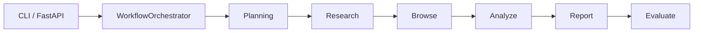
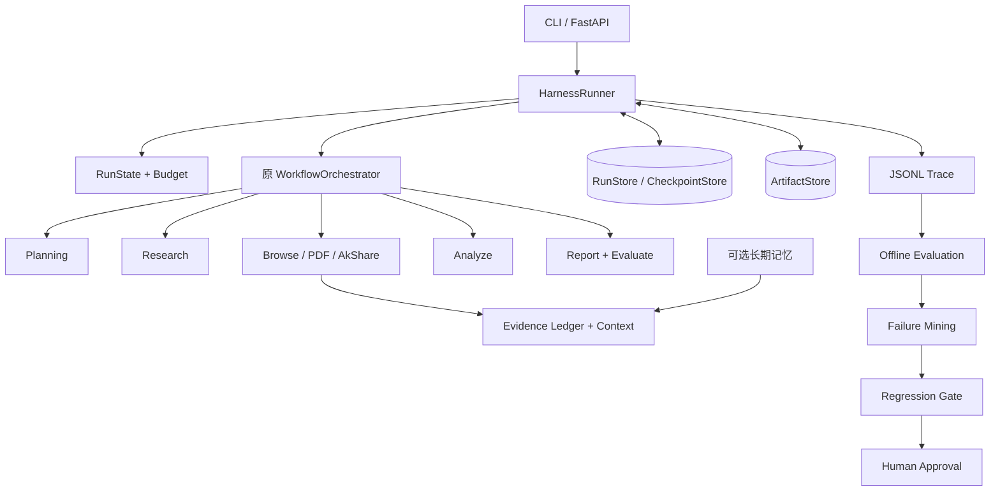

# 从 V1 研报流水线到可审计 Agent Harness

> 面向初学者的工程说明，也是大模型 Agent 平台技术面试讲稿。  
> 本文中的“V1”指仓库原有的金融研报执行方式，“Harness 版”指当前渐进升级后的版本，不代表已经发布了新的线上产品版本。

> **配套阅读**：本文回答"我把 V1 改成了什么"。
> 验收轮"你凭什么说它变好了"的专门报告见
> [measurement_credibility_report.md](measurement_credibility_report.md)——
> 其中包含单变量消融、回归集重建、恢复指标重建与真实 Provider Canary 的完整论证。

## 0. 先用一分钟看懂这个项目

这个项目要做的事情是：用户输入“分析贵州茅台的投资价值”，系统自动搜索资料、读取网页或 PDF、获取结构化财务数据、完成分析，最后生成带引用的研报。

V1 已经能完成这条流程，但它更像一支“能干活、缺少统一调度中心”的研究小组：每个人都会做自己的事，可是一旦工具超时、预算耗尽、进程中断、并发任务串线，系统很难统一回答：发生了什么、为什么重试、为什么停止、能不能从中断处继续。

这次升级没有继续增加 Agent 数量，而是在原业务流程外增加一层 **Agent Harness**。可以把 Harness 理解为赛车场的赛事控制中心：赛车手仍负责开车，控制中心负责规则、计时、预算、安全、事故记录和中断恢复。

升级后的核心链路是：

```text
用户请求
  → Harness：创建运行状态、预算、Trace、Checkpoint
  → 原有五阶段业务流程
      Planning → Research → Browse → Analyze → Report/Evaluate
  → Harness：判断成功、降级、信息不足、失败或取消
  → 离线评测：检查工具、参数、引用、数字、安全、成本和延迟
  → 失败挖掘：生成改进候选
  → 回归门禁 + 人工审批
```

最重要的工程变化不是“报告变得更会写”，而是系统从“跑一次看看结果”升级为“每一步可校验、可追踪、可恢复、可比较”。

---

## 1. 小白先补四个概念

### 1.1 Agent 和普通 LLM 调用有什么区别？

普通 LLM 调用像问一个人：“帮我写一份茅台研报。”模型只能依赖提示词和已有知识一次回答。

Agent 系统则会循环执行“观察—决定—行动—再观察”：

1. 判断需要什么资料；
2. 选择搜索、网页、PDF 或财务工具；
3. 读取工具结果；
4. 判断证据是否足够；
5. 必要时补充搜索或降级；
6. 生成并检查报告。

因此 Agent 工程的难点不只是 Prompt，而是工具、状态、错误、预算、并发、恢复和评测。

### 1.2 Harness 是什么？

Harness 原意是“安全带/线束”。在这里，它是包住 Agent 业务逻辑的统一运行环境，主要负责：

- 这是谁的任务、执行到哪一步；
- 可以使用哪些工具；
- 参数和返回值是否合法；
- 哪些错误允许重试；
- 最多花多少时间、Token 和工具调用；
- 中断后从哪里恢复；
- 每一步在 Trace 中留下什么证据；
- 最后应该标记成功、降级还是信息不足。

### 1.3 Checkpoint 和普通日志有什么区别？

日志像行车记录仪，告诉我们过去发生过什么；Checkpoint 像游戏存档，保存了可以继续执行的状态。

只有日志而没有 Checkpoint，进程挂掉后仍然要从头再来。只有 Checkpoint 记录而没有真正复用已完成工具结果，也只是“看起来能恢复”的伪恢复。

### 1.4 为什么一定要做评测？

没有评测时，修改 Prompt 后只能凭感觉说“好像更好了”。可靠的 Agent 评测必须同时检查：

- 最终任务是否完成；
- 工具选得对不对；
- 参数是否正确；
- 工具失败后是否恢复；
- 引用是否存在；
- 数字是否有来源；
- 是否产生无意义调用；
- 是否超预算；
- 延迟和成本有没有恶化；
- Prompt Injection 是否劫持了工具。

---

## 2. V1 的真实架构

V1 的主入口直接调用 `WorkflowOrchestrator.run()`：



需要特别诚实地说明：虽然名字叫多 Agent，Planner 生成的计划最终会被 `normalize_plan()` 压回固定五阶段。因此它更接近“多个专业节点组成的确定性工作流”，不是多个 Agent 自由协商和动态编排。

这并不是坏事。金融研究要求稳定和可复现，固定主流程通常比自由循环更安全。但 V1 缺少统一控制面，因此可靠性能力分散在各模块里。

### 2.1 V1 的主要问题

| 问题 | 小白理解 | 工程影响 |
|---|---|---|
| 状态是共享 `dict` | 大家在同一张草稿纸上写东西 | 无 schema、难恢复、容易键名漂移 |
| 工具控制分散 | 每个组员自己决定怎么打电话查资料 | 参数、重试、预算和 Trace 口径不统一 |
| 中间过程不持久化 | 只在交卷时保存最终文件 | 后期中断也要从头执行 |
| 错误语义较粗 | “电话没接通”和“号码写错”都叫失败 | 可能对永久错误重复重试 |
| 缺少硬预算 | 只靠业务代码自觉停止 | 容易无限补充搜索或成本失控 |
| Trace 不完整 | 只看到最后结果，看不到统一动作时间线 | 很难回答为什么调用、为什么停止 |
| 并发上下文不安全 | 两位研究员可能把资料放进对方文件夹 | API 并发时 Trace/预算可能串 run |
| 评测偏结果 | 报告生成了就容易看起来不错 | 不能证明工具选择、恢复和安全真的正确 |
| 优化缺少门禁 | 改 Prompt 后直接看单次结果 | 容易过拟合或引入隐性回归 |

---

## 3. 升级后的总体架构



设计原则是 **渐进式包裹，而不是推倒重写**：

- 原有 Research、Browser、Analyze、Report 逻辑继续复用；
- Harness 负责“如何可靠执行”；
- 业务 Agent 负责“研究什么、输出什么”；
- CLI/API 默认走 Harness；
- `--legacy` 和 `USE_AGENT_HARNESS=false` 保留回滚能力。

这个选择降低了迁移风险，也方便做同一业务逻辑下的 baseline 对照。

---

## 4. 改动一：统一状态机，不再靠裸字典猜状态

### V1

阶段之间通过共享 `context: dict` 传值。它简单，但不能保证：

- 某个键是否存在；
- 数据类型是否正确；
- 当前执行到了哪一阶段；
- 失败步骤是否已经重试；
- 状态能否跨进程恢复。

### Harness 版

使用 Pydantic 定义 Run、Task、Step、Attempt、Evidence、Budget 和 FinalOutcome，并加入：

- `schema_version`；
- `run_id/task_id/step_id`；
- 阶段和状态枚举；
- 模型、工具、参数和摘要；
- 开始/结束时间；
- Token、费用、调用次数；
- 错误类型与是否重试；
- checkpoint 版本；
- 最终状态和停止原因。

### 带来的效果

1. 状态可以序列化进 SQLite；
2. 恢复时可以拒绝不兼容版本；
3. 失败不会默认变成成功；
4. Trace、预算、评测使用同一套 run/step 标识；
5. API 能把 Harness 终态准确映射给调用方。

对应实现：`src/runtime/state.py`、`src/runtime/runner.py`。

---

## 5. 改动二：统一 Tool Registry 和 Tool Executor

### V1

搜索、网页、PDF、AkShare 等工具由不同模块直接调用或通过 MCP fallback，重试、参数校验和错误记录不完全统一。

### Harness 版

每个工具注册以下元数据：

- 唯一名称和 namespace；
- 什么时候使用、什么时候不要使用；
- 输入/输出 schema；
- 成本等级、超时和调用上限；
- 是否只读；
- 是否需要审批；
- 是否支持幂等和 dry-run。

所有进入网关的真实工具调用统一经过 Tool Executor：

```text
参数校验
  → 策略与审批检查
  → 预算检查
  → 重复调用检查
  → 熔断检查
  → 执行
  → 返回 schema 校验
  → Artifact 外置
  → Trace + 预算更新
```

### 错误为什么要分类？

系统区分 TIMEOUT、RATE_LIMIT、AUTH_ERROR、INVALID_ARGUMENT、SCHEMA_ERROR、NOT_FOUND、TRANSIENT_NETWORK、PERMANENT_FAILURE、POLICY_BLOCKED 和 BUDGET_EXCEEDED。

原因很简单：

- 网络抖动可能重试后恢复；
- 401 认证错误重试十次也不会变好；
- 参数错误应该修参数，不应该打爆 Provider；
- 策略阻止代表不允许执行，不能偷偷重试绕过。

### 直接实测效果

- TIMEOUT：最多尝试 3 次；
- AUTH_ERROR：只尝试 1 次；
- 熔断阈值触发后，第 3 次请求没有到达底层工具，工具计数停在 2；
- 工具预算上限为 2 时，实际只有 2 次到达工具层，后续调用被 `BUDGET_EXCEEDED` 阻止；
- 大结果保存到 ArtifactStore，只把摘要和引用 ID 注入模型。

这部分效果来自生产入口探针，不是单纯阅读源码得出的结论。

---

## 6. 改动三：让 Checkpoint 从“有记录”变成“真恢复”

这是本次最有面试价值的真实缺陷修复。

### 最初看起来没有问题

系统可以：

- 保存 checkpoint；
- 恢复 RunState；
- 生成 `skip_step_keys`；
- 写 `checkpoint_restored` 事件。

旧测试也全部通过。但实际测量发现：

| | 首次运行 | 恢复运行（修复前） |
|---|---:|---:|
| 到达底层工具的调用数 | 3 | 4 |

恢复后调用不降反增，说明系统只是“恢复了状态描述”，没有真正复用已完成工作。

### 根因

1. resume plan 只写进 Trace，没有应用到 Tool Executor；
2. Executor 的去重备忘录每次运行从空开始；
3. 某些 compact result 没有存进 ArtifactStore，恢复时无法重放。

### 修复

- 新增 `ToolExecutor.seed_completed_steps(state)`；
- 从 checkpoint 中筛选成功、幂等、无副作用且 artifact 仍存在的步骤；
- 用工具 projector 重建调用方需要的 compact result；
- 所有成功工具结果均进入 ArtifactStore；
- 恢复命中记录为 `STEP_SKIPPED_IDEMPOTENT`，不算作冗余调用。

### 修复效果

| | 首次运行 | 恢复运行（修复后） |
|---|---:|---:|
| 到达底层工具的调用数 | 3 | **0** |
| 恢复跳过事件 | 0 | **12** |

同时增加两条回归测试，并做过“反向验证”：临时注释修复代码后测试立即失败，恢复代码后重新通过。这比只断言 `checkpoint_restored` 存在更有说服力，因为它验证的是环境中的真实副作用次数。

### 面试中的设计深度

恢复语义不能简单宣称 exactly-once。对于只读且幂等的工具，可以安全重放或复用；对于可能产生写操作的工具，需要 idempotency key、approval 和补偿策略。无法判断状态的副作用步骤应该升级人工处理，而不是猜测成功或失败。

---

## 7. 改动四：预算、停止条件和诚实终态

### V1

已有部分重试和最多一轮补充检索，但缺少覆盖全 run 的统一预算账本。

### Harness 版

预算可以限制：

- 最大总 Token；
- 最大估算费用；
- 最大总时长；
- 最大模型调用次数；
- 最大工具调用次数；
- 单工具上限；
- 单阶段预算；
- 补充检索轮数。

接近上限时执行降级阶梯：缩小搜索、减少并行、使用已有证据、返回部分结果或停止。

终态语义变为：

- `succeeded`：证据和产物满足要求；
- `degraded`：部分工具失败，但剩余证据仍能形成有限结论；
- `insufficient`：证据或预算不足，不能负责地完成；
- `failed`：不可恢复错误；
- `cancelled`：用户或系统取消。

效果是“失败不再伪装成功”。例如：

- 无来源 → `no_usable_sources`；
- 实体无法验证 → `entity_unverified`；
- 预算耗尽 → `budget_exhausted`；
- AkShare 失败但网页证据足够 → `degraded`。

---

## 8. 改动五：结构化 Trace，让每个决定可追责

### V1

主要记录最终阶段结果，缺少统一模型/工具/预算/恢复事件流。

### Harness 版

每次运行写 append-only JSONL，典型事件包括：

```text
run_started
plan_created
model_call_started/completed/failed
tool_call_started/completed/failed
retry_scheduled
circuit_opened
budget_updated/exceeded
checkpoint_saved/restored
step_skipped_idempotent
memory_read/write
approval_requested/resolved
grader_result
run_completed/failed
```

Trace 记录可见输入输出摘要、工具理由、状态和错误，不记录隐藏 Chain of Thought。

### 安全处理

脱敏器会移除或遮盖：

- API Key；
- Bearer Token；
- Cookie 和敏感 Header；
- JWT、云厂商 Key；
- `reasoning_content` 等隐藏推理字段。

这里还修过一个细节问题：早期使用过宽的子串规则，会把 `tokens_in` 和 `authority_tier` 这类正常字段误判为敏感数据。现在改为按字段和密钥形状精确匹配，既保护 secret，也保留有效遥测。

### 带来的效果

系统现在可以回答：

- 为什么选择这个工具；
- 参数是什么、是否通过校验；
- 失败属于哪一类；
- 为什么重试或不重试；
- 哪个预算阻止了继续执行；
- 为什么返回 degraded/insufficient；
- 恢复时具体跳过了哪些步骤。

当前真实模型调用的 Token/费用 Trace 仍未由 live canary 验证，这是明确的 PARTIAL 项。

---

## 9. 改动六：修复并发 run 串线

### 问题

早期 Harness 绑定同时使用 ContextVar 和进程全局 executor。FastAPI 同时处理两个任务时，工具可能拿到另一条 run 的 executor，造成：

- Trace 写错 run；
- 预算扣到其他任务；
- 结果互相污染。

ResearchAgent 又使用线程池并发搜索，而 ContextVar 不会自动复制到新线程。

### 修复

- 删除进程级全局 executor；
- 只保留 ContextVar 绑定；
- 每个线程池任务使用独立 `contextvars.copy_context().run()`；
- 退出作用域后明确解绑；
- 增加两个并发 Harness run 的生产路径测试。

### 效果

生产入口探针验证：

- 两个线程并发运行均成功，没有绑定冲突；
- ResearchAgent 线程池中的 10 次检索均经过对应 executor；
- asyncio task 中绑定可见，退出后清空。

这是典型的大厂并发面试点：ContextVar 解决的是“逻辑上下文隔离”，但跨线程必须显式传播，不能假设与 async task 行为相同。

---

## 10. 改动七：上下文不再只是“太长就截断”

上下文被拆成：

- 当前目标；
- 当前计划；
- 阶段状态；
- 最近关键交互；
- Evidence Ledger；
- 工具结果摘要；
- 未解决问题；
- 数字—引用关系；
- 可选历史记忆。

处理顺序是：长结果外置、证据去重、来源级摘要、分阶段压缩，最后做一致性校验。

校验重点不是“压缩后字数够不够短”，而是：

- 核心数字是否还在；
- 数字对应的来源是否还在；
- 未解决问题是否被错误删除；
- 是否产生了孤立引用；
- 哪些层被保留、哪些层被丢弃。

这部分已有实现与测试，但还没有足够的下游 A/B 证明压缩提高了报告质量，因此只能说“机制完成”，不能声称“效果提升”。

---

## 11. 改动八：重建评测，而不是只看报告能不能生成

### 11.1 数据和运行方式

当前主数据产物包括：

- dev：88 tasks；
- held-out test：70 tasks；
- regression：41 tasks；
- adversarial tool routing：31 tasks × 3 trials = 93 rows。

评测支持多 trial、配置哈希、断点续跑、原始 JSONL、结果 SHA-256 和自动 Markdown/JSON 报告。

所有自动任务都明确标为 `synthetic_draft`、`synthetic_adversarial` 或 `machine_verified`。当前 `human_verified=0`，所以不能叫人工 Gold Test。

### 11.2 为什么旧 Tool F1=1.0 不可信？

旧 Tool Selection Grader 在任务没有声明期望工具时，把 precision 和 recall 都默认成 1.0。因此：

- 一次工具都不调用，也能得 F1=1.0；
- 调用 5 次无关工具，仍能得 F1=1.0。

264 行 dev 结果中只有 36 行被旧 grader 判定“适用”，并且这些任务只声明了 forbidden tools，没有真正声明必要工具。这个指标衡量的是“没碰禁用工具”，却被命名成了“工具选择 F1”。

### 11.3 修复方式

- 只有声明 required/optional tools 或 `expects_no_tools` 时，Tool Selection Grader 才适用；
- forbidden tool 单独评分；
- 增加 Necessary Tool Recall；
- 增加 Unnecessary Tool Call Rate；
- 增加 Tool Outcome Success；
- 增加 Alternative Valid Path；
- 手工构造 31 条对抗路由任务，覆盖不需要工具、单工具、多合法路径、禁用工具和失败工具等情况。

### 11.4 诚实的新结果

对抗集 31 tasks × 3 trials：

| 指标 | 结果 | 说明 |
|---|---:|---|
| Task Success | 0.3548 | 大量任务不符合期望路径或停止条件 |
| Tool Precision | 0.3590 | 调用了很多任务并不需要的工具 |
| Tool Recall | 1.0000 | 不是路由优秀，而是固定链几乎“全都调” |
| Tool F1 | **0.4616** | 旧 1.0 被证明是口径退化 |
| Necessary Tool Recall | 1.0000 | 必要工具通常包含在固定链里 |
| Unnecessary Tool Call Rate | **0.4133** | 工具选择仍有明显优化空间 |
| Alternative Valid Path | 1.0000 | 允许多路径时至少命中一条 |
| Invalid Tool Call Rate | 0 | 参数 schema 控制有效 |

这组“变差”的数字反而提高了项目可信度：评测终于能够暴露问题，而不是稳定输出满分。

它也揭示当前系统的真实定位：**业务主链仍是固定工具流水线，不是一个会根据任意任务动态选择最小工具集合的 Router。**

---

## 12. 离线开发集效果应该怎样解读？

同一 88-task dev、每任务 3 trials 的历史对照结果是：

| 指标 | V1 Baseline | Harness | 变化 |
|---|---:|---:|---:|
| Task Success | 0.6818 | 0.8068 | +0.1250 |
| 综合分均值 | 0.8752 | 0.9340 | +0.0588 |
| 最差综合分 | 0.2857 | 0.7143 | +0.4286 |
| Citation Coverage | 0.6935 | 0.7318 | +0.0383 |
| Unsupported Number | 0.0053 | 0.0044 | -0.0009 |
| P95 延迟 | 4.4789s | 1.8308s | -2.6481s |
| 平均工具调用 | 11.7841 | 15.3182 | **+3.5341** |

这可以作为离线工程回归信号，但不能直接写成“线上成功率提升 12.5 个百分点”，原因有三：

1. `human_verified=0`；
2. 离线 LLM stub 会返回与 fixture 数字一致的固定报告，数字溯源和引用指标天然偏高；
3. 旧 Tool F1 口径已被证明失真。

因此正确结论是：Harness 在该离线构造集上改善了流程完成和中断恢复表现，但增加了工具调用；它没有证明真实模型、真实网页和真实用户环境中的同等收益。

冻结后的 70-task × 3-trial test 结果同样只能作为 synthetic 信号：Task Success 0.7714、Citation Coverage 0.7429、P95 2.7934 秒。

---

## 13. 改动九：长期记忆不是“把聊天全塞进向量库”

记忆分为：

- Semantic：用户偏好、公司别名、数据口径、可靠来源；
- Episodic：经验证的成功查询、失败网站、恢复路径；
- Procedural：版本化工具规则、来源优先级和停止条件。

写入前执行 schema、来源可信度、敏感信息、Prompt Injection、重复和冲突检查。Procedural Memory 必须审批和版本化，不能由网页或模型自评直接写成生产规则。

检索时综合相关性、新近度、重要度、使用频率、来源置信度和 token budget，并按 namespace/project 隔离。

### A/B 结果

构造式 3 subjects × 2 sessions 实验中：

- none 和 full 的下游成功率都为 1.0；
- full 平均增加 78.7 memory tokens；
- full precision 0.6667、recall 1.0；
- vector-only 出现过期记忆误用；
- full policy 过期误用为 0；
- 跨用户泄漏为 0。

所以记忆默认关闭。当前只能证明记忆接入、隔离和策略链可运行，不能宣传“记忆提升任务效果”。

---

## 14. 改动十：离线优化只生成候选，不自动改生产

流程是：

```text
Trace + Grader
  → Failure Miner 识别根因切片
  → Candidate Generator 生成受限候选
  → Dev 实验
  → Held-out Test
  → Bad Case Regression
  → 安全/数字/成本/P95 门禁
  → 人工审批
  → 仅生成 overlay，可回滚
```

允许修改的范围被限制为 Prompt、工具描述/schema、路由、检索参数、停止条件、预算和记忆策略，不允许模型自由修改任意代码。

当前 5 个候选全部停留在 `proposed`。未审批版本无法 apply；即使审批，系统也只生成 overlay 文件，不直接覆盖 `config.py` 或生产 Prompt。

这不是“自主进化”，更准确的名称是 **Regression-gated Offline Optimization**。

---

## 15. V1 与 Harness 版完整对照

| 维度 | V1 | Harness 版 | 已验证效果 |
|---|---|---|---|
| 生产入口 | CLI/API 直接调工作流 | 默认进入 Harness，保留 legacy | CLI/API 探针通过 |
| 状态 | 共享裸 dict | 版本化 Pydantic 状态 | 可序列化、可恢复 |
| 工具 | 分散调用 | Registry + Executor + Gateway | 参数、错误和调用统一记录 |
| 错误 | 局部异常/Fallback | 结构化错误分类 | timeout 3 次、auth 1 次 |
| 熔断 | 不统一 | 工具/Provider circuit | 熔断后请求不再触达工具 |
| 预算 | 局部分支控制 | run/阶段/工具硬预算 | 上限 2 时实际只触达 2 次 |
| 终态 | 容易依赖是否产出报告 | success/degraded/insufficient/failed/cancelled | 无证据不伪装成功 |
| Checkpoint | 无 run 级真实复用 | SQLite + Artifact + 幂等跳过 | 恢复工具调用 3 → 0 |
| 并发上下文 | 可能共享 executor | ContextVar + 显式跨线程传播 | 双 run 隔离探针通过 |
| 上下文 | 全量字典/局部截断 | 分层预算、Ledger、压缩校验 | 机制和测试完成，效果 A/B 未证明 |
| Trace | 业务阶段日志 | 统一 JSONL 事件流 | 19 项探针中 17 PASS、2 PARTIAL |
| 评测 | 结果和历史指标为主 | 多 trial、哈希、对抗集、门禁 | 发现 Tool F1 虚高 |
| 记忆 | 轻量报告索引 | 三类型、隔离、TTL、审批 | 链路有效，但无成功率增益 |
| 优化 | 人工修改后观察 | 失败挖掘→候选→门禁→审批 | 不自动部署 |
| 测试 | 原有业务测试 | runtime/tool/memory/eval/optimization/e2e | 硬断网 **391 passed** |

---

## 16. 当前仍然存在的技术债

面试中主动讲限制通常比回避更加分。

### 16.1 搜索热缓存是可观测性盲区

ResearchAgent 在进入 gateway 之前先查磁盘缓存。命中热缓存时：

- 不经过 Tool Executor；
- 不产生 tool call Trace；
- 不扣 Harness 工具预算；
- `tool_calls` 会低估真实检索意图。

离线 eval 已强制关闭搜索缓存以保证口径一致，但生产链还没有修复。合理方案是把 cache 变成 Executor 内的一级 transport，或者把 cache hit 也作为正式工具事件和预算类型记录。

### 16.2 仍有两处 AkShare 直接调用

`tools/*.py` 中还有两处直接 `import akshare`，没有完整经过 Registry/Executor，所以其预算、重试、熔断和 Trace 覆盖不统一。

### 16.3 live provider 证据：已有小样本，但不构成 SLO

这一项已经从"完全没有"变成"有一个明确标注样本量的 canary"，详见第 22 节。

已经补上的：真实搜索 Provider、真实 token usage、真实费用、真实网页漂移与限流
的错误分布。canary 甚至直接暴露了一个 fixture 永远测不到的分类缺口（见 22.3）。

仍然不能声称的：

- 样本量是 16 个任务、单 trial，**不足以给出成功率置信区间**；
- 没有跨时段重复采样，无法区分"系统能力"和"当天网络状况"；
- 没有生产并发压测，P95 是串行单并发下的值，不是 SLO；
- 没有长期趋势，无法判断 provider 漂移速度。

所以 canary 的结论只能是"真实链路能跑通、成本量级是每次约 1.5 分钱、
失败以超时和临时网络为主"，不能是"线上成功率是 X%"。

### 16.4 Regression 数据已重构，但仍是 machine-verified

原先 41 条 regression 里大量条目是把历史 Bug 标题直接当成研究 query，
不能作为回归任务。现已逐条重写，见 `docs/regression_rebuild.md`：

- 31 条历史 bad case 全部显式分类，**没有一条被静默丢弃**；
- 13 条可确定性复现（真实 query + 故障注入 fixture + 明确期望）；
- 9 条判定为"不是 Agent 行为问题"（例如文档笔误、环境配置），每条写明理由；
- 5 条需要真实网络，不能进离线回归；
- 4 条需要人工判断，进入 `evals/human_review/gold_review_queue.jsonl`。

仍然存在的限制：重构后的任务 `gold_status` 全部是 `needs_human_review`，
**没有任何一条被人工确认过**。它能防住"回归再次发生"，但不能声称
"期望值本身是正确的"——这需要第 4 阶段的人工标注闭环真正跑完。

### 16.5 API 任务队列仍是单进程内存实现

Harness run/checkpoint 可以持久化，不等于 FastAPI 的任务队列持久化。服务重启后 API task record 会丢失；生产环境还需要持久任务队列、租户认证、资源配额和 worker 协调。

---

## 17. 为什么这套方案适合大厂面试

它展示的不是堆框架，而是几个通用平台问题：

1. **渐进迁移**：外层 Harness 接管控制面，避免重写业务链路；
2. **可靠性语义**：错误分类、重试、熔断、预算、取消和降级；
3. **状态恢复**：区分“恢复状态”和“真正减少副作用”；
4. **并发隔离**：理解 async ContextVar 与线程池传播差异；
5. **可观测性**：事件驱动 Trace、指标口径和敏感信息保护；
6. **评测可信度**：主动发现 grader 泄漏和满分指标退化；
7. **安全优化**：候选、门禁、审批、overlay、回滚，不自动上线；
8. **诚实实验**：区分 fixture、synthetic、human Gold 和 live evidence。

真正高级的部分不是把数字做高，而是能识别“为什么这个高分不可信”，再设计一个能暴露真实缺陷的评测。

---

## 18. 高频面试追问与回答思路

### Q1：为什么不直接重写成 LangGraph 或其他框架？

原业务 Agent、MCP、引用检查和报告生成已经可用，核心缺口是统一运行控制面。直接重写会把业务回归和基础设施迁移绑在一起。外层 Harness 可以保留旧能力、提供 legacy 回滚，还能在同一业务逻辑上做 baseline 对照。框架是实现手段，不是目标。

### Q2：为什么只重试临时错误？

重试的前提是相同请求再次执行可能获得不同结果。TIMEOUT、RATE_LIMIT、网络抖动满足；AUTH、参数、schema 和 policy 错误通常不会自行恢复。对永久错误重试只会放大延迟、成本和下游压力。

### Q3：熔断和重试有什么区别？

重试处理单次调用；熔断保护一个持续故障的 Provider。连续失败达到阈值后，熔断器直接拒绝后续请求，避免每个任务都重复等待超时。冷却后进入 half-open，用少量探测决定关闭还是重新打开。

### Q4：如何保证恢复不重复执行？

不能对所有工具承诺绝对 exactly-once。只对成功、幂等、无副作用且 artifact 完整的步骤复用；副作用工具依赖 idempotency key、审批和补偿。未知状态步骤按风险安全重试或转人工。验证时必须统计底层工具真实调用次数，而不是只检查 checkpoint 日志。

### Q5：为什么 ContextVar 还会在线程池出问题？

ContextVar 会自然跟随 asyncio task 的上下文切换，但不会自动复制到新 OS 线程。ThreadPoolExecutor 提交任务时要为每个任务创建独立 `copy_context()`，不能多个线程共享同一个 Context，否则会报重入错误或串 run。

### Q6：旧 Tool F1 为什么是 1.0？

任务没有 expected tools 时，旧 grader 把 precision/recall 默认成 1.0；实际只有 forbidden tool 场景进入分母。修复后增加了明确 expected/no-tool/alternative-path 任务，对抗集 F1 为 0.4616，证明当前系统主要执行固定链而非真正路由。

### Q7：为什么记忆默认关闭？

因为 A/B 没显示下游成功率提升，却增加 78.7 tokens；vector-only 还会误用过期记录。平台能力已经实现，但没有正向产品证据时不应该默认增加成本和污染风险。

### Q8：你怎么防止 Agent 自己把系统改坏？

优化模块只能生成限定类型候选，不能自由编辑代码；候选必须通过 dev、held-out、regression、安全、数字和成本门禁，再由人工审批。apply 只写 overlay，并保留版本和 rollback。当前五个候选全部未上线。

### Q9：如果要真正上线，下一步做什么？

优先顺序应是：修复缓存可观测性和 AkShare 绕行；重构 regression 并加入人工 Gold；建立少量 live canary；做多租户认证和任务持久化；采集真实 token/费用/P95；最后再考虑动态 Router 和 LoRA。

---

## 19. 三种面试表达模板

### 30 秒版本

> 我在现有金融研报五阶段流水线外增加了一层统一 Agent Harness，没有重写业务 Agent。它统一管理工具 schema、错误重试、熔断、预算、Checkpoint、Trace 和终态，并接管 CLI/API。验收时我发现原 checkpoint 只是恢复状态、不会跳过已完成工具，修复后恢复调用从 3 次降到 0；同时重建了工具评测，证明旧 F1=1.0 是口径退化，对抗集真实 F1 为 0.46。当前 391 条测试可在硬断网下通过；另外我花 $0.25 跑了 16 条真实链路 canary，拿到首份真实成本（$0.0158/次）与 P95（341s），并且明确不把离线结果宣传成线上收益。

### 2 分钟版本

> V1 能生成报告，但可靠性能力分散，状态是共享字典，工具重试、预算、Trace 和恢复没有统一语义。我选择用外层 Harness 渐进接管，而不是换框架重写。Harness 用版本化 Pydantic 状态记录 run/step/attempt/evidence，通过 Tool Registry 和 Executor 统一参数校验、临时错误重试、熔断、预算、幂等和 artifact；Workflow 在每个阶段调用 gate 和 checkpoint hook。CLI 和 FastAPI 默认走 Harness，同时保留 legacy 回滚。
>
> 我最重要的两个发现都来自验收，而不是新增功能。第一，原 resume 虽然有 checkpoint_restored 和 skip plan，但实际恢复调用从 3 次变成 4 次，根因是去重状态和 artifact 没重建；我加入 completed-step seeding 后恢复调用降为 0，并用反向测试证明用例能捕获缺陷。第二，旧 Tool F1=1.0 是空期望分支的假满分；重写 grader 和 31 条对抗任务后 F1 是 0.4616，说明系统仍是固定工具链，动态路由是下一阶段重点。整套 391 条测试硬断网通过。真实 Provider 侧我跑了 16 条 canary，它直接暴露出两类被误判为 UNKNOWN 的永久失败，也暴露出 fixture 系统性高估数字溯源率（0.9956 vs 真实 0.8126）；但 n=16 单 trial，不能当作线上成功率结论。

### STAR 版本

- Situation：金融研报流水线已能工作，但缺统一状态、预算、恢复和可信评测。
- Task：在不破坏既有业务 Agent 的前提下，构建可审计、可恢复、可回归的运行平台。
- Action：外层 Harness、统一工具执行、ContextVar 隔离、Checkpoint seeding、分层上下文、离线多-trial eval、对抗 grader、门禁优化。
- Result：CLI/API Harness 探针通过；恢复工具调用 3→0；timeout/auth 重试行为可分辨；391 条测试硬断网通过；单变量消融把成功率收益定位到 checkpoint 一项；16 条真实 canary 给出首份成本与错误分布；同时识别并公开旧 Tool F1 虚高、旧 Recovery 指标结构性恒为 0、以及 fixture 高估数字溯源率这三个评测口径缺陷。

---

## 20. 可复现命令

```bash
# 硬断网全量测试；本文最后一次实测为 391 passed
python -m pytest tests -q -p audit_netblock_plugin

# 生产入口与可靠性探针
python scripts/verify_harness_claims.py

# 测试分层与弱断言扫描
python scripts/classify_tests.py

# 离线 smoke
python -m evals.runners.run_eval --smoke

# 工具路由对抗集
python -m evals.datasets.adversarial_tools --write
python -m evals.runners.run_eval --split adversarial --arm harness --trials 3 \
  --results evals/results/adversarial_harness.jsonl
python -m evals.reports.build_report \
  --results evals/results/adversarial_harness.jsonl

# 查看离线优化候选状态
python -m src.optimization.experiment_runner status

# 单变量消融矩阵（有效性检查不过时退出码为 1）
python scripts/build_ablation_matrix.py --split dev
python scripts/build_ablation_matrix.py --split reg

# 真实链路 canary（会花钱；--yes 与硬上限必填）与其报告
python -m evals.runners.live_canary --yes --max-cost-usd 1.50
python -m evals.reports.build_live_canary_report

# 用当前分类规则离线重放真实错误消息（免费，不需要 Key）
python scripts/replay_canary_error_classes.py

# 结果文件哈希：刷新 / 只校验是否过期
python scripts/hash_results.py
python scripts/hash_results.py --check
```

关键证据：

- `docs/_evidence/verification_probes.json`
- `docs/_evidence/result_hashes.json`（26 个结果文件的 sha256，可用 `--check` 验证未过期）
- `docs/_evidence/canary_error_replay.json`
- `evals/reports/live_canary_report.md`
- `evals/reports/ablation_matrix_dev.md` / `ablation_matrix_reg.md`
- `docs/_evidence/test_classification.json`
- `evals/results/adversarial_harness.jsonl`
- `evals/reports/adversarial_harness_report.json`

---

## 21. 单变量消融：把"Harness 有用"拆成可归因的结论

### 21.1 为什么必须重做这张表

README 里原来有一张对照表，结论是"Harness 让 Task Success 提升 12.5pp"。
这张表是**无效的**，原因有三个，任何一个单独出现都足以让结论作废：

1. **一次关掉了多个变量。** baseline 臂同时关掉了预算门禁和 checkpoint。
   即使差异真实存在，也无法知道是哪一个造成的。
2. **两臂的 Grader 集合不同。** baseline 的结果文件是用旧的（退化的）
   tool grader 打的分，harness 臂是用修好的 grader 打的分。
   分母定义都不一样，减法没有意义。
3. **两臂的运行时间不同。** 中间 fixture 和代码都改过。

这是一个很容易在面试里被一句话问死的问题："你这个 12.5pp，
是 Harness 的功劳，还是 checkpoint 一个功能的功劳？"

### 21.2 重做的方式：一次只动一个变量

现在有 7 个臂，除 legacy 外每个臂与参照臂 `harness_full` **只差一个布尔开关**：

| 臂 | 与参照臂的唯一差异 |
|---|---|
| `legacy_no_harness` | 完全不绑定 Harness（参照点，不是单变量臂） |
| `harness_full` | 参照：全部能力开启 |
| `abl_no_retry` | 只关重试 |
| `abl_no_checkpoint` | 只关 checkpoint |
| `abl_no_budget` | 只关预算门禁 |
| `abl_no_context_mgmt` | 只关上下文压缩 |
| `no_fallback` | 只关权威站点 fallback 轮 |

注意 `baseline_v4` **被故意排除在消融集之外**（`evals/runners/arms.py`
的 `ablation_arms()`），因为它捆绑了两个变化，留着它就会诱人重新犯第一个错误。

更重要的是，报告脚本现在会**拒绝**输出结论。
`scripts/build_ablation_matrix.py` 的 `validate()` 在打印任何数字之前检查三项：
任务数一致、trial 数一致、Grader 集合一致。任意一项不过，
报告顶部会印"⚠️ 对照有效性检查未通过，以下数字不可作为归因结论"。
这个拒绝行为本身有 15 条测试（`tests/harness/test_ablation_validity.py`），
并且做过反向验证：把 Grader 集合检查改成 `if False`，
对应测试立刻失败。

### 21.3 dev 集（88 任务，1 trial）的真实结果

| 指标 | legacy | harness_full | no_retry | no_checkpoint | no_budget | no_context | no_fallback |
|---|---|---|---|---|---|---|---|
| Task Success | 0.7500 | **0.8068** | 0.8068 | **0.6818** | 0.8068 | 0.8068 | 0.8068 |
| Unresolved Failure | n/a | **0** | 0 | **0.125** | 0 | 0 | 0 |
| Citation Coverage | 0.8568 | 0.7318 | 0.7318 | 0.6935 | 0.7318 | 0.7318 | 0.7318 |
| 平均工具调用数 | n/a | 13.59 | 13.28 | 11.78 | 13.59 | 13.59 | **9.99** |

**读法（这是最重要的部分）**：

- **只有 checkpoint 一个能力影响成功率**。关掉它，成功率掉 12.5pp
  （0.8068 → 0.6818），同时 Unresolved Failure 从 0 升到 0.125。
  所以原来那个"12.5pp 归功于 Harness"的数字，**数值上恰好是对的，
  归因上是错的**——它是 checkpoint 一个功能的收益，不是整层 Harness 的收益。
  这是我最愿意在面试里讲的一段：旧结论的数字没错，但它无法回答追问。
- **retry / budget / context 压缩 / fallback 对成功率的影响是精确的 0**。
  不是"影响很小"，是四个臂的成功率与参照臂**完全相同**（0.8068）。
  诚实的解释是：离线 fixture 里注入的故障类型不需要这些能力就能通过。
  这不能证明这些能力无用，只能证明**当前评测集证明不了它们有用**。
  如果我说"retry 提升了稳定性"，我就没有证据。
- **fallback 是纯成本**：关掉它工具调用从 13.59 降到 9.99（少 3.6 次），
  而成功率、来源数、引用覆盖率全部不变。这是一个应该被优化掉的能力，
  或者需要一个能证明它价值的评测场景（例如权威站点限流）。
- **legacy 的 Citation Coverage 反而更高（0.8568 vs 0.7318）**。
  我没有把这一条藏起来。部分原因是 legacy 平均拿到更多来源
  （3.47 vs 2.97），来源多则可引用的锚点多。但**根因没有完全查清**，
  文档里是按"未解决"记录的，不是按"已解释"记录的。

### 21.4 重构回归集（13 任务）的结果，以及本轮最重要的一句话

| 指标 | legacy | harness_full |
|---|---|---|
| Task Success | 0.8462 | 0.8462 |
| Unresolved Failure | **0.5385** | **0** |
| 平均工具调用数 | n/a | 15.31 |

两臂成功率**完全相同**。差别全部在第二行：

> **Harness 没有让这个系统更常成功，而是让失败变得可解释。**

legacy 臂有 53.85% 的任务以"说不清为什么没成"结束；
Harness 臂是 0——每个失败都有错误分类、停止原因和 trace 事件。

这句话是整个项目最诚实也最值钱的结论。它同时回答了三层追问：

- **第一层**："你的 Harness 提升了多少成功率？" → 在这个回归集上是 0。
- **第二层**："那它有什么用？" → 它把不可归因的失败率从 0.54 降到 0。
  在生产里，一个能说出"是 provider 限流"还是"是参数错误"的系统，
  和一个只能说"失败了"的系统，运维成本差一个量级。
- **第三层**："这个 0 是不是你把 grader 调宽松了？" → 不是。
  两臂用**同一份任务、同一份 fixture、同一个 Grader 集合**，
  validate() 会在不一致时拒绝出表；Unresolved Failure 是从 trace 事件派生的，
  legacy 没有 trace 所以其他事件派生指标都标 `n/a`，
  唯独这一项能算，是因为"没有任何错误分类信息"本身就是它的观测结果。

### 21.5 可复现命令

```bash
# 逐臂跑（每臂一条结果文件，互不覆盖）
python -m evals.runners.run_eval --split dev --arm legacy_no_harness --trials 1   --results evals/results/abl_dev_legacy_no_harness.jsonl
# ... 其余 6 臂同理

# 生成矩阵（validity 不过时退出码为 1）
python scripts/build_ablation_matrix.py --split dev
python scripts/build_ablation_matrix.py --split reg

# 对照有效性守卫的测试
python -m pytest tests/harness/test_ablation_validity.py -q
```

产物：`evals/reports/ablation_matrix_dev.md` / `ablation_matrix_reg.md`
及同名 `.json`（含 `validity_problems` 字段，空列表才代表可用）。

---

## 22. 真实 Provider Canary：第一份非 fixture 的证据

### 22.1 为什么必须花钱跑这一次

在这之前，项目里**每一个数字都来自离线 fixture**。离线模式用 stub 替换了
`BaseAgent.call_llm`，所以 token 和费用**结构性地等于 0**——不是测得很小，
是根本没有测。任何"成本下降""时延优化"的说法在那个阶段都没有依据。

面试里这会被一句话问穿："你说这套 Harness 控制了预算，那一次运行多少钱？"
答不出具体数字，整个预算门禁的叙事就是空的。

### 22.2 怎么做的（以及为什么不是简单地"跑一遍"）

`evals/runners/live_canary.py`，16 个人工分层挑选的真实主体：

- 覆盖 4 类任务（公司/行业/宏观/结构化取数）+ 4 个专门的边界场景；
- `--yes` 必填，`--max-cost-usd` 是**硬上限**，超限立刻停；
- 每条跑完立即落盘（增量保存），中途被杀不会丢已花的钱；
- 结果文件**永不与 fixture 结果合并**，报告脚本单独读 `live_canary.jsonl`。

### 22.3 实测结果（16/16 全部跑完，总花费 $0.2520）

| 指标 | 实测值 |
|---|---|
| 平均单次费用 | **$0.0158** |
| 平均输入 / 输出 Token | 11,270 / 4,342 |
| 平均时延 | 179.94s |
| **P95 时延** | **340.92s** |
| 平均工具调用数 | 20.0 |
| 终态 | succeeded 13 / degraded 1 / insufficient 2 |
| Task Success（符合预期终态） | 0.9375 |
| False Success | **0** |
| Unresolved Failure | **0** |

两个"失败"是**设计上应该失败**的：一条是虚构主体
（希兹维恩量子玄武科技）被实体校验挡下，`stop_reason=entity_unverified`；
一条是茅台首轮所有来源都不可用，`no_usable_sources`。还有一条
`degraded / enough_evidence` 是预算降级阶梯在真实环境里真的触发了
（真实错误分布里 `BUDGET_EXCEEDED` 出现 18 次尝试）。

### 22.4 最重要的一条：fixture 系统性高估了数字溯源质量

| 指标 | 离线 dev（88×3） | 真实 canary（16×1） |
|---|---|---|
| Number Grounding | 0.9956 | **0.8126** |
| 成功但含无源数字 | 0.0154 | **0.8571** |

离线看，1000 个数字里只有 4 个没有出处；真实环境是 1000 个里有 187 个没有出处。
**14 条完成的真实运行里有 12 条至少含一个无源数字。**

原因不是模型变差了，而是 fixture 的构造方式决定了这个指标测不出问题：
fixture 网页里的数字是按报告需要生成的，所以报告引用什么、页面里就有什么。
真实网页的数字分散在图表、PDF、被清洗掉的表格里，模型会写出
"同比增长约 12%"这种**在正文里找不到锚点**的句子。

这是我最想讲的方法论结论：**一个指标在 fixture 上接近满分，
往往说明 fixture 和被测对象共享了同一个假设，而不是说明系统好。**
上一轮的 Tool F1 = 1.0 是同一个病的另一种表现。

### 22.5 canary 直接暴露的一个真实代码缺陷

真实运行里出现了 8 次 `UNKNOWN` 错误，占全部 32 次失败调用的 1/4。
UNKNOWN 按不可重试处理，所以**行为是对的，但归因是错的**——
运维看到 UNKNOWN 只能去翻日志。查下来是两类：

1. `empty_content_after_cleaning`：网页取回成功，但 HTML 清洗后没有正文
   （以及扫描版 PDF 的 "no text layer"）。对这个 URL 是永久失败。
2. `468 Client Error`：反爬前端自己编的非标准状态码，没有任何规则认领。

两条规则补进 `src/runtime/errors.py` 后，8 次 UNKNOWN 全部归类为
`PERMANENT_FAILURE`，其余 24 次分类**一个都没有变**（无遮蔽）。

这里有一个**不能作弊的细节**：这两条规则是在 canary 已经跑起来之后才改的，
运行中的进程加载的是旧模块。所以我**没有**去重跑一次（重跑要再花钱），
也**没有**改写已有 trace（重写历史证据不可接受）。
做法是写 `scripts/replay_canary_error_classes.py`：
trace 里逐字保存了真实错误消息，用当前规则离线重放同一批消息，
报告第 4.2 节把"运行时记录"和"当前规则重放"**并列两列**并给出 Δ。

这张表第一版我自己写错了：左列取自 `live_metrics.by_error`（按**尝试**计，
含重试），右列取自 trace 事件（按**失败的调用**计），
于是 `TRANSIENT_NETWORK` 显示成 10 vs 5——纯粹的分母不同造成的假差异。
改成两列同源后合计都是 32，Δ 只剩规则改动的那 8 条。
**能相减的前提是分母相同**，这一点现在有测试守着。

### 22.6 这份数据不支持什么

- **不能当成功率结论**：n=16、每条 1 trial、无置信区间；
- **不能当"线上"指标**：单机串行、无并发、无持续观测，P95 不是 SLO；
- **不能外推成本**：主体热度决定检索轮数，token 量随之变化；
- 任务期望值仍是 `needs_human_review`，**没有人工 Gold**。

### 22.7 可复现命令

```bash
# 真实链路（会花钱，需要 API Key；--yes 与硬上限都是必填）
python -m evals.runners.live_canary --yes --max-cost-usd 1.50

# 报告（只读 live_canary.jsonl，不与任何 fixture 结果合并）
python -m evals.reports.build_live_canary_report

# 用当前分类规则离线重放真实错误消息（免费，不需要 API Key）
python scripts/replay_canary_error_classes.py
```

---

## 23. 最终结论

与 V1 相比，Harness 版最大的进步不是增加 Agent 或包装新框架，而是建立了统一的工程闭环：

```text
可控执行
→ 可追踪环境结果
→ 可验证恢复
→ 可解释失败
→ 可比较实验
→ 受门禁约束的改进候选
```

已经能够可靠证明的是控制面、错误策略、预算阻断、熔断、并发隔离、真实 checkpoint 跳过、
Trace 脱敏和离线门禁机制；本轮补上了**单变量归因**（第 21 节）和
**第一份真实链路成本/时延/错误分布**（第 22 节）。

仍不能证明的是线上真实成功率（n=16、单 trial，无置信区间）、长期记忆收益、
动态工具路由能力和完整生产高可用。把这些边界写清楚，恰恰是这份技术文档最重要的工程结论。

### 如果只能记住三句话

1. **Harness 没有让这个系统更常成功，而是让失败变得可解释。**
   重构回归集上两臂 Task Success 完全相同（0.8462），
   差别是 Unresolved Failure 从 0.5385 降到 0。

2. **指标接近满分，通常说明评测和被测对象共享了同一个假设。**
   旧 Tool F1 = 1.0 来自空期望分支；离线 Number Grounding = 0.9956
   来自"fixture 网页按报告需要生成数字"。真实环境分别是 0.4616 和 0.8126。

3. **能相减的前提是分母相同。**
   旧 README 的 +12.5pp 对照同时改了两个变量、还换了 Grader 集合；
   真实 Δ 属于 checkpoint 一个能力。现在报告脚本会在三项一致性检查
   不通过时**拒绝给出归因结论**，并且这个拒绝行为本身有测试。
